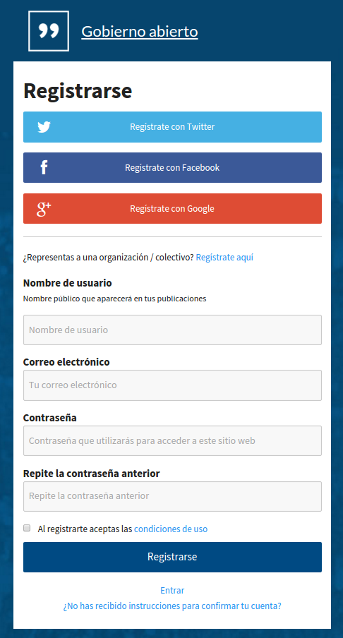

# Índice

* [Funcionalidades](#funcionalidades)
* [Registro de usuario](#registro-de-usuario)
* [Perfil de usuario](#perfil-de-usuario)
* [Perfiles de administrador, moderador y gestor](#perfiles-de-administrador,-moderador-y-gestor)
* [Perfiles de evaluador y presidente de mesa](#perfiles-de-evaluador-y-presidente-de-mesa)

## Funcionalidades

Actualmente CONSUL soporta:

* Registro y verificación de usuarios tanto en la misma aplicación como con distintos proveedores (Twitter, Facebook, Google).
* Distintos perfiles de usuario, tanto ciudadanos individuales como organizaciones y cargos públicos.
* Distintos perfiles de administración, gestión, evaluación y moderación.
* Espacio permanente de debates y propuestas.
* Comentarios anidados en debates y propuestas.
* Presupuestos participativos a través de distintas fases.

## Registro de usuario

Para registrar un usuario nuevo es posible hacerlo en la propia aplicación, dando un nombre de usuario (nombre público que aparecerá en tus publicaciones), un correo electrónico y una contraseña con la que se accederá a la web. Se deben aceptar las condiciones de uso. El usuario debe confirmar su correo electrónico para poder iniciar sesión.



Por otro lado también se puede habilitar el registro a través de servicios externos como Twitter, Facebook y Google. Para esto hace falta tener la configuración habilitada en Settings y las claves y secretos de estos servicios en el fichero *config/secrets.yml*.

```
  twitter_key: ""
  twitter_secret: ""
  facebook_key: ""
  facebook_secret: ""
  google_oauth2_key: ""
  google_oauth2_secret: ""
```

Una vez el usuario ha iniciado sesión le aparecerá la posibilidad de verificar su cuenta, a través de una conexión con el padrón municipal.


Para esta funcionalidad hace falta que el padrón municipal soporte la posibilidad de conexión a través de una API, puedes ver un ejemplo en *lib/census_api.rb*.


## Perfil de usuario

Dentro de su perfil ("Mi cuenta" en el menú superior) cada usuario puede configurar si quiere mostrar públicamente su lista de actividades, así como las notificaciones que le enviará la aplicación a través de correo electrónico. Estas notificiaciones pueden ser:

* Recibir un email cuando alguien comenta en sus propuestas o debates.
* Recibir un email cuando alguien contesta a sus comentarios.
* Recibir emails con información interesante sobre la web.
* Recibir resumen de notificaciones sobre propuestas.
* Recibir emails con mensajes privados.

## Perfiles de administrador, moderador y gestor

CONSUL cuenta con tres perfiles de usuario para administrar contenidos de la web: administrador, moderador y gestor. Además tiene otros dos perfiles para gestión de procesos participativos: [evaluador y presidente de mesa](#perfiles_de_evaluador,_gestor_y_presidente_de_mesa), que se detallan más abajo.

Los usuarios con perfil de administrador pueden asignar cualquier tipo de perfil a cualquier tipo de usuario. Sin embargo, todos los perfiles tienen que ser usuarios verificados (contrastados con el padrón municipal) para poder realizar ciertas acciones (por ejemplo, los gestores necesitan estar verificados para crear propuestas de inversión).

### Panel Administrar


Desde aquí puedes administrar el sistema, a través de los siguientes menús:

#### Categorías 

##### Temas de debates/propuestas

Los temas (también llamados tags, o etiquetas) son palabras que definen los usuarios al crear debates o propuestas para facilitar su catalogación (ej: sanidad, movilidad, arganzuela, ...). Desde aquí el administrador tiene las siguientes opciones:

* Crear temas nuevos
* Eliminar temas inapropiados
* Marcar temas para que aparezcan como sugerencia al crear debates/propuestas. Cada usuario puede crear los que quiera, pero el administrador puede sugerir algunos que le parezcan útiles como catalogación por defecto. Marcando "Proponer tema al crear la propuesta" en cada tema, establece cuáles se sugieren.

#### Contenido moderado 

##### Propuestas/Debates/Comentarios ocultos

Cuando un administrador o moderador oculta una Propuesta/Debate/Comentario desde la web, aparecerá en esta lista. De esta forma los administradores pueden revisar los elementos que se han ocultado y subsanar posibles errores.

* Al pulsar "Confirmar" se acepta el que se haya ocultado; se considera que se ha hecho correctamente.
* Si se considera que la ocultación ha sido errónea, al pulsar "Volver a mostrar" se revierte la acción de ocultar y vuelve a ser una Propuesta/Debate/Comentario visible en la web.

Para facilitar la gestión, arriba encontramos un filtro con las secciones: "Pendientes" (los elementos sobre los que todavía no se ha pulsado "Confirmar" o "Volver a mostrar", que deberían ser revisados todavía), "Confirmadas" y "Todas".

Es recomendable revisar regularmente la sección "Pendientes".

#### Usuarios bloqueados

Cuando un moderador o un administrador bloquea a un usuario desde la web aparecerá en esta lista. Cuando un usuario está bloqueado no puede realizar acciones en la web, y todas sus Propuestas/Debates/Comentarios dejaran de ser visibles.

* Al pulsar "Confirmar" se acepta el bloqueo; se considera que se ha hecho correctamente.
* Si se considera que el bloqueo ha sido erróneo, al pulsar "Volver a mostrar" se revierte el bloqueo y el usuario vuelve a estar activo.

#### Votaciones 

Se puede crear una votación pulsando "Crear votación" y definiendo un nombre, fecha de apertura y de cierre. Adicionalmente se puede restringir la votación a unas zonas determinadas marcando "Restringir por zonas". Las zonas disponibles se definen en el menú [Gestionar distritos](#gestionar-distritos).

Los usuarios tienen que estar verificados para poder participar en la votación.

Una vez que se ha creado la votación, se definen y se agregan sus componentes. Las votaciones tienen tres componentes: Preguntas ciudadanas, Presidentes de mesa y Ubicación de las urnas.

##### Preguntas ciudadanas

Se puede crear una pregunta ciudadana o buscar una existente. Al crear la pregunta se puede asignar a una votación determinada. También se puede modificar la asignación a una pregunta existente pulsando el ella y seleccionando "Editar".

Desde el apartado de Preguntas ciudadanas también se pueden asignar a una votación aquellas Propuestas ciudadanas que han superado el umbral de apoyos. Se pueden seleccionar desde la pestaña "Propuestas que han superado el umbral".

##### Presidentes de mesa

Cualquier usuario registrado en la web puede convertirse en Presidente de mesa. Para asignarle ese rol se introduce su email en el campo de búsqueda y una vez encontrado se asigna con "Añadir como Presidente de mesa". Cuando los presidentes acceden a la web con su usuario ven en la parte superior una nueva sección llamada "Presidentes de mesa".

##### Ubicación de las urnas

Para añadir una urna a la lista, seleccionar "Añadir urna" y a continuación completar los datos de nombre de la urna y ubicación.

#### Presupuestos participativos 

Desde esta sección se puede crear un presupuesto participativo seleccionando "Crear nuevo presupuesto" o editar uno existente. Al editar se puede cambiar la fase en la que se encuentra el proceso; este cambio se reflejará en la web. También se pueden crear grupos de partidas presupuestarias y agregar propuestas de inversión que hayan sido creadas previamente por un [gestor](#panel-gestión).

#### Perfiles 

##### Organizaciones

En la web cualquier usuario se puede registrar con un perfil individual o como una organización. Los usuarios de organizaciones pueden ser verificados por parte de los administradores, confirmando que quien gestiona el usuario efectivamente representa a esa organización. Una vez se haya realizado el proceso de verificación, por el proceso externo a la web que se haya definido para ello, se pulsa el botón "Verificar" para confimarlo; lo que hará que al lado del nombre de la organización aparezca una etiqueta señalando que es una organización verificada.

En caso de que el proceso de verificación haya sido negativo, se pulsa el botón "Rechazar". Para editar alguno de los datos de la organización, se pulsa el botón "Editar".

Las organizaciones que no aparecen en la lista pueden ser encontradas para actuar sobre ellas por medio del buscador en la parte superior. Para facilitar la gestión, arriba encontramos un filtro con las secciones: "pendientes" (las organizaciones que todavía no han sido verificadas o rechazadas), "verificadas", "rechazadas" y "todas".

Es recomendable revisar regularmente la sección "pendientes".

##### Cargos Públicos

La condición de cargo público no se puede elegir en el registro que se hace desde la web: se asigna directamente desde esta sección. El administrador busca un usuario introduciendo su email en el campo de búsqueda y le asigna el rol de Cargo público.

El cargo público se diferencia del usuario individual únicamente en que al lado de su nombre aparece una etiqueta que le identifica, y cambia ligeramente el estilo de sus comentarios. Esto permite que los usuarios le identifiquen más fácilmente. Al lado de cada cargo vemos la identificación que aparece en su etiqueta, y su nivel (la manera que internamente usa la web para diferenciar entre un tipo de cargos y otros). Pulsando el botón "Editar" al lado del usuario, se puede modificar su información. Los cargos públicos que no aparecen en la lista pueden ser encontrados para actuar sobre ellos por medio del buscador en la parte superior.

##### Moderadores

Cualquier usuario registrado en la web puede convertirse en moderador. Para asignarle ese rol se introduce su email en el campo de búsqueda y una vez encontrado se asigna con "Añadir como Moderador". Cuando los moderadores acceden a la web con su usuario ven en la parte superior una nueva sección llamada "Moderar".

Al seleccionar "Actividad de moderadores" aparece un listado de todas las acciones que realizan los moderadores: ocultar/mostrar Propuestas/Debates/Comentarios y bloquear usuarios. En la columna "Acción" comprobamos si la acción corresponde con ocultar o con volver a mostrar (restaurar) elementos o con bloquear usuarios. En las demás columnas tenemos el tipo de elemento, el contenido del elemento y el moderador o administrador que ha realizado la acción.

Esta sección permite que los administradores detecten comportamientos irregulares por parte de moderadores específicos y que por lo tanto puedan corregirlos.

##### Evaluadores

Cualquier usuario registrado en la web puede convertirse en evaluador. Para asignarle ese rol se introduce su email en el campo de búsqueda y una vez encontrado se asigna con "Añadir como evaluador". Cuando los evaluadores acceden a la web con su usuario ven en la parte superior una nueva sección llamada "Evaluación".

##### Gestores

Cualquier usuario registrado en la web puede convertirse en gestor. Para asignarle ese rol se introduce su email en el campo de búsqueda y una vez encontrado se asigna con "Añadir como gestor". Cuando los gestores acceden a la web con su usuario ven en la parte superior una nueva sección llamada "Gestión".

#### Banners 

Desde el menú "Gestionar banners" se pueden crear banners para hacer anuncios especiales que aparecerán siempre en la parte superior de la web, tanto en el apartado de debates como en el de propuestas. Para crearlo hay que seleccionar "Crear banner" e introducir sus datos y fechas de inicio y fin de publicación en formato ```dd/mm/aaa```.

Por defecto, en la web sólo aparecerá un banner. Si existen varios banners cuyas fechas indican que deberían estar activos, sólo se visualizará aquel cuya fecha de inicio de publicación sea más antigua.

#### Personalizar sitio 

##### Personalizar páginas

Las páginas sirven para mostrar cualquier tipo de contenido estático relativo a los procesos de participación. Al crear o editar una página se debe introducir un _slug_ para definir el _permalink_ de esa página en cuestión. Una vez creada, podemos acceder a ella desde el listado, seleccionando "Ver página".

##### Personalizar imágenes

Desde este panel se definen las imágenes de los elementos corporativos de tu CONSUL.

##### Personalizar bloques

Puedes crear bloques de HTML que se incrustarán en la cabecera o el pie de tu CONSUL.

Los bloques de la cabecera (top_links) son bloques de enlaces que deben crearse con este formato:

```
<li><a href="http://site1.com">Site 1</a></li>
<li><a href="http://site2.com">Site 2</a></li>
<li><a href="http://site3.com">Site 3</a></li>
```

Los bloques del pie (footer) pueden tener cualquier formato y se pueden utilizar para guardar huellas Javascript, contenido CSS o contenido HTML personalizado.

#### Gestionar distritos

Desde este menú se pueden crear los distintos distritos de un municipio con su nombre, coordenadas, código externo y código del censo.

#### Hojas de firmas

Con el fin de registrar apoyos externos a la plataforma, se pueden crear hojas de firmas de Propuestas ciudadanas o Proyectos de inversión introduciendo el ID de la propuesta en cuestión e introduciendo los números de los documentos separados por comas(,).

#### Estadísticas

Estadísticas generales del sistema.

#### Configuración global

Opciones generales de configuración del sistema.

### Panel Moderar


Desde aquí puedes moderar el sistema, a través de las siguientes acciones:

#### Propuestas / Debates / Comentarios

Cuando un usuario marca en una Propuesta/Debate/Comentario la opción de "denunciar como inapropiado", aparecerá en esta lista. Respecto a cada uno aparecerá el título, fecha, número de denuncias (cuántos usuarios diferentes han marcado la opción de denuncia) y el texto de la Propuesta/Debate/Comentario.

A la derecha de cada elemento aparece una caja que podemos marcar para seleccionar todos los que queramos de la lista. Una vez seleccionados uno o varios, encontramos al final de la página tres botones para realizar acciones sobre ellos:

* Ocultar: hará que esos elementos dejen de mostrarse en la web.
* Bloquear autores: hará que el autor de ese elemento deje de poder acceder a la web, y que además todas las Propuestas/Debates/Comentarios de ese usuario dejen de mostrarse en la web.
* Marcar como revisados cuando consideramos que esos elementos no deben ser moderados, que su contenido es correcto, y que por lo tanto deben dejar de ser mostrados en esta lista de elementos inapropiados.

Para facilitar la gestión, arriba encontramos un filtro con las secciones:

* Pendientes: las Propuestas/Debates/Comentarios sobre los que todavía no se ha pulsado "ocultar", "bloquear" o "marcar como revisados", y que por lo tanto deberían ser revisados todavía.
* Todos: mostrando todos las Propuestas/Debates/Comentarios de la web, y no sólo los marcados como inapropiados.
* Marcados como revisados: los que algún moderador ha marcado como revisados y por lo tanto parecen correctos.

Es recomendable revisar regularmente la sección "pendientes".

#### Bloquear usuarios

Un buscador nos permite encontrar cualquier usuario introduciendo su nombre de usuario o correo electrónico, y bloquearlo una vez encontrado. Al bloquearlo, el usuario no podrá volver a acceder a la web, y todas sus Propuestas/Debates/Comentarios serán ocultados y dejarán de ser visibles en la web.

### Panel Gestión


Desde aquí puedes gestionar usuarios a través de las siguientes acciones:

* Usuarios.
* Editar cuenta de usuario.
* Crear propuesta.
* Apoyar propuestas.
* Crear propuesta de inversión.
* Apoyar propts. de inversión.
* Imprimir propuestas.
* Imprimir propts. de inversión.
* Invitaciones para usuarios.

## Perfiles de evaluador y presidente de mesa

### Panel Evaluación

### Panel Presidentes de mesa
