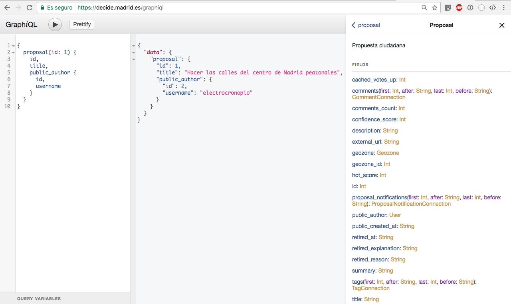
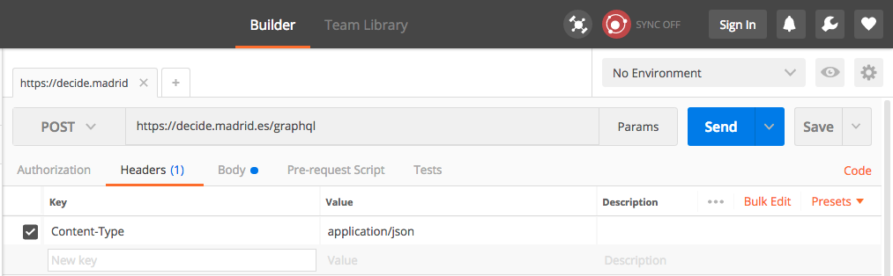

# API Documentation

* [Characteristics](#characteristics)
* [GraphQL](#graphql)
* [Making API requests](#making-api-requests)
  * [Supported clients](#supported-clients)
    * [GraphiQL](#graphiql)
    * [Postman](#postman)
    * [HTTP libraries](#http-libraries)
* [Available information](#available-information)
* [Examples of queries](#examples-of-queries)
  * [Request a single record from a collection](#request-a-single-record-from-a-collection)
  * [Request a complete collection](#request-a-complete-collection)
    * [Pagination](#pagination)
  * [Accessing several resources in a single request](#accessing-several-resources-in-a-single-request)
* [Security limitations](#security-limitations)
  * [Example of too deep query](#example-of-too-deep-query)
  * [Example of too complex query](#example-of-too-complex-query)
* [Code examples](#code-examples)

## Characteristics

* Read-only API
* Public access, no authentication needed
* Uses GraphQL technology:
  * Maximum page size (and the default) is 25 records
  * Maximum query depth is set at 8 levels
  * A maximum of two collections can be requested within the same query
  * Support for GET requests (query must be inside the *query string*) and POST requests (query must be within the *body*, encoded as `application/json` or `application/graphql`)

## GraphQL

The CONSUL API uses GraphQL [http://graphql.org](http://graphql.org), the [Ruby implementation](http://graphql-ruby.org/), to be specific. If you're not familiar with this kind of APIs, it's recommended to make some research about GraphQL before.

One of the characteristics that differentiates a REST API from a GraphQL one is that with the last one it's possible for the client to build its own *custom queries*, so the server will only return information in which we're interested.

GraphQL queries are written following a standard which ressembles to JSON, for example:

```
{
  proposal(id: 1) {
    id,
    title,
    public_author {
      id,
      username
    }
  }
}
```

Responses are formatted in JSON:

```json
{
  "data": {
    "proposal": {
      "id": 1,
      "title": "Hacer las calles del centro de Madrid peatonales",
      "public_author": {
        "id": 2,
        "username": "electrocronopio"
      }
    }
  }
}
```

## Making API requests

Following [the official recommendations](http://graphql.org/learn/serving-over-http/), the CONSUL API supports the following kind of requests:

* GET requests, with the query inside the *query string*.
* POST requests
  * With the query inside the *body*, with `Content-Type: application/json`
  * With the query inside the *body*, with `Content-Type: application/graphql`

### Supported clients

Because it's an API that works through HTTP, any tool capable of making this kind of requests is capable of querying the API.

This section presents a few examples about how to make requests using:

* GraphiQL
* Chrome extensions like Postman
* Any HTTP library

#### GraphiQL

[GraphiQL](https://github.com/graphql/graphiql) is a browser interface for making queries against a GraphQL API. It's also an additional source of documentation. It's deployed in the route `/graphiql` and it's the best way to get familiar with GraphQL-based APIs.



It has three main panels:

* The left panel is used to write the query.
* The central panel shows the result of the request.
* The right panel (occultable) shows a documentation autogenerated from the models and fields exposed in the API.

#### Postman

Example of `GET` request, with the query as part of the *query string*:


Example of `POST` request, with the query as part of the *body* and encoded as `application/json`:



The query must be located inside a valid JSON document, as the value of the `"query"` key:


#### HTTP libraries

Sure you can use any HTTP library available for most programming languages.

**IMPORTANT**: Due to security protocols from the Madrid City Council servers, it's necessary to include a *User Agent* header from a web browser so the request is not rejected. For example:

`User-Agent: Mozilla/5.0 (Macintosh; Intel Mac OS X 10_12_5) AppleWebKit/537.36 (KHTML, like Gecko) Chrome/59.0.3071.115 Safari/537.36`


## Available information:

The [config/api.yml](../../config/api.yml) file contains a complete list of all the models (and their attributes) which are currently being exposed in the API.

The models are the following:

| Model                   | Description                   |
| ----------------------- | ----------------------------- |
| `User`                  | Users                         |
| `Debate`                | Debates                       |
| `Proposal`              | Proposals                     |
| `Comment`               | Comments on debates, proposals and other comments |
| `Geozone`               | Geozones (districts)          |
| `ProposalNotification`  | Notifications related to proposals |
| `ActsAsTaggableOn::Tag` | Tags on debates and proposals |
| `Vote`                  | Information related to votes  |

## Examples of queries

### Request a single record from a collection

```
{
  proposal(id: 2) {
    id,
    title,
    comments_count
  }
}
```

Response:

```json
{
  "data": {
    "proposal": {
      "id": 2,
      "title": "Crear una zona cercada para perros en Las Tablas",
      "comments_count": 10
    }
  }
}
```

### Request a complete collection

```
{
  proposals {
    edges {
      node {
        title
      }
    }
  }
}
```

Response:

```json
{
  "data": {
    "proposals": {
      "edges": [
        {
          "node": {
            "title": "ELIMINACION DE ZONA APARCAMIENTO EXCLUSIVO FUNCIONARIOS EN MADRID"
          }
        },
        {
          "node": {
            "title": "iluminación de zonas deportivas"
          }
        }
      ]
    }
  }
}
```

#### Pagination

The maximum (and default) number of records that each page contains is set to 25. For navigating through the different pages it's necessary to request also information relative to the `endCursor`:

```
{
  proposals(first: 25) {
    pageInfo {
      hasNextPage
      endCursor
    }
    edges {
      node {
        title
      }
    }
  }
}

```

The response:

```json
{
  "data": {
    "proposals": {
      "pageInfo": {
        "hasNextPage": true,
        "endCursor": "NQ=="
      },
      "edges": [
        # ...
      ]
    }
  }
}
```

To retrieve the next page, you have to pass as a parameter the cursor received in the previous request, and so on:

```
{
  proposals(first: 25, after: "NQ==") {
    pageInfo {
      hasNextPage
      endCursor
    }
    edges {
      node {
        title
      }
    }
  }
}
```

### Accessing several resources in a single request

This query requests information about several models in a single request: `Proposal`,` User`, `Geozone` and` Comment`:

```
{
  proposal(id: 15262) {
    id,
    title,
    public_author {
      username
    },
    geozone {
      name
    },
    comments(first: 2) {
      edges {
        node {
          body
        }
      }
    }
  }
}
```

## Security limitations

Allowing a client to customize queries is a major risk factor. If too complex queries were allowed, it would be possible to perform a DoS attack against the server.

There are three main mechanisms to prevent such abuses:

* Pagination of results
* Limit the maximum depth of the queries
* Limit the amount of information that is possible to request in a query

### Example of too deep query

The maximum depth of queries is currently set at 8. Deeper queries (such as the following) will be rejected:

```
{
  user(id: 1) {
    public_proposals {
      edges {
        node {
          id,
          title,
          comments {
            edges {
              node {
                body,
                public_author {
                  username
                }
              }
            }
          }
        }
      }
    }
  }
}
```

The response will look something like this:

```json
{
  "errors": [
    {
      "message": "Query has depth of 9, which exceeds max depth of 8"
    }
  ]
}
```

### Example of too complex query

The main risk factor is when multiple collections of resources are requested in the same query. The maximum number of collections that can appear in the same query is limited to 2. The following query requests information from the `users`,` debates` and `proposals` collections, so it will be rejected:

```
{
  users {
    edges {
      node {
        public_debates {
          edges {
            node {
              title
            }
          }
        },
        public_proposals {
          edges {
            node {
              title
            }
          }
        }
      }
    }
  }
}
```

The response will look something like this:

```json
{
  "errors": [
    {
      "message": "Query has complexity of 3008, which exceeds max complexity of 2500"
    },
    {
      "message": "Query has complexity of 3008, which exceeds max complexity of 2500"
    },
    {
      "message": "Query has complexity of 3008, which exceeds max complexity of 2500"
    }
  ]
}
```

However, it is possible to request information belonging to more than two models in a single query, as long as you do not try to access the entire collection. For example, the following query that accesses the `User`,` Proposal` and `Geozone` models is valid:

```
{
  user(id: 468501) {
    id
    public_proposals {
      edges {
        node {
          title
          geozone {
            name
          }
        }
      }
    }
  }
}
```

The response:

```json
{
  "data": {
    "user": {
      "id": 468501,
      "public_proposals": {
        "edges": [
          {
            "node": {
              "title": "Empadronamiento necesario para la admisión en GoFit Vallehermoso",
              "geozone": {
                "name": "Chamberí"
              }
            }
          }
        ]
      }
    }
  }
}
```

## Code examples

The [doc/api/examples](examples) directory contains examples of code to access the API.