# Configure connection to the Census:

The objective of this service is to be able to configure the connection with the Town Hall Census through the Administration panel without having to modify the application code.

It should be noted that to properly configure this connection will require a technical profile that knows the WebService of your City Council.

Currently the application was designed to send only the **document number** and **document type**. With this new feature is enabled the possibility of sending if necessary the fields **date of birth** and **postal code**.


## Activate feature
In the section **Configuration > Global Configuration** a new tab **Remote Census Configuration** has been added.

If we have the feature deactivated we will see an informative text that will indicate us how to activate it:
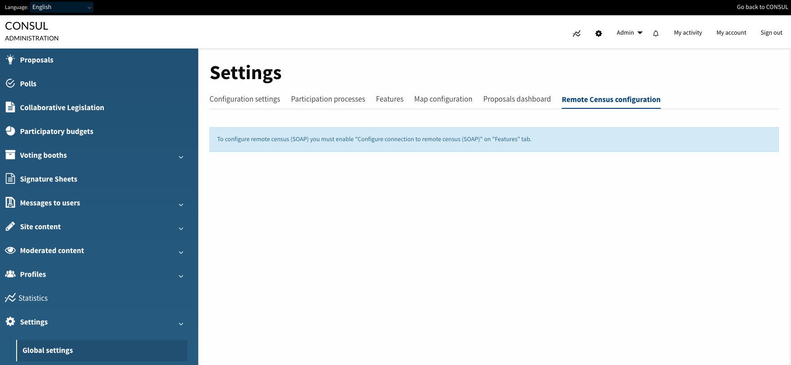

To activate the feature you must follow the instructions of the previous image:
1. Access through the administration panel of your application to the section **Settings > Features** and activate the module **Configure connection to the remote census (SOAP)** as shown below:
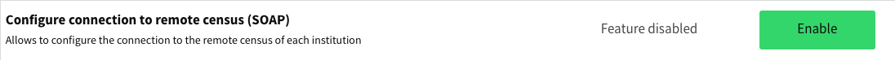

## Configuration
Once the feature is activated, we can access the section **Settings > Global Settings** and click on the tab **Remote Census Configuration**.
In this screen you will be able to fill in all the necessary information to be able to configure the connection with the Census of each Town Hall.

The information to be filled in is divided into three sections:

1. **General Information**
  - **Endpoint**: Host name where the census service is available (wsdl).

    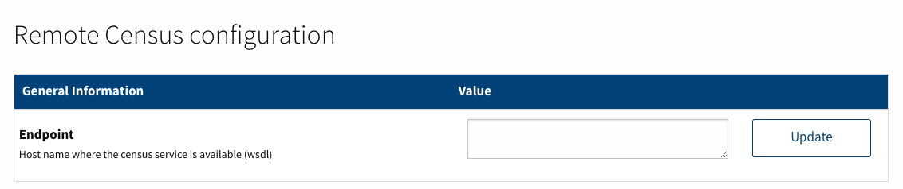

1. **Request Data**

  In this section we will fill in all the necessary fields to be able to make a request to verify a user through the Census of the City council.

  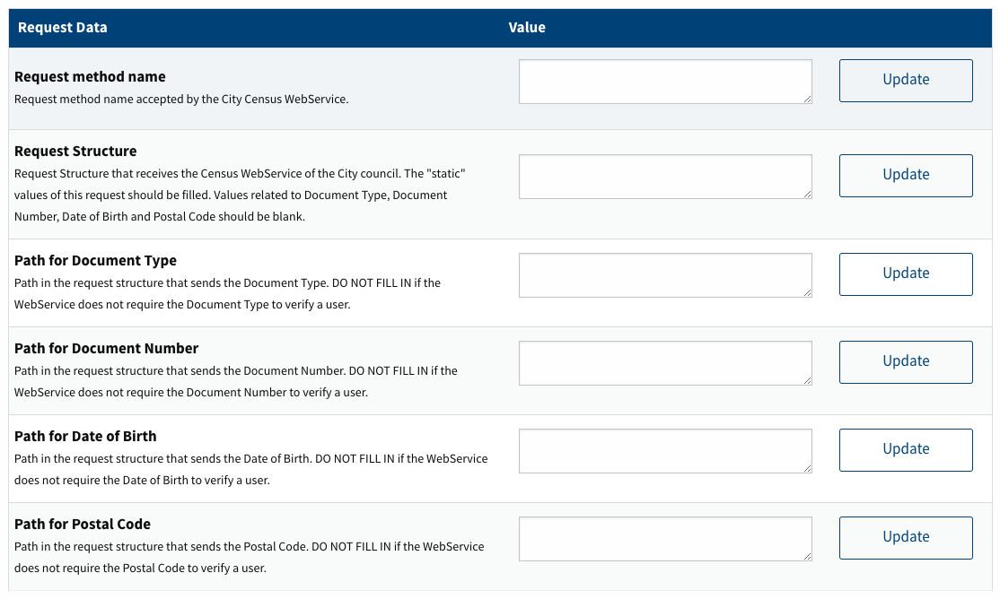

  To help you understand how to fill in each of the fields, we will rely on a supposed WebService that receives a method called  `:get_habita_datos` with the following structure:
  ```
  {
    request: {
      codigo_institucion: 12,        # Static Value
      codigo_portal:      5,         # Static Value
      codigo_usuario:     10,        # Static Value
      documento:          12345678Z, # Dynamic value related to Document Number
      tipo_documento:     1,         # Dynamic value related to Document Type
      nivel:              3          # Static Value
    }
  }
  ```

  Required fields for the request:
  - **Request method name**: Request method name accepted by the City Census WebService.

    Example:
    
  - **Request Structure**: Structure of the request received by the WebService of the Census of the City Council. The "static" values of this request should be reported. The "dynamic" values related to Document Type, Document Number, Date of Birth and Postal Code should be filled with null value.

    Example:
    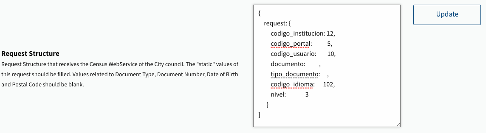
    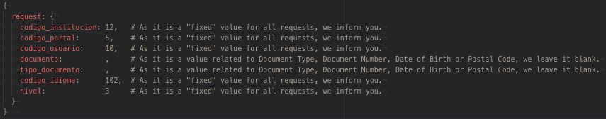
  - **Path for document type**: Path in the request structure that sends the Document Type.

    *NOTE: DO NOT FILL IN if the WebService does not require the Document Type to verify a user.*

    Example:
    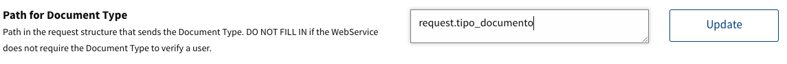
  - **Path for document number**: Path in the request structure that sends the Document Number.

    *NOTE: DO NOT FILL IN if the WebService does not require the Document Number to verify a user.*

    Example:
    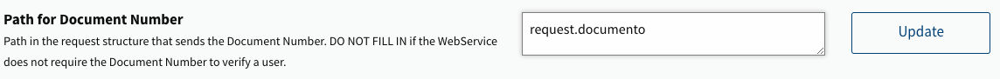
  - **Path for date of birth**: Path in the request structure that sends the Date of Birth.

    *NOTE: DO NOT FILL IN if the WebService does not require the Date of Birth to verify a user.*

    In the case of *Example* we will fill it in blank, since it is not necessary to send the date of birth to verify a user.

    Example:
    
  - **Path for Postal Code**: Path in the request structure that sends the Postal Code.

    *NOTE: DO NOT FILL IN if the WebService does not require the Postal Code to verify a user.*

    En el caso del *Example* lo dejaríamos en blanco, ya que no se necesita enviar el código postal para verificar a un usuario.

    Example:
    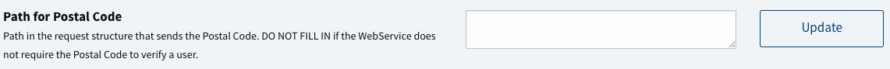

1. **Response data**

  In this section we will configure all the necessary fields to be able to receive the answer of the WebService and to verify a user in the application.

  

  As in the previous section we will define an example answer, to help you understand how to fill in each of the fields in this section.

  ```
      {
        get_habita_datos_response: {
          get_habita_datos_return: {
            datos_habitante: {
              item: {
                fecha_nacimiento_string: "31-12-1980",
                identificador_documento: "12345678Z",
                descripcion_sexo: "Varón",
                nombre: "José",
                apellido1: "García"
              }
            },
            datos_vivienda: {
              item: {
                codigo_postal: "28013",
                codigo_distrito: "01"
              }
            }
          }
        }
      }
  ```

  Required fields to parse the response:
  - **Path for Date of Birth**: In what path of the response is the user's Date of Birth?.

    Example:
    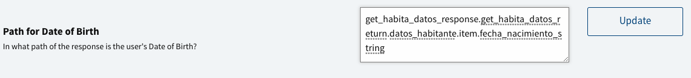
  - **Path for Postal Code**: In what path of the response is the user's Postal Code?.

    Example:
    
  - **Path for District**: In what path of the response is the user's District?.

    Example:
    
  - **Path for Gender**: In what path of response is the user's Gender?.

    Example:
    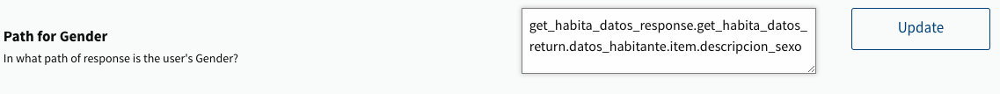
  - **Path for Name**: In what path of the response is the user's Name?.

    Example:
    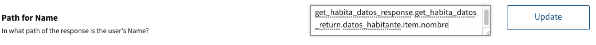
  - **Path for the Last Name**: In what path of the response is the user's Last Name?.

    Example:
    
  - **Condition for detecting a valid response**: What response path has to come informed to be considered a valid response and user verified.

    Example:
    


  Once the general data, the necessary fields of the request and "all" fields to validate the response have been filled in correctly, the application will be able to verify any user through the defined WebService.
