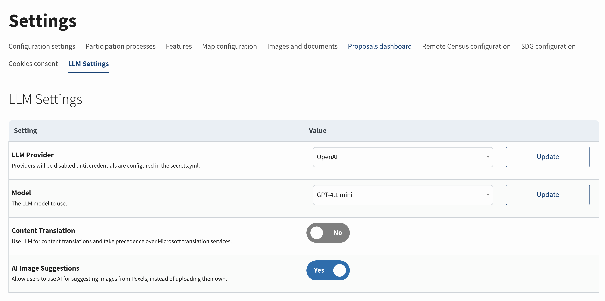
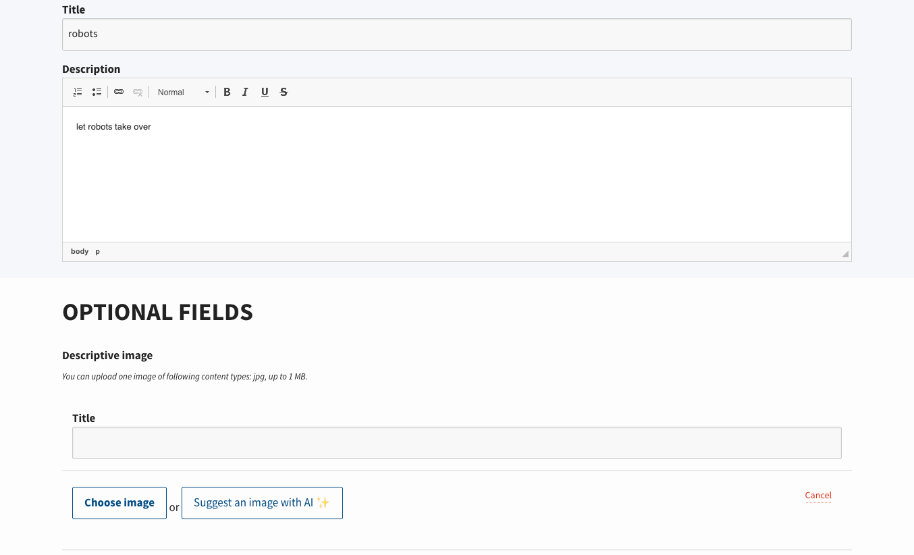
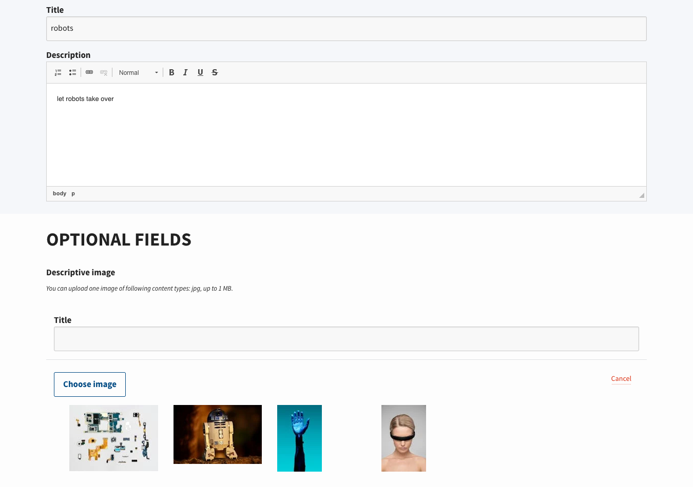
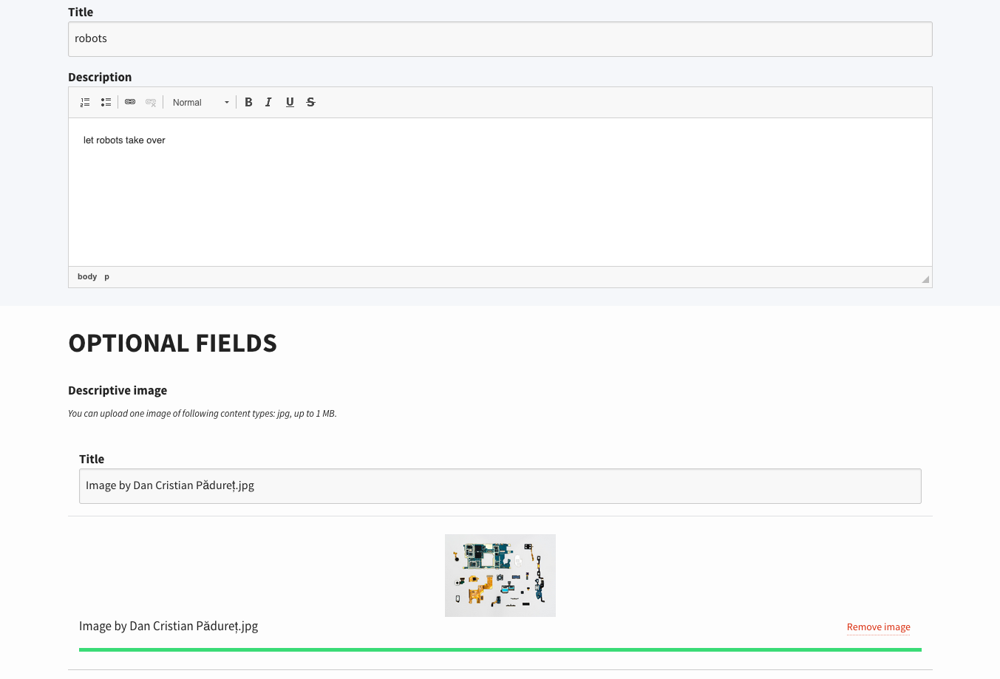

# AI Image Suggestions

## Overview

The AI Image Suggestions feature allows users to get AI-powered image recommendations when creating or editing content in Consul Democracy. Instead of manually searching for and uploading images, users can click a button to receive relevant stock image suggestions from Pexels based on the title and description of their content.

The feature uses a Large Language Model (LLM) to analyze the title and description fields of a resource, extract meaningful concepts, and generate an optimized search query. This query is then used to search the Pexels API for relevant stock images. When a user selects a suggested image, it is downloaded and attached to their content just like a user-uploaded image.

## Prerequisites

To use this feature, you need:

1. **LLM Provider Account**: An account with an LLM provider (OpenAI, Anthropic, DeepSeek, etc.) or a self-hosted Ollama endpoint
2. **Pexels API Key**: A free API key from [Pexels](https://www.pexels.com/api/)

### Getting a Pexels API Key

1. Visit [Pexels API](https://www.pexels.com/api/)
2. Sign up for a free account or log in
3. Navigate to your [API dashboard](https://www.pexels.com/api/new/)
4. Create a new application to get your API key
5. Copy the API key for use in configuration

**Note**: Pexels offers a generous free tier with 200 requests per hour and 20,000 requests per month, which should be sufficient for most use cases.

## Configuration

### Step 1: Configure Secrets

First, you need to set up your LLM provider. For detailed instructions, see the [User content translations](user_content_translations.md) documentation, which covers LLM configuration in detail.

In summary:

1. Add your LLM API key to the `secrets.yml` file in the `apis:` section under `llm:`:

```yml
apis: &apis
  llm:
    # Provide keys for the LLM providers you intend to use.
    openai_api_key: "your-openai-api-key"
    # or
    anthropic_api_key: "your-anthropic-api-key"
    # or other supported providers
```

2. Add Pexels API Key

Add your Pexels API key to the `secrets.yml` file in the `apis:` section:

```yml
apis: &apis
  microsoft_api_key: ""
  census_api_end_point: ""
  # ... other API configurations ...
  pexels_access_key: "your-pexels-api-key"
  llm: *llm
```

**For multitenancy setups**: You can override the Pexels API key for specific tenants:

```yml
tenants:
  my_tenant_subdomain:
    pexels_access_key: "tenant-specific-pexels-key"
```

### Step 2: Configure the Image Suggestion Prompt (Optional)

You can customize the prompt used to generate image search queries by editing `config/llm_prompts.yml`:

```yml
image_suggestion_prompt: |
  <task>Produce an image search query</task>
  <goal>A short and concise image search query, for finding best suited images for the input text</goal>
  <instructions>Analyze given title and description of a resource, translate sentences to english, extract the meaningful concepts and produce a search query string in english language.</instructions>
  <title>%{title}</title>
  <description>%{description}</description>
  <output>Reply ONLY with a single string.</output>
```

The prompt uses `%{title}` and `%{description}` placeholders that will be replaced with the actual content from the resource being created or edited.

### Step 3: Enable the Feature

Once you have configured both the LLM provider and the Pexels API key:

1. Navigate to **Admin > Global Settings > LLM Settings**
2. Enable the **AI Image Suggestions** feature toggle
3. The feature will be enabled if:
   - LLM provider is configured
   - LLM model is selected
   - Pexels API key is present in secrets



## How It Works

### User Experience

When creating or editing content (proposals, budget investments, debates, etc.) that supports images:

1. **User fills in title and description**: The feature requires both title and description fields to be filled in order to generate meaningful image suggestions.

2. **User clicks "Suggest an image with AI ✨"**: A button appears next to the image upload field (only when no image is currently attached).

   

3. **System generates suggestions**:
   - The LLM analyzes the title and description
   - Extracts key concepts and generates a search query
   - Searches Pexels API with the generated query
   - Returns up to 4 relevant image suggestions

4. **User views suggestions**: A grid of suggested images appears below the upload button.

   

5. **User selects an image**: Clicking on a suggested image:
   - Downloads the image from Pexels
   - Attaches it to the form as if it were user-uploaded
   - Replaces the upload interface with the selected image preview

   

### Technical Flow

1. **Frontend**: User clicks the suggestion button, which sends an AJAX request with the form data (title, description, resource type, etc.)

2. **Backend Processing**:
   - `ImageSuggestionsController#create` receives the request
   - Creates a model instance with the provided attributes
   - Calls `ImageSuggestions::Llm::Client` to generate a search query
   - The LLM client:
     - Validates LLM configuration
     - Validates that title and/or description are present
     - Sends the prompt to the LLM with title and description
     - Receives a search query string
     - Searches Pexels API with the query
     - Returns up to 4 image results

3. **Image Attachment**:
   - When user clicks a suggested image, `ImageSuggestionsController#attach` is called
   - Downloads the full-resolution image from Pexels
   - Creates an `ActionDispatch::Http::UploadedFile` from the downloaded image
   - Uses the existing `DirectUpload` system to attach the image
   - Returns JSON with attachment details for frontend processing

## Supported Resources

The image suggestions feature works with any resource that:

- Has `title` and `description` attributes (or responds to these methods)
- Supports image attachments through the standard image attachment system
- Uses the `Images::NestedComponent`

Currently, this is only implemented on with Budget Investments feature!

## Customization

### Styling

The suggested images grid uses CSS classes that can be customized:

- `.suggested-images-container`: Container for all suggested images
- `.js-attach-suggested-image`: Individual image button
- `.suggested-image`: The image element itself

Styles are defined in `app/assets/stylesheets/mixins/uploads.scss`.

## Pricing Considerations

### LLM Costs

Image suggestion queries are relatively short (typically 10-50 tokens), so costs are minimal. Each suggestion request:

- Input: ~50-100 tokens (title + description + prompt)
- Output: ~5-15 tokens (search query)

### Pexels Costs

Pexels offers a free tier that should be sufficient for most installations:

- 200 requests per hour
- 20,000 requests per month

For higher usage, Pexels offers paid plans. See [Pexels API pricing](https://www.pexels.com/api/pricing/) for details.

## Troubleshooting

### Feature button doesn't appear

- Check that LLM provider and model are configured in **Admin > Global Settings > LLM Settings**
- Verify that Image suggestions setting is enabled
- Ensure Pexels API key is present in `secrets.yml`
- Check browser console for JavaScript errors

### No images are suggested

- Pexels might be missing stock photos for certain terms.
- Check that LLM is responding correctly (check application logs)
- Verify Pexels API key is valid and has remaining quota
