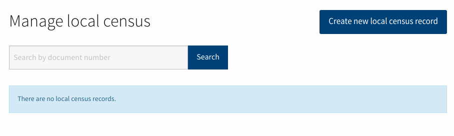

# Local Census

To provide to administrator users a way to manage the local census database through the administration panel **Settings > Manage local census**. Currently the only way to manipulate this table records is through the rails console.

Allow administrators users to manage this table in two different ways:

- **Manually**: one by one through a CRUD interface.
- **Automatically**: through an importation process.

## Manually
Provide a way to manage local census records to administrator users through administration interface.

- Local Census Page

- Add new record

Features:

1. Search by document_number: As local_census_records could contain a lot of records we have added a search feature to allow administrators to find existing records by document_number.
1. Avoid the introduction of duplicated records: A model validation has been added to the following attributes pair [:document_number, :document_type]

## Automatically
Allow administrator users to import local census records though CSV file.

- Local Census Page

- Import CSV

