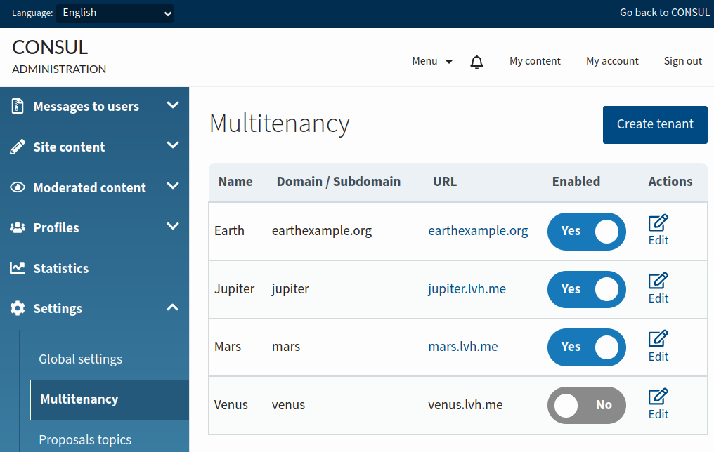
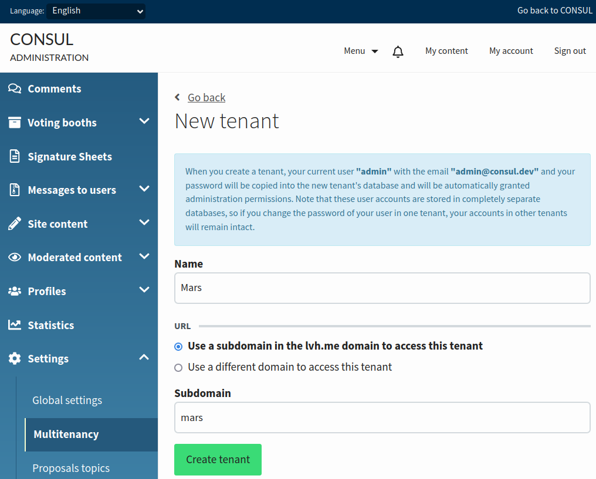
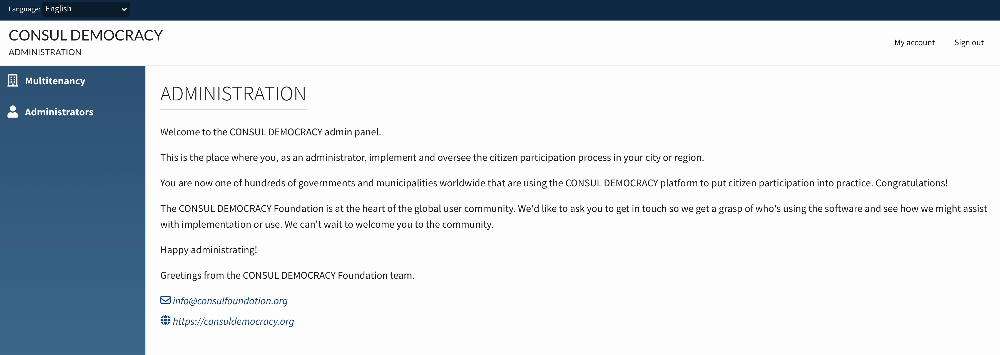
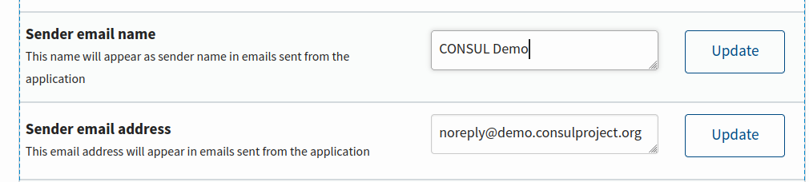
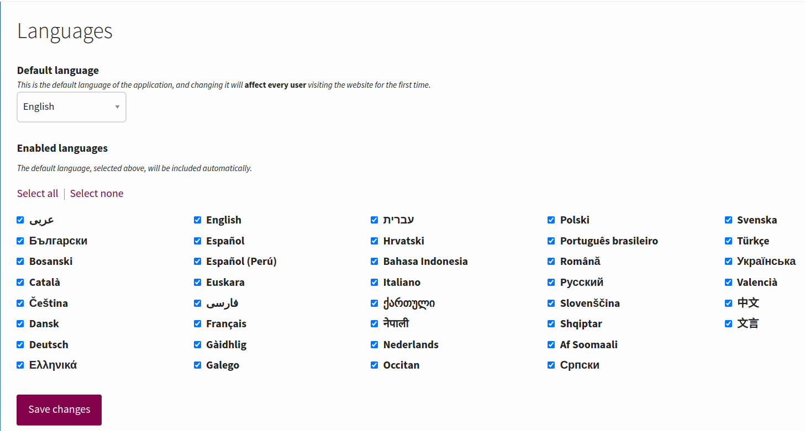

# Multitenancy

## What's multitenancy and how does it work

The multitenancy feature allows managing several independent institutions ("tenants") using the same application. For example, in our case, a user who signs up for a certain tenant will only be able to sign in on that tenant, and that user's data won't be available from any other tenant.

Which tenant we're accessing depends on the URL we're using in the browser to access the application. In Consul Democracy, the current tenant is established by the subdomain used in this URL. For example, if we used the domain `solarsystemexample.org` to manage the planets in the Solar System, using the URL `https://mercury.solarsystemexample.org` we'd access data from the planet Mercury, while using the URL `https://venus.solarsystemexample.org` we'd access data from the planet Venus. It's also possible to use different domains per tenant (for example, `earthexample.org`).

## Enabling multitenancy

### Preliminary steps after upgrading from Consul Democracy version 1.5.0

If you're upgrading a Consul Democracy installation to version 2.0.0 from version 1.5.0, you'll have to follow these steps before enabling multitenancy. These steps aren't necessary on Consul Democracy installations that used version 2.0.0 or later as their initial version.

First, after deploying version 2.0.0 to your production server, execute the release tasks:

```bash
RAILS_ENV=production bin/rails consul:execute_release_tasks
```

After running this command, you might get the following warning:

> The database search path has been updated. Restart the application to apply the changes.

If that's the case, restart the application. If not, make sure the `config/database.yml` file contains the line `schema_search_path: "public,shared_extensions"` and, if that's not the case, add it for example below the line saying `adapter: postgresql` and restart the application.

Next, open a database console with a user having permission to create and manage database extensions:

```bash
sudo -u postgres psql -d consul_production
```

If you didn't use the [installer](https://github.com/consuldemocracy/installer/) to install Consul Democracy, you might need to execute a couple of queries to make sure the Rails database user has permission to create schemas and the shared extensions schema has the right permissions:

```sql
CREATE SCHEMA shared_extensions AUTHORIZATION <replace_with_rails_database_username>;
GRANT CREATE ON DATABASE consul_production TO <replace_with_rails_database_username>;
GRANT usage ON SCHEMA shared_extensions TO public;
```

Whether or not you installed Consul Democracy with the installer, run:

```sql
ALTER EXTENSION pg_trgm SET SCHEMA shared_extensions;
ALTER EXTENSION unaccent SET SCHEMA shared_extensions;
```

### Common step for all Consul Democracy installations

There are two possible ways to enable multitenancy:

* Adding `config.multitenancy = true` inside the `class Application < Rails::Application` class in the `config/application_custom.rb` file
* Replacing the line `multitenancy: false` with `multitenancy: true` (or adding it if it isn't already there) in the `config/secrets.yml` file

The difference between these options is that the first one uses a file under version control while the second one uses a file which isn't under version control. Choose the first option if you'd like to have this change in your git repository; otherwise, use the second one.

After enabling this option, restart the application.

## Managing tenants

Once multitenancy has been enabled and the application has been restarted, you'll see a new "Multitenancy" section inside the "Settings" menu in the Consul Democracy admin panel.



This section will only be available from the "main" tenant (the one which is created by default). It will not be possible to add/edit tenants by accessing the admin section of any other tenant.

Since removing a tenant would delete **all** its associated data, making it impossible to restore it, Consul Democracy doesn't allow deleting a tenant using the admin panel. However, it's possible to disable a tenant so it cannot be accessed.

The interface to manage tenants is very simple, needing just a name and a domain or subdomain.



The name will be used to set the default site name for new tenants. Note that, once a tenant is created, changing this name will have no effect. To change the site name of an existing tenant, edit it in the "Global settings" section in the administration of that tenant.

The domain or subdomain will be used to access this tenant. If you've got a domain like `solarsystemexample.org` and would like to access tenants using subdomains (like `mars.solarsystemexample.org`), choose "Use a subdomain". If you're using a different domain for the tenant (like `marsexample.org`), choose "Use a different domain".

Note that, if you use a different domain for a tenant, you'll have to configure your SSL certificates, web server and DNS so they support that domain and point to your Consul Democracy application.

When adding a new tenant, an admin user **copying the same login data as the administrator creating the tenant** will be automatically created. Note this user is stored in the database schema of the new tenant, so changing their password in one tenant won't change their password in any other tenants.

### Multitenancy management mode

The `multitenancy_management_mode` setting allows using the main tenant solely for managing other tenants and admin users, hiding any other admin panel functionality or public content.

There are two possible ways to enable multitenancy management mode:

* Adding `config.multitenancy_management_mode = true` inside the `class Application < Rails::Application` class in the `config/application_custom.rb` file
* Replacing the line `multitenancy_management_mode: false` with `multitenancy_management_mode: true` (or adding it if it isn't already there) in the `config/secrets.yml` file

We recommend using the same method that has been used to enable the multitenancy functionality in the [Common step for all Consul Democracy installations](#common-step-for-all-consul-democracy-installations) section.

After enabling this option, restart the application and you will see the administration panel as follows:



## Steps to take after adding a tenant

### SSL certificates

In order to make it possible to access the application using secure HTTPS/SSL connections, you'll need a valid SSL certificate for the tenant you've just added. Since every institution using Consul Democracy has a different system to manage these certificates, getting a valid SSL certificate for the new tenant will need a different process depending on the way your institution manages these certificates.

If you've installed Consul Democracy using the installer and are using Certbot to manage these certificates, you have two options.

One option would be adding each certificate manually every time you create a tenant. For example, in order to add a tenant using the `mars` subdomain in the `solarsystemexample.org` domain, run:

```bash
sudo certbot certonly --nginx --noninteractive --agree-tos --expand -d solarsystemexample.org,mars.solarsystemexample.org
```

If you're going to add many subdomains at different times, this task can be tedious. Another option is enabling any subdomain. In order to achieve this goal, you need access to your DNS configuration in order to follow the instructions you'll get by either using one of the [Certbot DNS plugins](https://eff-certbot.readthedocs.io/en/stable/using.html#dns-plugins) or the [manual generation of the certificate](https://eff-certbot.readthedocs.io/en/stable/using.html#manual) with the following command:

```bash
sudo certbot certonly --manual --agree-tos --expand -d solarsystemexample.org,*.solarsystemexample.org
```

You'll be asked to create a DNS TXT record with the subdomain `_acme-challenge` on your domain, with a certain value. You might also be asked to create a file with a certain name containing a certain content (usually in a `.well-known/acme-challenge` folder); if that's the case, assuming you're using Consul Democracy's default folders, create it in `/home/deploy/consul/current/public/.well-known/acme-challenge/`.

After doing so, update your web server configuration file (by default `/etc/nginx/sites-enabled/default`) so it uses the generated certificate, and restart the web server with `sudo systemctl restart nginx`.

### Sending e-mails

In order to reduce the chance your application sends emails which are erroneously identified as spam, you might want to edit the fields "Sender email name" and "Sender email address" in the administration panel of the new tenant. The default values for these fields are the name and subdomain introduced when creating the tenant.



If you'd like to use a different mail configuration for the new tenant, like one for a hypothetical `jupiter` subdomain, edit the `config/secrets.yml` file this way:

```yaml
production:
  # (...) Other secrets
  multitenancy: true
  tenants:
    jupiter:
      mailer_delivery_method: :smtp
      smtp_settings:
        :address: <mail_server>
        :port: <port>
        :domain: <your_domain>
        :user_name: <username>
        :password: <password>
        :authentication: "plain"
        :enable_starttls_auto: true
   # (...) Other secrets
```

After editing this file, restart the application.

### Sign in via social networks

If you've configured applications so users can sign in via Twitter, Google, Facebook or Wordpress, you need to allow the new tenant to access these applications. You have two options.

The first option is changing your existing application using the Twitter/Google/Facebook/Wordpress dashboard and add the new tenant's URL to the list of allowed domains. When doing so, take into account your application's terms and conditions settings, which might not be compatible with this option.

The other option is creating a new Twitter/Google/Facebook/Wordpress application and configuring it so it can be used from the new tenant. In this case, you'll have to add the configuration of this application to the `config/secrets.yml` file. For example, if you've added a tenant using the `saturn` subdomain, edit the file this way, filling in the keys and secrets of the services you're using:

```yaml
production:
  # (...) Other secrets
  multitenancy: true
  tenants:
    saturn:
      twitter_key: <twitter_key>
      twitter_secret: <twitter_secret>
      facebook_key: <facebook_key>
      facebook_secret: <facebook_secret>
      google_oauth2_key: <google_key>
      google_oauth2_secret: <google_secret>
      wordpress_oauth2_key: <wordpress_key>
      wordpress_oauth2_secret: <wordpress_secret>
      wordpress_oauth2_site: <wordpress_site>
   # (...) Other secrets
```

After editing this file, restart the application.

### Enabling different languages for different tenants

In Consul Democracy 2.2.0 or later, it's possible to display the application in different languages for different tenants.

By default, every tenant uses all the languages defined in `config/application.rb`. You can (optionally) overwrite this value by [customizing your application configuration](../customization/application.md). Note that **if you overwrite this value, tenants will only be able to enable the languages you define here**. So, for instance, with this code in the `config/application_custom.rb` file:

```ruby
module Consul
  class Application < Rails::Application
    config.i18n.available_locales = ["de", "en", "es", "fr", "it", "ru", "zh-CN"]
  end
end
```

After restarting the application, tenants will be able to choose which language is the default and which ones are enabled among German, English, Spanish, French, Italian, Russian and Simplified Chinese. However, they'll no longer be able to enable any other language.

To define the default and the enabled languages for a tenant, go the administration area of that tenant. Then, on the side navigation menu, click on "Settings" and then click on "Languages". Note that **this section is not present if you only have one language in `available_locales`**.

On this page you'll find a form to choose the default and the enabled languages for this tenant (note: this form changes slightly when only a few languages are available):



Choose the ones you'd like, save the changes, and the language selector at the top of the web will be updated immediately.

## Information to take into account during development

### Maintenance of the schema.rb file

When Consul Democracy creates a tenant, it loads the content of the `db/schema.rb` file to create a new database schema for the new tenant. This means that if for some reason this file doesn't contain the same database structure you'd get by creating a new database and running the migrations with `rake db:migrate`, you could end up with different database tables or columns on different tenants. This could result in a disastrous situation.

In order to avoid it, we recommend checking the integrity of the `db/schema.rb` file in your continuous integration system. If you're doing continuous integration using GitHub Actions, you can use the workflow already included in Consul Democracy. Pull requests adding this check on GitLab CI or other continuous integration environments are welcome.

### Using custom styles for a tenant with CSS

When the multitenancy feature is enabled, Consul Democracy adds a class to the `<html>` element, making it possible to apply styles (or JavaScript events) to just a specific tenant. For example, the tenant with the `uranus` subdomain would have the `tenant-uranus` class.

This way, it'll be possible to overwrite the default styles for just this tenant by creating a new stylesheet in the `app/assets/stylesheets/custom/` folder:

```css
.tenant-uranus {
  // Styles that will only be applied to the Uranus tenant
}
```

To easily change the default colors on a specific tenant, you can use CSS variables; their usage is documented in the [app/assets/stylesheets/custom/tenants.scss](https://github.com/consuldemocracy/consuldemocracy/blob/master/app/assets/stylesheets/custom/tenants.scss) file. For example, to make the brand colors green on the tenant with the `uranus` subdomain, write:

```css
.tenant-uranus {
  --brand: #350;
  --brand-secondary: #173a00;
}
```

### Using different custom ERB views for a tenant

Sometimes it might be convenient to use completely different views for different tenants. For example, a certain tenant might use a footer that has nothing to do with the default one.

In these cases, instead of adding conditions like `case Tenant.current_schema` to the view, using a different file might result in code easier to maintain.

For this purpose, we can use [Rails variants](https://guides.rubyonrails.org/layouts_and_rendering.html#the-variants-option), which means that, for example, a tenant named `milky-way` will use a view file ending with `.html+milky-way.erb` if it's available. That is, in order to use a different `application.html.erb` layout for the `milky-way` tenant, add a new file under `app/views/custom/layouts/application.html+milky-way.erb`.

We recommend only using this feature when there are substantial differences between the default view and the specific view for a tenant. If the differences are small, use `if` or `case` conditions instead in order to avoid code duplication.

The same principle works for components too, but in this case, when using the `custom/` folder to add ERB files for a tenant, the default tenant ERB file needs to be added to the `custom/` folder as well; if there aren't changes to this file, a symbolic link will do.

For example, if you're writing a custom `admin/action_component` component view for the `milky-way` tenant but don't need to change this file for the default tenant:

1. Create the `app/components/custom/admin/action_component.rb` file according to the [components customization documentation](../customization/components.md)
1. Create the custom view for the `milky-way` tenant and save it under `app/components/custom/admin/action_component.html+milky-way.erb`
1. Enter the `app/components/custom/admin/` folder and run `ln -s ../../admin/action_component.html.erb`

## Current limitations of multitenancy

The multitenancy feature was first included in Consul Democracy 2.0.0 and there are a few things that are still missing.

### Applications which can be accessed from multiple domains

You might have a Consul Democracy application which can be accessed from two different domains; for example, `solarsystemexample.org` and a domain in Spanish named `ejemplodesistemasolar.org`.

In this case, the source code needs to be changed a little so multitenancy works with both domains. In particular, the `allowed_domains` method in the `Tenant` class needs to be changed in order to include both domains. See the [models customization documentation](../customization/models.md) for examples on how to customize methods like this one.

### Custom images per tenant

The administration panel in Consul Democracy contains a "Custom images" section, where you can customize some (but not all) images appearing in the application. Using this interface allows having different images per tenant.

Sometimes it's useful to have a certain image under version control, though. For instance, if we'd like to use a different logo for a tenant with the `neptune` subdomain, we'd put that file under `app/assets/images/custom/tenants/neptune/logo_header.png`.

However, this will only work for images which can already be configured through the administration interface. If you'd like to customize a different image, you'll have to change the code rendering it. For instance, to make it possible to customize the `avatar_admin.png` image, replace the code `image_tag("avatar_admin.png")` with `image_tag(image_path_for("avatar_admin.png"))`.

### Databases on different servers for different tenants

In Consul Democracy 2.0.0, data from all tenants is stored in the same database and so it isn't possible to use several databases on different servers.

If this feature is requested often, it'll be possible to include it in Consul Democracy in the future, since Rails 6.1 and Rails 7.0 added better support for it.

### Deleting tenants

Since removing a tenant would delete **all** its associated data, making it impossible to restore it, Consul Democracy doesn't allow deleting tenants using the admin panel and only allows disabling them so they cannot be accessed. To completely delete a tenant, use the Rails console.
