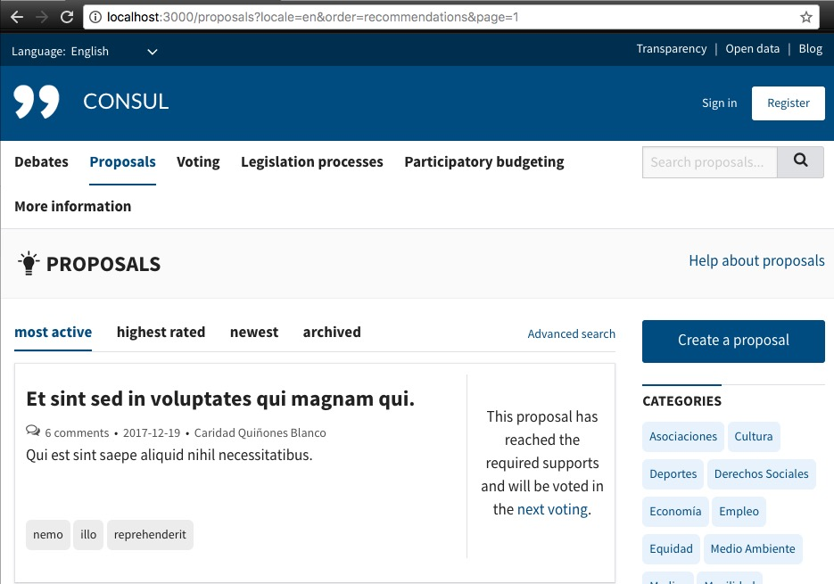
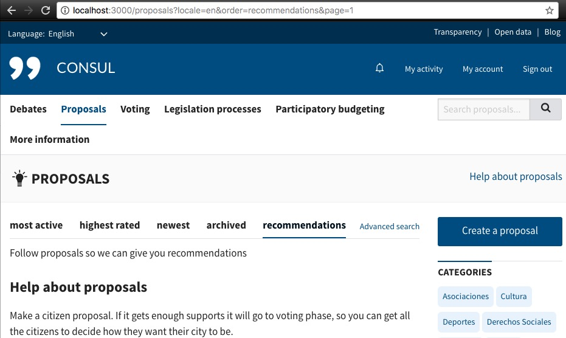
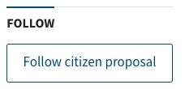
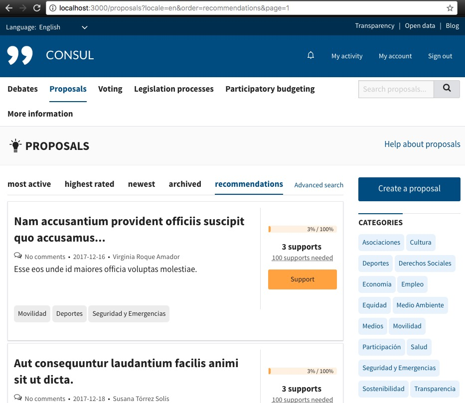

# Debates & Proposals Recommendations

Logged in users can see recommended Debates or Proposals listed with the ordering option "recommendations".

The list shows, ordered by votes descending, those elements that:

1. Have tags that interests the user. Being those tags the ones on the proposals that the user follows.
2. The user isn't the author.
3. In the case of proposals: only those that haven't reached the required threshold of votes, hiding as well those that the user is already following.

## How to try it

In our local installation, if we haven't logged in, we can check at http://localhost:3000/proposals that the "recommendations" ordering isn't present:

Once we log in we see the menu, but because we don't aren't following any proposals we get the message "Follow proposals so we can give you recommendations" at http://localhost:3000/proposals?locale=en&order=recommendations&page=1

After following any proposal with the "Follow citizen proposal" on the side menu:

We can finally see some recommendations:

The feature works the same for debates
