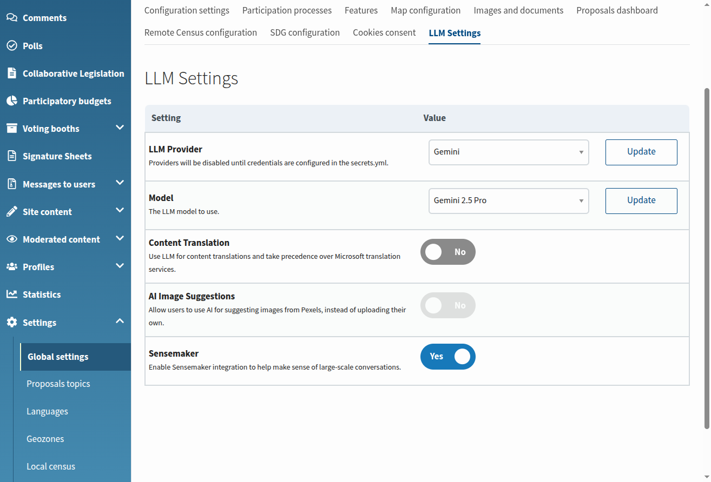
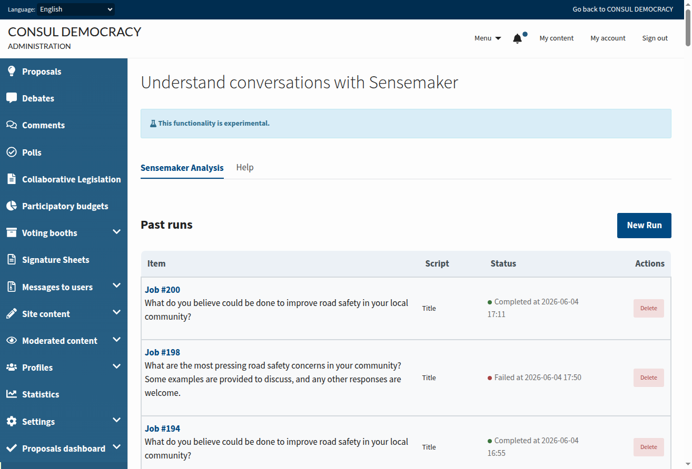
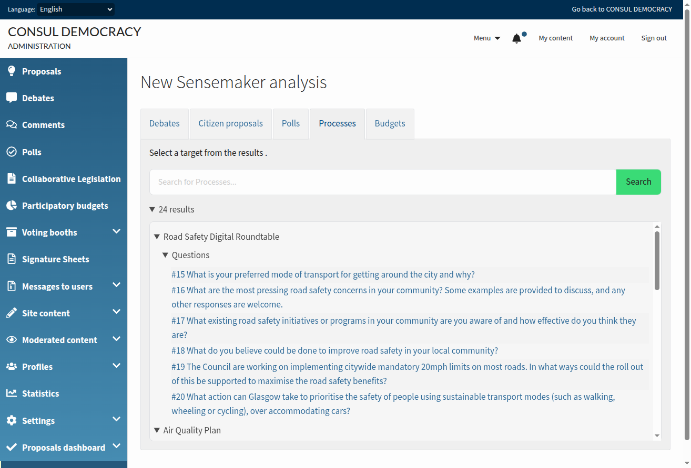
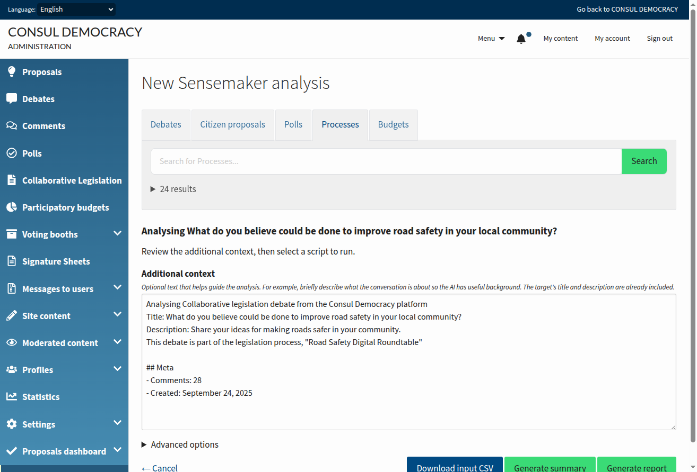
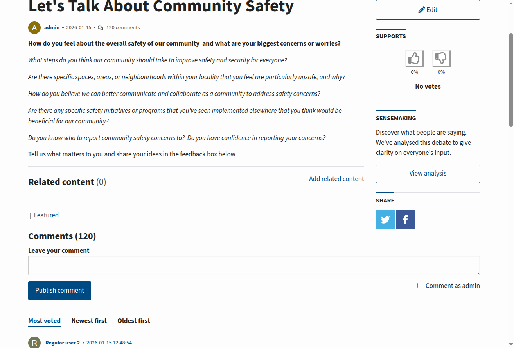
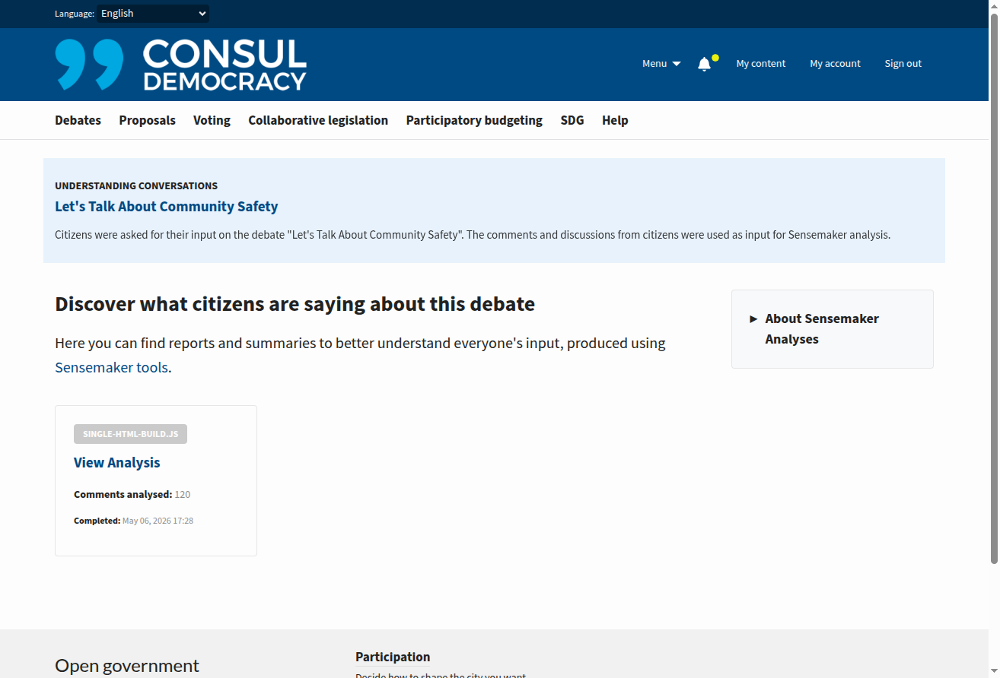
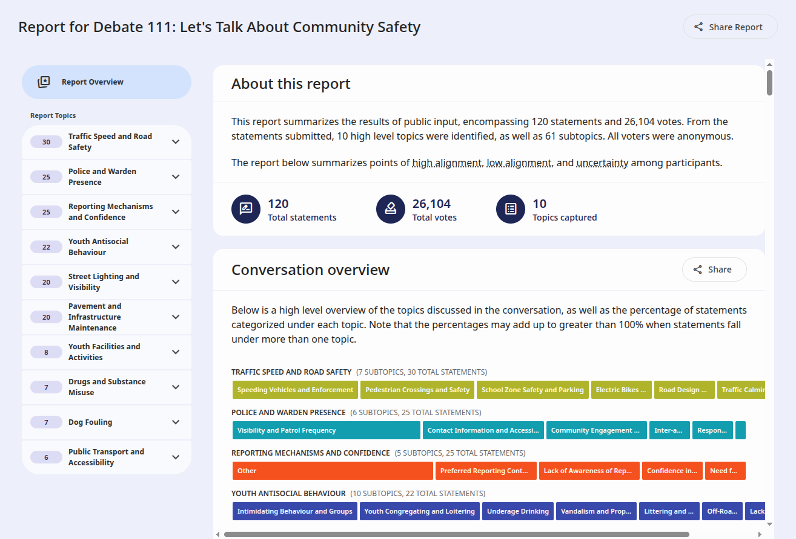

# Sensemaker

## Overview

Sensemaker helps administrators make sense of large-scale citizen conversations in Consul Democracy. It uses Large Language Models (LLMs) to analyse comments and discussions associated with participation resources—such as debates, proposals, polls, legislation processes, and participatory budgets—and produces summaries and HTML reports that can be published for citizens.

Administrators run analyses from the admin area, review job output, and choose which results to publish. When published, citizens see a **View analysis** link on the relevant resource pages and can browse reports and summaries produced with [Sensemaking Tools](https://jigsaw-code.github.io/sensemaking-tools/).

Sensemaker is an experimental feature. The target resource's title and description are included as context for the analysis, and administrators can add optional additional context before running a job.

## Prerequisites

To use this feature, you need:

1. **LLM provider account**: An account with a supported LLM provider (OpenAI, OpenRouter, Mistral, Vertex AI, etc.) or a self-hosted Ollama endpoint
2. **Writable data directory**: A folder on disk for Sensemaker input and output files
3. **Background job worker**: When `delay_jobs` is enabled (typical in production), a worker must process the `sensemaker` Delayed Job queue

## Configuration

### Step 1: Install Node dependencies

The required packages are already listed in `package.json`:

```json
"@cosla/sensemaking-tools": "^1.1.4",
"@cosla/sensemaking-report-ui": "^0.1.1"
```

Run `npm install` from the application root. On deploy, ensure this runs as part of your existing build or asset pipeline so packages are available under `node_modules/@cosla/`.

### Step 2: Configure secrets

#### LLM credentials

Configure your LLM provider in `secrets.yml`. For detailed instructions, see the [User content translations](user_content_translations.md) documentation, which covers LLM configuration in detail.

In summary, add API keys under `apis.llm`:

```yml
llm: &llm
  # Provide keys for the LLM providers you intend to use.
  # Consult RubyLLM configuration for all supported providers and use the same key names here.
  openai_api_key: "your-openai-api-key"
  # or other supported providers

apis: &apis
  microsoft_api_key: ""
  # ... other API configurations ...
  llm: *llm
```

For **Vertex AI**, also set `vertexai_project_id` and optionally `vertexai_location` under `llm:`, and configure `google_application_credentials` under `apis:` if using a service account key file.

#### Sensemaker data folder

Add the Sensemaker data folder at the **top level** of `secrets.yml` (not under `apis:`):

```yml
sensemaker: &sensemaker
  sensemaker_data_folder: "vendor/sensemaking-tools/data"
```

Merge it into each environment section (as in `config/secrets.yml.example`):

```yml
production:
  <<: *maps
  <<: *apis
  <<: *sensemaker
```

The path is relative to the Rails application root. Sensemaker jobs read and write CSV, JSON, and HTML artefacts in this directory.

### Step 3: Prepare the data directory

Create the directory configured in `sensemaker_data_folder` and ensure the application user can write to it:

```bash
mkdir -p vendor/sensemaking-tools/data
```

### Step 4: Configure LLM provider and model

1. Navigate to **Admin > Global Settings > LLM Settings**
2. Select an **LLM Provider** (providers remain disabled in the dropdown until credentials are configured in `secrets.yml`)
3. Select an **LLM Model**

### Step 5: Enable Sensemaker

On the same **LLM Settings** tab:

1. Enable the **Sensemaker** toggle

The toggle is only available when:

- An LLM provider and model are configured
- `sensemaker_data_folder` is set in secrets

**Note for upgraded installations**: If the toggle or settings page reports a missing setting, run:

```bash
bundle exec rake settings:add_new_settings
```



### Step 6: Verify installation

1. Open **Admin > Sensemaker** (the menu entry appears when Sensemaker is enabled)
2. Click **New Run**
3. Open **Advanced options** and select **Perform health check**
4. Run the job and confirm it completes without errors on the jobs list or job detail page

If the health check fails, inspect the job's error message on the job detail page (see [Troubleshooting](#troubleshooting)).

## How It Works

### Admin workflow

1. Go to **Admin > Sensemaker** and open the **Sensemaker Analysis** tab to see running and past jobs.

   

2. Click **New Run** and search for a target resource (debate, proposal, poll, legislation item, budget, etc.).

   

3. Review the **additional context** field (the target's title and description are pre-filled where available) and add optional guidance for the analysis.

4. Choose how to run the analysis: use **Generate summary** to run the summarisation script, **Generate report** to run the full report pipeline and produce an HTML report (this automatically runs prerequisite categorisation and advanced analysis jobs when needed), or **Advanced options** to choose any script manually (health check, categorise, summarise, analyse, or report).

   

5. When a job completes successfully, use **Publish** to make summaries and reports visible to citizens. Only completed jobs with output files can be published. Use **Unpublish** to hide them again.

Only **Summarise** and **Report** jobs can be published. Health check, categorise, and analyse jobs are for setup, diagnostics, and intermediate pipeline steps—they remain visible in the admin area only.

Available scripts:

| Script | Purpose | Publishable |
|--------|---------|-------------|
| Perform health check | Verify Sensemaker dependencies and LLM connectivity | No |
| Categorise | Categorise comments into topics and subtopics | No |
| Summarise | Generate a summary of the conversation | Yes |
| Analyse | Analyse the conversation with statistics | No |
| Report | Analyse and generate a report in HTML format | Yes |

### Public workflow

When Sensemaker is enabled and an administrator has **published** at least one summary or report for a resource:

1. Citizens see a **View analysis** link on the resource page (debates, proposals, polls, legislation, budgets, etc.).

   

2. The link opens a public index of published analyses for that resource.

   

3. Citizens can open HTML reports or summaries from the index.

   

#### Public routing patterns

Most resources use the standard Sensemaker jobs index:

| Pattern | Example URL | Used for |
|---------|-------------|----------|
| Standard | `/sensemaker/debates/123/jobs` | Debates, individual proposals, polls, legislation questions and proposals, etc. |
| All proposals | `/sensemaker/proposals/jobs` | Site-wide analyses where the target is all proposals (`analysable_id` is nil) |
| Budget | `/budgets/123/sensemaking` | Participatory budgets (and budget group analyses aggregated on the budget page) |

The **all proposals** route is separate from the per-proposal URL. Its index lists only aggregate proposal jobs and has no parent resource in the breadcrumb.

**Participatory budgets** also require administrators to enable **Show sensemaker analyses** on the budget (alongside results and stats settings), and the budget must be in a **finished** phase before citizens can open the sensemaking page.

### Technical flow

1. **Input**: Comments and related text are exported to a CSV file in the configured data folder (`Sensemaker::CsvExporter`).
2. **Queue**: The job is enqueued on the `sensemaker` Delayed Job queue (`Sensemaker::JobRunner`).
3. **Processing**: The runner invokes `npx ts-node` for pipeline scripts or `npx sensemaking-report-ui` for HTML reports. LLM provider, model, and credentials are passed from admin LLM settings via `Sensemaker::RuntimeConfig`.
4. **Output**: Result files are written to the data folder and recorded on the `Sensemaker::Job` record.
5. **Publish**: An administrator publishes the job; `Sensemaker::ReportLinkComponent` then shows the public link when a published job exists for the resource.

## Supported Resources

### Admin analysis targets

Administrators can analyse:

- Debates
- Proposals (including **all proposals** as a single target)
- Polls and poll questions
- Legislation processes, questions, proposals, and question options
- Participatory budgets and budget groups

### Public "View analysis" links

The link is currently shown on:

- Debate show pages
- Proposal show and index pages (including all-proposals analyses)
- Poll headers
- Legislation process, question, and proposal pages
- Participatory budget investment pages (when budget sensemaking is enabled and published jobs exist)

## Troubleshooting

### Sensemaker menu is missing

- Confirm an LLM provider and model are configured under **Admin > Global Settings > LLM Settings**
- Enable the **Sensemaker** toggle on the same tab
- Both are required for `Sensemaker.enabled?` to return true

### Sensemaker toggle is disabled on LLM Settings

- Set `sensemaker_data_folder` in `secrets.yml`
- Configure LLM credentials so a provider and model can be selected

### Job error: "Sensemaker data folder not configured"

- Add `sensemaker_data_folder` to `secrets.yml`
- Create the directory and ensure the app user can write to it

### Job error: "Node.js not found" or "NPX not found"

- Install Node.js on the server
- Ensure the background job worker has `node` and `npx` on its `PATH`

### Job error: package folder not found

- Run `npm install` from the application root
- Confirm `@cosla/sensemaking-tools` and `@cosla/sensemaking-report-ui` are in `package.json`

### Job error: unsupported LLM provider or missing API key

- Use a supported provider: OpenAI, OpenRouter, Mistral, Vertex AI, or Ollama
- Add the corresponding `llm.{provider}_api_key` in `secrets.yml`
- For Vertex AI, set `vertexai_project_id` (and optionally `vertexai_location`)

### Jobs stay in "Running" status

- Ensure a Delayed Job worker is running and processing the `sensemaker` queue when `delay_jobs` is enabled

### Public "View analysis" link does not appear

- Confirm Sensemaker is enabled globally
- Confirm the job completed successfully and was **published**
- For participatory budgets, also enable **Show sensemaker analyses** on the budget and ensure the budget is finished

### Setting not found on LLM Settings tab

Run `bundle exec rake settings:add_new_settings` to add the `llm.use_sensemaker` setting row.
