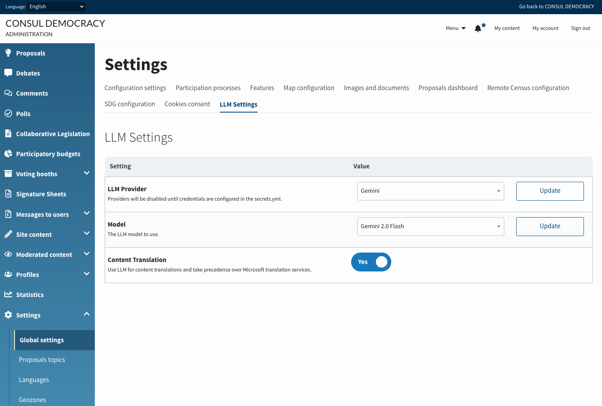
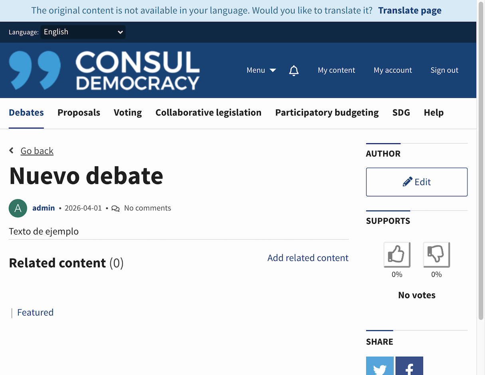
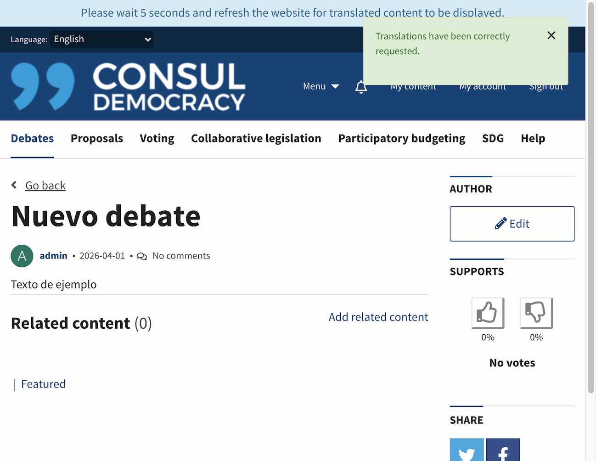
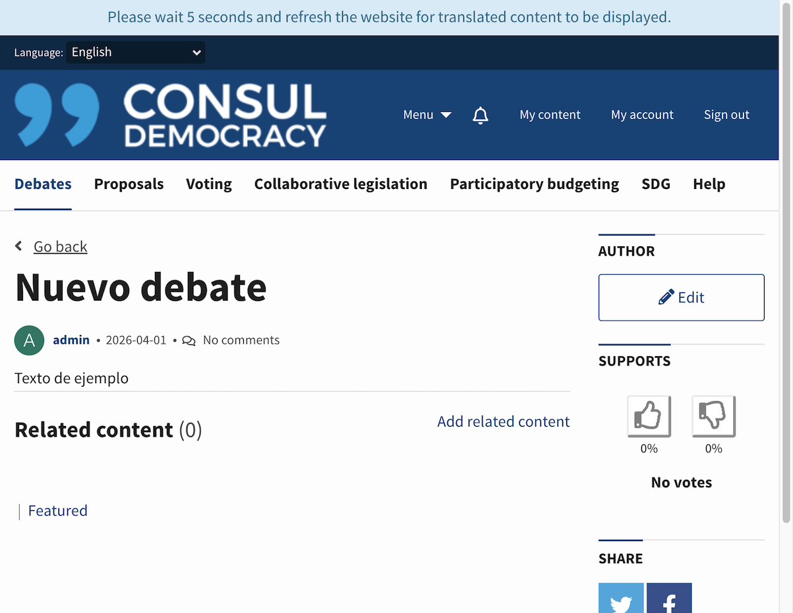
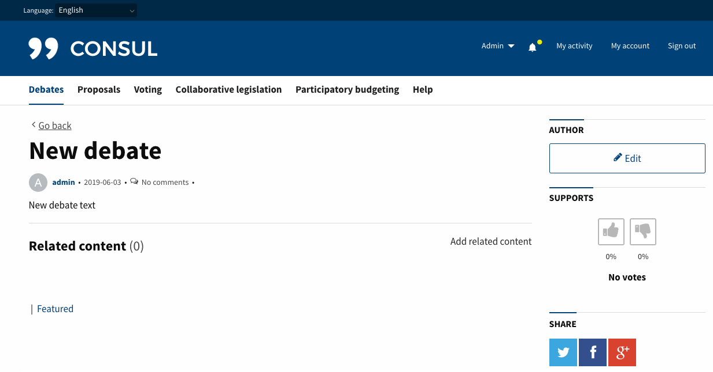
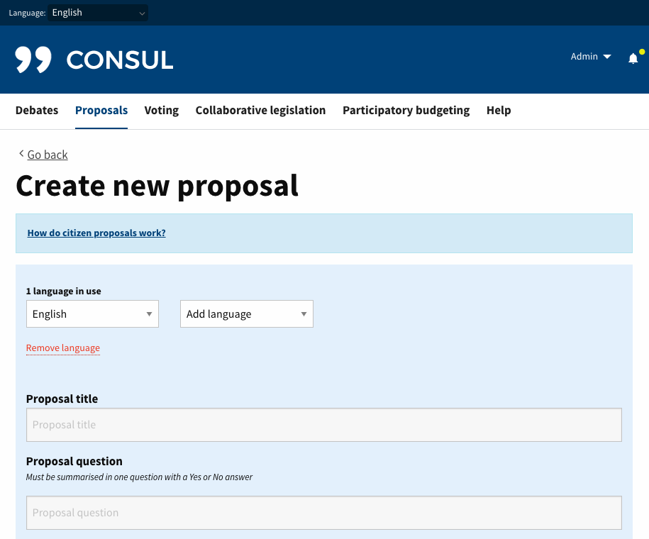
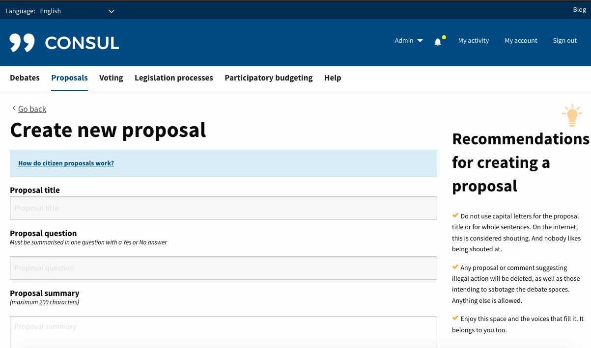

# Translations of user content

## Remote translations on demand by the user

The aim of this service is to be able to offer all the dynamic contents of the application (proposals, debates, budget investments and comments) in different languages automatically.

When a user visits a page with a language where there is untranslated content, they will have a button to request the translation of all the content. This content will be sent to an automatic translator and as soon as the response is obtained, all these translations will be available to any user.

Content translation is powered by a Large Language Model (LLM) provider of your choice.

### Using LLM Translation

#### Getting started

In order to use this functionality, the following steps are necessary:

1. Create an account with your LLM provider of choice (OpenAI, Anthropic, ...), or set up a self-hosted Ollama LLM endpoint.
2. Obtain an authentication / API key for the service. This step differs for each provider, so you will have to look it up yourself.

#### Configuration

To enable the translation service in your application you must complete the following steps:

##### Add api key in the application's credentials

Once your LLM API credentials are available, you have to configure your application secrets by using the section `apis:` and subsection `llm:` of the `secrets.yml` file, with the key `{provider}_api_key` as follows:

* Add a `llm:` subsection into the `apis:` subsection:

```yml
apis: &apis
  llm:
    # Provide keys for the LLM providers you intend to use.
    # consult RubyLLM https://rubyllm.com/configuration#global-configuration-rubyllmconfigure configuration for all supported providers and use the same key names here.
    deepseek_api_key: "1234567890"
```

##### Configuring LLM provider, model

Boot up your application, then navigate to Admin > Global Settings and choose LLM Settings tab. Your provider and the model to use for translations can be selected here.



If you have configured LLM credentials in `secrets.yml` file, but that provider is still disabled on the dropdown list, you are missing some [required fields for your provider](https://rubyllm.com/configuration#global-configuration-rubyllmconfigure).

##### Configuring LLM prompt

Use `config/llm_prompts.yml` and edit `remote_translation_prompt` to set up your own translation prompt. Ensure that the prompt returns the resulting translation as it's expected to be viewed by the end user.

#### Pricing

Different LLM providers use different pricing strategies, but they are almost always based on input and output token usage. We can estimate 1 token = ~4 characters of text. The text to translate, along with translation prompt, will count towards input tokens, and the translated result towards output token count. Following this logic, translating 1 Million characters consumes about ~250k tokens as input and ~250k tokes as an output.

### Use Cases

Once we have the feature set up and enabled, users will now be able to use remote translations in the application.

We attach some screenshots of how the application interacts with our users:

* When a user visits a page in a language without translated content, an informative text will appear at the top of the page next to a button to request the translation. (**Note:** *If a user visits a page with a language not supported by the translation service, no text or translation button will be displayed.*)

  

* Once the user clicks the `Translate page` button, the translations are enqueued and the page is reloaded with a notice (*informing that the translations have been requested correctly*) and an informative text in the header (*explaining when you will be able to see these translations*).

  

* If a user visits a page that does not have translations but its translations have already been requested by another user, the application will not show the translate button but an informative text in the header (*explaining when you will be able to see these translations*).

  

* The translation request, response processing and data saving are processed by background jobs and, as soon as they've finished, the user will be able to read them after refreshing the page.

  

## Translation interface

The aim of this feature is to allow users the introduction of dynamic contents in many languages at the same time. From the administration panel you can enable or disable it. If you disable this feature (default configuration) users will be able to enter one single translation.

### Enabling the feature

To enable this feature you must access from the administration panel to the section **Configuration > Global configuration > Features** and enable the feature called **Translation Interface**.

### Use Cases

Depending on whether we enable or disable the **Translation Interface** feature we will see the forms as follows:

* When the translation interface is active:
  As you can see in the image below, the translation interface has two selectors, the first one "Select language" is to switch between enabled languages and the second one "Add language" is to add new languages to the form. Translatable fields appears with a blue background to facilitate users to distinguish between translatable and not translatable fields.

  Additionally, the interface provides a link `Remove language` to delete the current language shown at "Select language". If a user accidentally removes a translation they can recover it by re-adding it to the form.

  This feature is visible during the creation and edition of translatable resources.

  

* When the translation interface is disabled:
  When this feature is disabled users will see standard forms without the translation interface and without highlighted translation fields.

  
