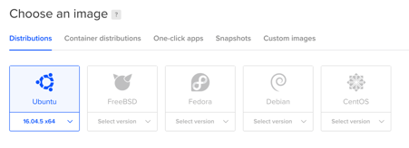
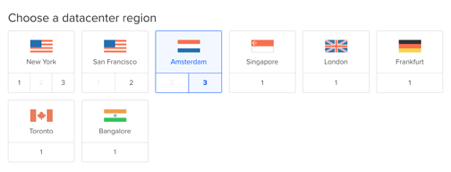
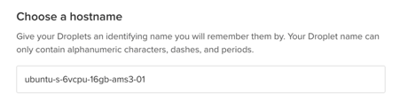
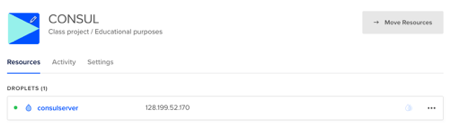

# Installing CONSUL on a Digital Ocean VPS

1. Installing ANSIBLE in the local machine

In order to control the installation of CONSUL in the server, you need to install ANSIBLE in your local machine. The method depends on the kind of operative system that you are using.

**Mac OSX**

Open a Terminal console and type the following commands:

  ```
  sudo easy_install pip
  sudo pip install ansible
  ```

**Linux**

You should install ANSIBLE using your package manager. For example, if you are using Ubuntu, these are the commands to install it:

  ```
  sudo apt-get update

  sudo apt-get install software-properties-common

  sudo apt-add-repository --yes --update ppa:ansible/ansible
  sudo apt-get install ansible
  ```

**Windows**

In order to use ANSIBLE, you need to first install Cygwin, which is a UNIX environment for Windows. You can [download the software here](http://cygwin.com/setup-x86_64.exe).
Once downloaded, open a console window and type the following command (it’s all one long line):

  ```
  setup-x86_64.exe -q --packages=binutils,curl,cygwin32-gcc-g++,gcc-g++,git,gmp,libffi-devel,libgmp-devel,make,nano,openssh,openssl-devel,python-crypto,python-paramiko,python2,python2-devel,python2-openssl,python2-pip,python2-setuptools
  ```

Once the installer finishes you will have a desktop shortcut that you can use to open a Cygwin terminal. In this terminal, type:

  ```
  pip2 install ansible
  ```

2. Generating your SSH keys

In the terminal window, type:

  ```
  ssh-keygen
  ```

When prompted for the file in which to save  the key just press ENTER to leave the default. When prompted for a passphrase, just press ENTER again to leave this empty. At the end you should see a message like this:

  ```
  Your identification has been saved in /your_home/.ssh/id_rsa.

  Your public key has been saved in /your_home/.ssh/id_rsa.pub.
  ```

Take note of the **id_rsa.pub** file location, because you’ll need the content of this file later.

3. Buying the server from Digital Ocean

First you need to [sign up](https://cloud.digitalocean.com/registrations/new) and provide your personal information.

Once you are logged in, you need to create a Droplet (that’s the name that Digital Ocean uses for a Virtual Server). Click on the “Create” green button at the top of the page and select "Droplets":


In the next page, you need to select Ubuntu (it should be pre-selected) and change the version **from 18.04 x 64 to 16.04 x64**.



In the "Choose a size" section select the **$80/mo 16GB/6CPUs** option if this is going to be a production server. If you are just setting up a test system with a few users the cheapest $5/mo option can be enough.


Leave the rest of the options with their defaults until “Choose a datacenter”. Select the one that will be geographically closer to your users. If you are in the EU, select either Frankfurt or Amsterdam data centers.



In the "Add you SSH keys" section click "New SSH Key" button.


In the pop up window that appears you need to copy and paste the public key that we generated in the previous step. To see the content of this key in the terminal window type:

  ```
  cat ~/.ssh/id_rsa.pub
  ```

You should see a text like this:

  ```
  ssh-rsa AAAAB3NzaC1yc2EAAAADAQABAAABAQDy/BXU0OsK8KLLXpd7tVnqDU+d4ZS2RHQmH+hv0BFFdP6PmUbKdBDigRqG6W3QBexB2DpVcb/bmHlfhzDlIHJn/oki+SmUYLSWWTWuSeF/1N7kWf9Ebisk6hiBkh5+i0oIJYvAUsNm9wCayQ+i3U3NjuB25HbgtyjR3jDPIhmg1xv0KZ8yeVcU+WJth0pIvwq+t4vlZbwhm/t2ah8O7hWnbaGV/MZUcj0/wFuiad98yk2MLGciV6XIIq+MMIEWjrrt933wAgzEB8vgn9acrDloJNvqx25uNMpDbmoNXJ8+/P3UDkp465jmejVd/6bRaObXplu2zTv9wDO48ZpsaACP bprieto@MacBook-Pro.local
  ```

Select and copy all the text and paste it in the pop-up window like this:


Please note that there will be two little green checks. If they are not there, retry copying the text because you probably left something out. Give your key a meaningful name, like **CONSUL_key** and click "Add SSH Key" button.

By using a SSH key instead of a user/password combination to access your server, it will be much more secure, as only someone with the SSH key can access the server.

Now in the "Choose a hostname" section change the default for something more meaningful, like **consulserver** for example.



At the bottom of the page you’ll see a summary of your options. Check that everything is OK and click the big green "Create" button.


It will take a few minutes, and at the end you will have a shiny new server. It will look like this in the Digital Ocean page:



4. Setting up the new server

To enter your new server, copy the IP address of the server and in your terminal window type:

  ```
  ssh root@your-copied-ip-address
  ```

You’ll see a welcome message and a prompt like this:

  ```
  root@consulserver:~#
  ```

The first thing that you should do is to update the server, by typing these commands:

  ```
  apt update
  apt upgrade -y
  ```

If the upgrading process ask you something, just accept the default option.

At the moment we are logged in with the root user, which is a bad practice that could compromise the server's security. So we need to create a new user to administer our server:

  ```
  adduser jupiter
  ```

I'm using jupiter as the user name, you should change that for whatever makes sense to you. Input a password when prompted, and just leave empty the rest of the options.

Let's give this user superadmin rights:

  ```
  usermod -aG sudo jupiter
  ```

**Remember to change jupiter** for whatever username you chose in the previous step.

Now we need to give the keys of the server to the new user. Don’t close the server terminal window, because you can lock yourself out of your server if there is a mistake.

Open another local terminal window (not in the server) and type:

```
ssh-copy-id jupiter@your-copied-ip-address
```

Input your new user password when prompted. Remember to change "jupiter" for you username and "your-copied-ip-address" for the IP address of your server.

Test that your user can log in by typing:

  ```
  ssh jupiter@your-copied-ip-address
  ```

You should see the server welcome page and a prompt like this:

  ```
  jupiter@consulserver:~$
  ```

Note the username at the prompt is not "root", but your username. So everything is fine and we can now block the root account from outside access and also stop allowing password access so only people with SSH keys can log in.

Type the following command to edit the SSH config file of the server:

  ```
  sudo nano /etc/ssh/sshd_config
  ```

Look for the "PasswordAuthentication yes" line and change it to "PasswordAuthentication no". Type Control-K to close the nano editor and type:

  ```
  sudo service ssh restart
  ```

We are getting there, we just need to install some required software for ANSIBLE by typing:

  ```
  sudo apt-get -y install python-simplejson
  ```

5. Running the installer

In your local machine terminal, type:

  ```
  git clone https://github.com/consul/installer

  cd installer
  cp hosts.example hosts
  ```

Edit your hosts file to input your server IP address by typing "nano hosts" and changing "remote-server-ip-address" for your server IP address. Type Control-k to save and close the editor.

Now we are ready at last to launch the installer. Type:

  ```
  sudo ansible-playbook -v consul.yml -i hosts
  ```

You should see some messages from ANSIBLE as it’s working its way into the CONSUL installation. Pat yourself on the back, and go grab a coffee or something because this could take a while.

When everything is finished, just go to your browser and type your IP address in the URL box. You should see your new **CONSUL** website up and running! 🎉
There is a default admin user with **username admin@consul.dev and password 12345678**, so you can just login and start working with CONSUL.
