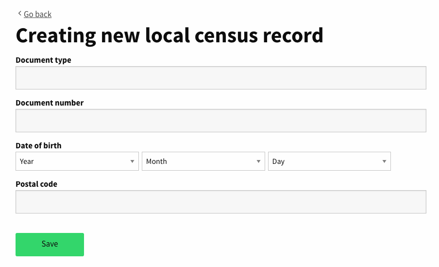

# Local Census

To provide to administrator users a way to manage the local census database through the administration panel **Settings &gt; Manage local census**. Currently the only way to manipulate this table records is through the rails console.

Allow adiministrators users to manage this table in two different ways:

* **Manually**: one by one through a CRUD interface.
* **Automatically**: through an importation process.

## Manually

Provide a way to manage local census records to administrator users through administration interface.

* Local Census Page

  

* Add new record

  

Features:

1. Search by document\_number: As local\_census\_records could contain a lot of records we have added a search feature to allow administrators to find existing records by document\_number.
2. Avoid the introduction of duplicated records: A model validation has been added to the following attributes pair \[:document\_number, :document\_type\]

## Automatically

Allow administrator users to import local census records though CSV file.

* Local Census Page 
* Import CSV 

