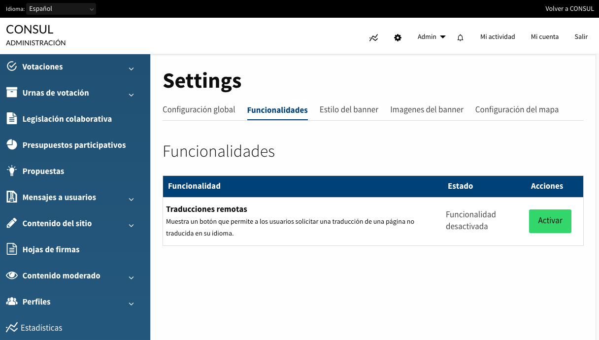
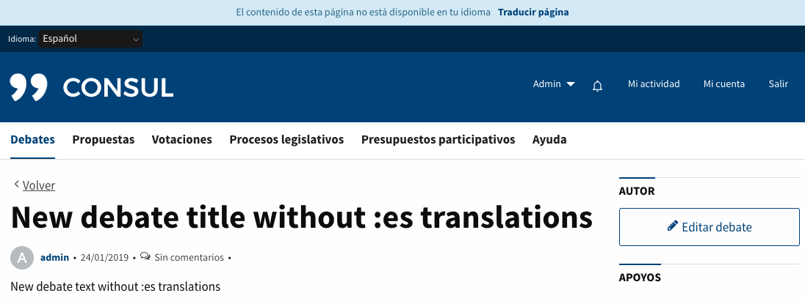
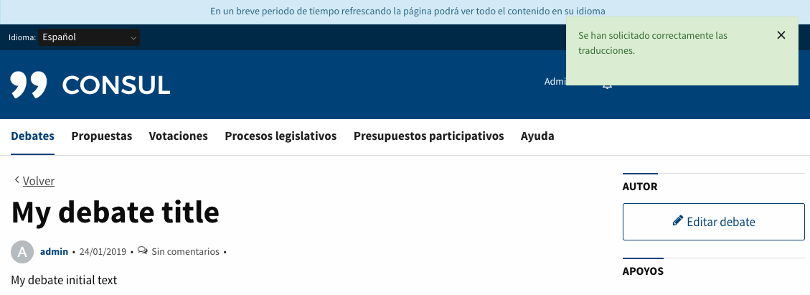
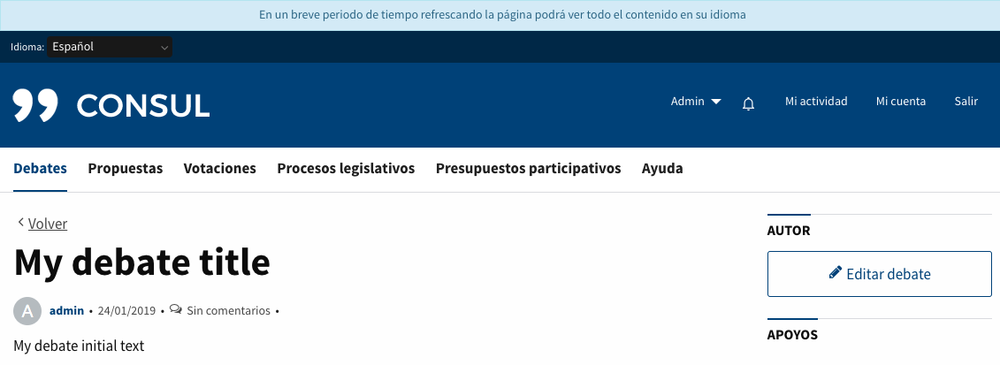
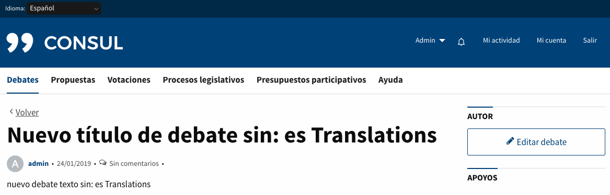
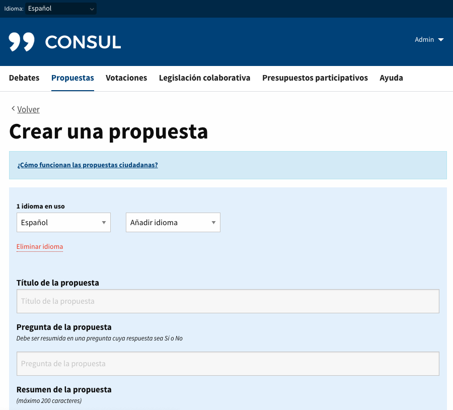
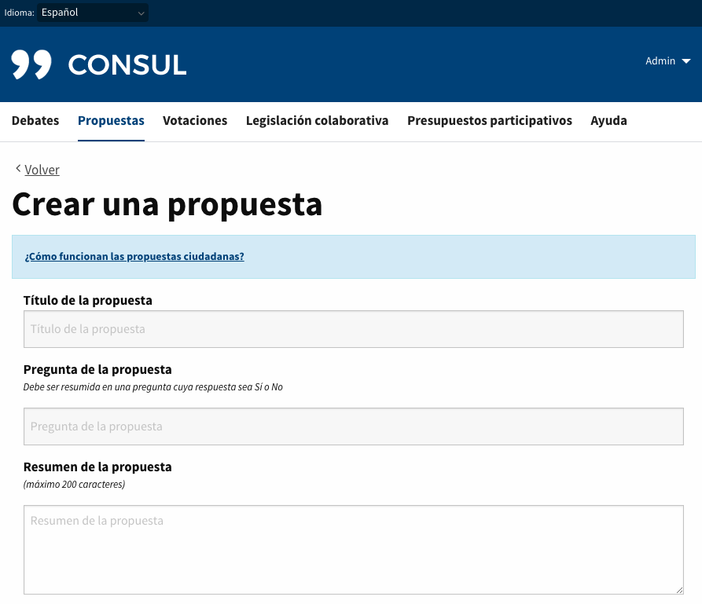

# Personalización

Puedes modificar CONSUL y ponerle tu propia imagen, para esto debes primero [crear tu propio fork](../getting_started/create.md).

Hemos creado una estructura específica donde puedes sobreescribir y personalizar la aplicación para que puedas actualizar sin que tengas problemas al hacer merge y se sobreescriban por error tus cambios. Intentamos que CONSUL sea una aplicación Ruby on Rails lo más plain vanilla posible para facilitar el acceso de nuevas desarrolladoras.

## Ficheros y directorios especiales

Para adaptar tu fork de CONSUL puedes utilizar alguno de los directorios `custom` que están en las rutas:

* `config/locales/custom/`
* `app/assets/images/custom/`
* `app/views/custom/`
* `app/controllers/custom/`
* `app/models/custom/`

Aparte de estos directorios también cuentas con ciertos ficheros para:

* `app/assets/stylesheets/custom.css`
* `app/assets/stylesheets/_custom_settings.css`
* `app/assets/javascripts/custom.js`
* `Gemfile_custom`
* `config/application.custom.rb`

## Traducciones remotas bajo demanda del usuario

Este servicio tiene como objetivo poder ofrecer todos los contenidos dinámicos de la aplicación (propuestas, debates, inversiones presupuestarias y comentarios) en diferentes idiomas sin la necesidad de que un usuario ó un administrador haya creado cada una de sus traducciones.

Cuando un usuario accede a una pantalla con un idioma donde parte del contenido dinámico que esta visualizando no tiene traducciones, dispondrá de un botón para solicitar la traducción de todo el contenido. Este contenido se enviará a un traductor automático (en este caso [Microsoft TranslatorText](https://azure.microsoft.com/es-es/products/cognitive-services/translator/)) y en cuanto se obtenga la respuesta, todas estas traducciones estarán disponibles para cualquier usuario.

### Como empezar

Para poder utilizar esta funcionalidad es necesario realizar los siguientes pasos:
1. Disponer de una api key para conectarse con el servicio de traducción. Para ello necesitamos una [cuenta en Azure](https://azure.microsoft.com/es-es/)
1. Una vez que haya iniciado sesión en el portal de Azure, subscríbase a Traductor en Cognitive Services.
1. Una vez subscrito al servicio de Translator Text, tendrá accesibles 2 api keys en la sección **Administración de recursos > Claves y punto de conexión** que serán necesarias para la configuración del servicio de traducciones en su aplicación.

### Configuración

Para activar el servicio de traducciones en su aplicación debe completar los siguientes pasos

#### Añadir api key en la aplicación

En el apartado anterior hemos comentado que una vez subscritos al servicio de traducciones disponemos de 2 api keys. Para configurar el servicio correctamente en nuestra aplicación deberemos añadir una de las dos api keys en el archivo `secrets.yml` en la sección `apis:` con la key `microsoft_api_key` como podemos ver en la siguiente imágen:


#### Activar funcionalidad

Una vez disponemos de la nueva key en el `secrets.yml` ya podemos proceder a activar la funcionalidad. Para activar la funcionalidad deberá realizar 2 pasos:
1. Ejecutar el siguiente comando `bin/rake settings:create_remote_translations_setting RAILS_ENV=production`
1. Acceder a través del panel de administración de su aplicación a la sección **Configuración > Funcionalidades** y activar el módulo de **Traducciones Remotas** como se puede ver a continuación:


### Funcionalidad

Una vez tenemos la api key en nuestro `secrets.yml` y el módulo activado, los usuarios ya podrán utilizar la funcionalidad.
Para aclarar el funcionamiento, se adjuntan unos pantallazos de como interactua la aplicación con nuestros usuarios:
* Cuando un usuario accede a una pantalla en un idioma en el que no están disponibles todas las traducciones, le aparecerá un texto en la parte superior de la pantalla y un botón para poder solicitar la traducción. (**Nota:** *En el caso de acceder con un idioma no soportado por el servicio de traducción no se mostrará ningún texto ni botón de traducción. Ver sección: Idiomas disponibles para la traducción remota*)


* Una vez el usuario pulsa el botón de `Traducir página` se encolan las traducciones y se recarga la pantalla con un notice (*informando que se han solicitado correctamente las traducciones*) y un texto informativo en la cabecera (*explicando cuando podrá ver estas traducciones*).


* Si un usuario accede a una pantalla que no dispone de traducciones pero ya han sido solicitadas por otro usuario. La aplicación no le mostrará el botón de traducir, pero si un texto informativo en la cabecera (*explicando cuando podrá ver estas traducciones*).


* Las peticiones de traducción se delegan a `Delayed Job` y en cuanto haya sido procesada, el usuario después de refrescar su página podrá ver el contenido traducido.


### Idiomas disponibles para la traducción remota

Actualmente estos son todos los [idiomas disponibles](https://api.cognitive.microsofttranslator.com/languages?api-version=3.0) en el servicio de traducción:
```yml
["af", "am", "ar", "as", "az", "ba", "bg", "bn", "bo", "bs", "ca", "cs", "cy", "da", "de", "dv", "el", "en", "es", "et", "eu", "fa", "fi", "fil", "fj", "fo", "fr", "fr-CA", "ga", "gl", "gu", "ha", "he", "hi", "hr", "hsb", "ht", "hu", "hy", "id", "ig", "ikt", "is", "it", "iu", "iu-Latn", "ja", "ka", "kk", "km", "kmr", "kn", "ko", "ku", "ky", "ln", "lo", "lt", "lug", "lv", "lzh", "mg", "mi", "mk", "ml", "mn-Cyrl", "mn-Mong", "mr", "ms", "mt", "mww", "my", "nb", "ne", "nl", "nso", "nya", "or", "otq", "pa", "pl", "prs", "ps", "pt", "pt-PT", "ro", "ru", "run", "rw", "sk", "sl", "sm", "sn", "so", "sq", "sr-Cyrl", "sr-Latn", "st", "sv", "sw", "ta", "te", "th", "ti", "tk", "tlh-Latn", "tlh-Piqd", "tn", "to", "tr", "tt", "ty", "ug", "uk", "ur", "uz", "vi", "xh", "yo", "yua", "yue", "zh-Hans", "zh-Hant", "zu"]
```
De todos los idiomas que actualmente tiene Consul definidos (`available_locales`) en `config/application.rb` el único que no está en la lista anterior y por lo tanto no se ofrece servicio de traducción es el valenciano `["val"]`.

### Costes

El servicio de traducción utilizado tiene los [precios](https://azure.microsoft.com/es-es/pricing/details/cognitive-services/translator/) más competitivos del mercado.
El precio por cada 1 Millón de caracteres traducidos asciende a 10 $ y sin ningún tipo de coste fijo al mes.

Aunque se han tomado medidas técnicas para evitar un mal uso de este servicio, recomendamos la creación de Alertas que ofrece Azure para que un Administrador pueda ser notificado en el caso de detectar un uso fuera de lo común del servicio. Este servicio tiene un coste de 0,10 $ al mes.

Para crear una Alerta en Azure debemos seguir los siguientes pasos:
1. Inicie sesión en **Azure Portal**.
1. Accede al servicio **Traductor** creado anteriormente.
1. Accede en el menu lateral a **Supervisión > Alertas**:
  1. Accedemos a **Crear regla de alertas**
  1. En **Selección de una señal** seleccionamos `Text Characters Translated`
  1. Una vez seleccionada debemos definir la lógica de la Alerta para que se ajuste a nuestras necesidades. Ej: Rellene el campo "Operador" con el valor "Mayor que", rellene el campo "Tipo de Agregación" con el valor "Total" y por último rellene el campo "Valor del umbral" por el número de caracteres que consideramos que deben traducirse antes de ser notificados. En esta sección también se puede configurar el periodo de tiempo y la frecuencia de evaluación.
  1. Para poder ser notificados tenemos que crear un **Grupo de Acciones** y asociarla a esta Alerta que estamos creando. Para ello accedemos al botón de **Crear** y rellenamos el formulario. Como se puede observar hay diferentes tipos de acciones, debemos seleccionar **Correo electrónico/SMS/Insertar/Voz** y configurar la opción que consideremos conveniente según nuestras necesidades.
  1. Una vez creado este grupo de acciones, ya queda directamente asociado a la regla que estamos creando.
  1. Por último ya solo queda añadir un nombre y clicar sobre el botón **Revisar y crear**

### Añadir un nuevo servicio de traducción

En el caso de que se quieran integrar más servicios de traducción por cualquier motivo (aparece un nuevo en el mercado más competitivo, se quiere cambiar para contemplar los idiomas que actualmente no tienen soporte, etc) se ha dejado preparado el código para poder añadirlo con las mínimas modificaciones posibles.
Esto es posible gracias a la class `RemoteTranslations::Caller` que es una capa intermedia entre la gestión de los contenidos sin traducir y el Cliente de traducción de Microsoft utilizado actualmente.
Una buena solución para añadir otro servicio de traducción sería sustituir la llamada al `MicrosoftTranslateClient` dentro del método `translations` del `RemoteTranslations::Caller` por el nuevo servicio implementado.
En caso de querer convivir con ambos sólo debería gestionarse en que caso queremos utilizar uno u otro, ya sea mediante condiciones especificas en el código o mediante una gestión en los Settings de la aplicación.

```ruby
class RemoteTranslationsCaller

  ...
  def translations
    @translations ||= RemoteTranslations::Microsoft::Client.new.call(fields_values, locale)
    # Add new RemoteTranslations Client
    # @translations = RemoteTranslations::NewTranslateClient::Client.new.call(fields_values, locale_to)
  end
  ...

end
```

## Interfaz de traducción

Esta funcionalidad permite a los usuarios introducir contenidos dinámicos en diferentes idiomas a la vez. Cualquier usuario administrador de Consul puede activar o desactivar esta funcionalidad a través del panel de administración de la aplicación. Si desactivas esta funcionalidad (configuración de la funcionalidad por defecto) los usuarios sólo podrán introducir un idioma.

### Activar funcionalidad

Para activar la funcionalidad deberá realizar 2 pasos:
1. Ejecutar el siguiente comando `bin/rake settings:create_translation_interface_setting RAILS_ENV=production` (Este paso sólo es necesario para instalaciones de Consul existentes que incorporan esta funcionalidad, para nuevas instalaciones no es necesario)
1. Accedediendo como usuario administrador a través del panel de administración de su aplicación a la sección **Configuración > Funcionalidades** y activando el módulo de **Interfaz de traducción** como se puede ver a continuación:


### Casos de uso

Dependiendo de si activamos o desactivamos el módulo de **Interfaz de traducción** veremos los formularios accesibles por el usuario de la siguiente manera:

* Cuando la interfaz de traducción esta activa:
Como podemos ver en la imagen a continuación la interfaz de traducción tiene 2 selectores, el primero "Seleccionar idioma" permite cambiar entre los lenguajes activos y el segundo selector "Añadir idioma" permite añadir nuevos idiomas al formulario. Los campos traducibles se pueden distinguir fácilmente mediante un fondo azul de los que no lo son. También disponemos de un botón `Eliminar idioma` para eliminar un idioma en caso de necesitarlo. Si un usuario elimina accidentalmente un idioma puede recuperarlo añadiendo dicho idioma otra vez al formulario.
Esta funcionalidad está visible tanto para las páginas de creación como para las páginas de edición.


* Cuando la interfaz de traducción esta desactivada:
Cuando esta funcionalidad está desactivada los formularios se renderizan sin la interfaz de traducción y sin resaltar los campos traducibles con fondo azul.

