# Configurar conexión con el Censo:

Este servicio tiene como objetivo poder configurar la conexión con el Censo de Ayuntamiento a través del panel de Administración sin necesidad de modificar el código de la aplicación.

Cabe destacar que para configurar correctamente esta conexión se requerirá de un perfil técnico que conozca el WebService de su Ayuntamiento.

Actualmente la aplicación estaba pensada para enviar solo el **numero de documento** y el **tipo de documento**. Con esta nueva funcionalidad se habilita la posibilidad de enviar en caso de ser necesario los campos **fecha de nacimiento** y **código postal**

## Activar la funcionalidad

En la sección **Configuración > Configuración Global** se ha añadido una nueva pestaña **Configuración del Censo Remoto**.

Si tenemos la funcionalidad desactivada veremos un texto informativo que nos indicará como activarla:
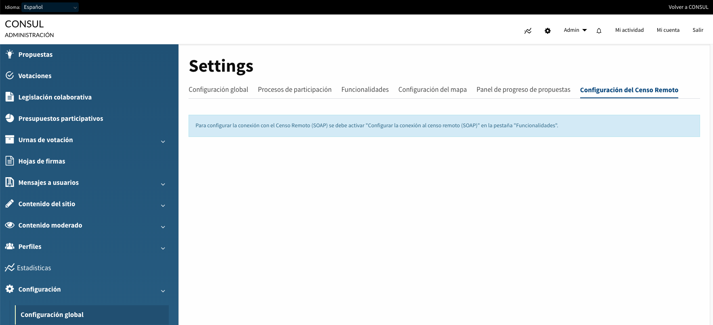

Para activar la funcionalidad deberá seguir las instrucciones de la imagen anterior:
1. Acceder a través del panel de administración de su aplicación a la sección **Configuración > Funcionalidades** y activar el módulo de **Configurar conexión al censo remoto (SOAP)** como se puede ver a continuación:
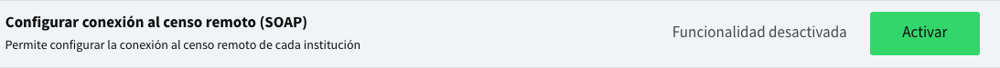

## Configuración

Una vez activada la funcionalidad, podremos acceder a la sección **Configuración > Configuración Global** y clicar en la pestaña **Configuración del Censo Remoto**.
En esta pantalla se podrá rellenar toda la información necesaria para poder configurar la conexión con el Censo de cada Ayuntamiento.

La información a rellenar esta dividida en tres apartados:

1. **Información General**
  - **Endpoint**: Nombre del host donde se encuentra el servicio del Censo con el que queremos conectarnos (wsdl).

    

1. **Información para realizar la Petición**

  En esta sección rellenaremos todos los campos necesarios para poder realizar una petición para verificar un usuario contra el Censo del Ayuntamiento.

  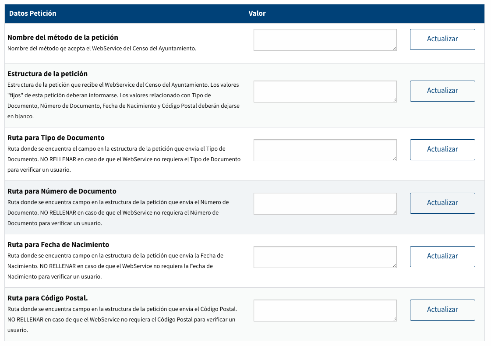

  Para ayudar a entender como rellenar cada uno de los campos, nos basaremos en un supuesto WebService que recibe un método llamado `:get_habita_datos` con la siguiente estructura:
  ```
  {
    request: {
      codigo_institucion: 12,        #Valor estático
      codigo_portal:      5,         #Valor estático
      codigo_usuario:     10,        #Valor estático
      documento:          12345678Z, #Valor dinámico relacionado con Número de Documento
      tipo_documento:     1,         #Valor dinámico relacionado con Tipo de Documento
      codigo_idioma:      102,       #Valor estático
      nivel:              3          #Valor estático
    }
  }
  ```

  Campos necesarios para la petición:
  - **Nombre del método de la petición**: Nombre del método que acepta el WebService del Censo del Ayuntamiento.

    Ejemplo:
    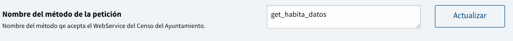
  - **Estructura de la petición**: Estructura de la petición que recibe el WebService del Censo del Ayuntamiento. Los valores "fijos" de esta petición deberán informarse. Los valores "dinámicos" relacionados con Tipo de Documento, Número de Documento, Fecha de Nacimiento y Código Postal deberán dejarse con valor null.

    Ejemplo:
    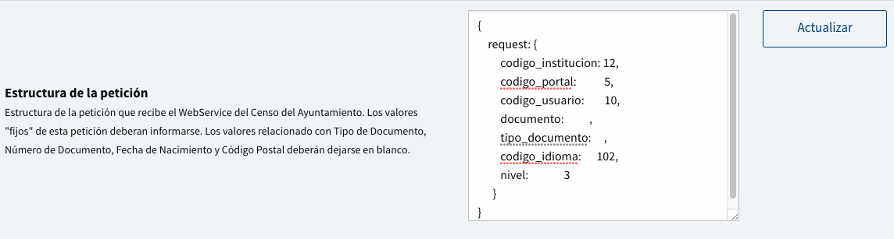
    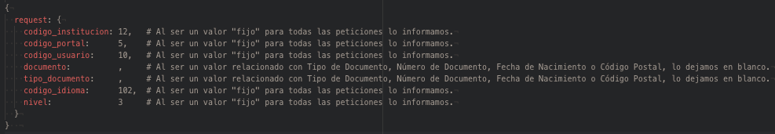
  - **Ruta para Tipo de Documento**: Ruta donde se encuentra el campo en la estructura de la petición que envía el Tipo de Documento.

    *NOTA: NO RELLENAR en caso de que el WebService no requiera el Tipo de Documento para verificar un usuario.*

    Ejemplo:
    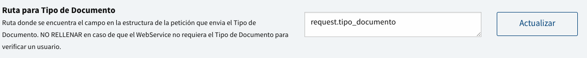
  - **Ruta para Número de Documento**: Ruta donde se encuentra campo en la estructura de la petición que envía el Número de Documento.

    *NOTA: NO RELLENAR en caso de que el WebService no requiera el Número de Documento para verificar un usuario.*

    Ejemplo:
    
  - **Ruta para Fecha de Nacimiento**: Ruta donde se encuentra campo en la estructura de la petición que envía la Fecha de Nacimiento.

    *NOTA: NO RELLENAR en caso de que el WebService no requiera la Fecha de Nacimiento para verificar un usuario.*

    En el caso del *Ejemplo* lo dejaríamos en blanco, ya que no se necesita enviar la fecha de nacimiento para verificar a un usuario.

    Ejemplo:
    
  - **Ruta para Código Postal**: Ruta donde se encuentra campo en la estructura de la petición que envía el Código Postal.

    *NOTA: NO RELLENAR en caso de que el WebService no requiera el Código Postal para verificar un usuario.*

    En el caso del *Ejemplo* lo dejaríamos en blanco, ya que no se necesita enviar el código postal para verificar a un usuario.

    Ejemplo:
    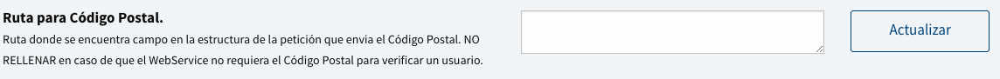

1. **Información para parsear la respuesta**

  En esta sección configuraremos todos los campos necesarios para poder recibir la respuesta del WebService y verificar a un usuario en la aplicación.

  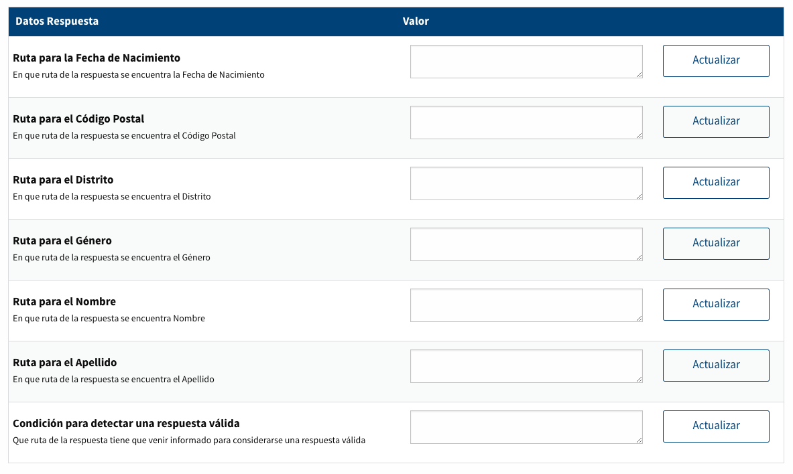

  Al igual que en el apartado anterior definiremos un ejemplo de respuesta, para ayudar a entender como rellenar cada uno de los campos de esta sección.

  ```
      {
        get_habita_datos_response: {
          get_habita_datos_return: {
            datos_habitante: {
              item: {
                fecha_nacimiento_string: "31-12-1980",
                identificador_documento: "12345678Z",
                descripcion_sexo: "Varón",
                nombre: "José",
                apellido1: "García"
              }
            },
            datos_vivienda: {
              item: {
                codigo_postal: "28013",
                codigo_distrito: "01"
              }
            }
          }
        }
      }
  ```

  Campos necesarios para parsear la respuesta:
  - **Ruta para la Fecha de Nacimiento**: En que ruta de la respuesta se encuentra la Fecha de Nacimiento.

    Ejemplo:
    
  - **Ruta para el Código Postal**: En que ruta de la respuesta se encuentra el Código Postal.

    Ejemplo:
    
  - **Ruta para el Distrito**: En que ruta de la respuesta se encuentra el Distrito.

    Ejemplo:
    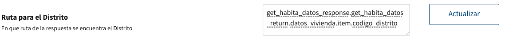
  - **Ruta para el Género**: En que ruta de la respuesta se encuentra el Género.

    Ejemplo:
    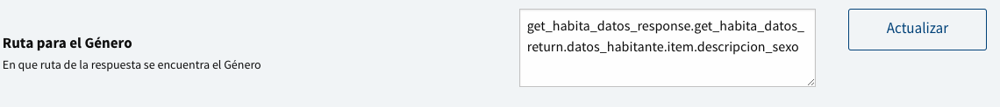
  - **Ruta para el Nombre**: En que ruta de la respuesta se encuentra Nombre.

    Ejemplo:
    
  - **Ruta para el Apellido**: En que ruta de la respuesta se encuentra el Apellido

    Ejemplo:
    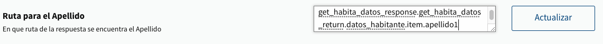
  - **Condición para detectar una respuesta válida**: Que ruta de la respuesta tiene que venir informado para considerarse una respuesta válida.

    Ejemplo:
    

  Una vez rellenados correctamente los datos generales, los campos necesarios de la petición y "todos" los campos para validar la respuesta, la aplicación podrá verificar cualquier usuario contra el WebService definido.
