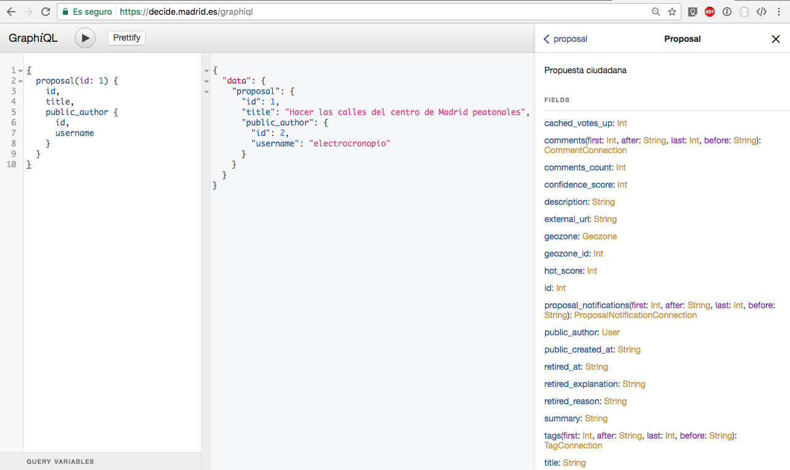
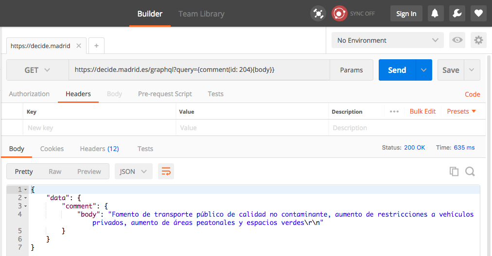
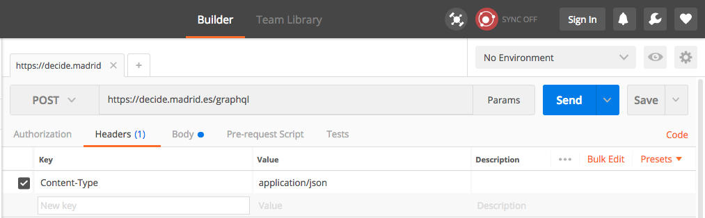
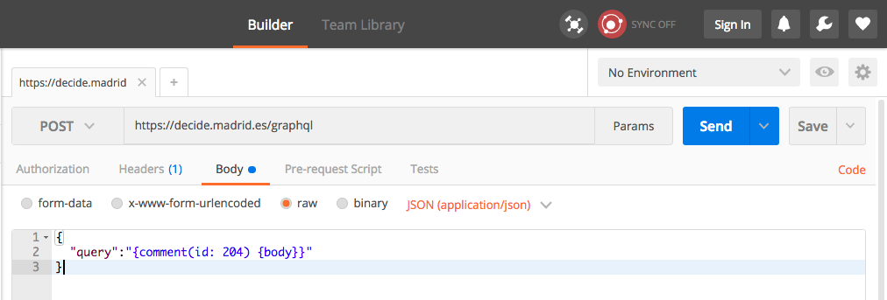

# GraphQL

* [Características](graphql.md#caracteristicas)
* [GraphQL](graphql.md#graphql)
* [Haciendo peticiones a la API](graphql.md#haciendo-peticiones-a-la-api)
  * [Clientes soportados](graphql.md#clientes-soportados)
    * [GraphiQL](graphql.md#graphiql)
    * [Postman](graphql.md#postman)
    * [Librerías HTTP](graphql.md#librerias-http)
* [Información disponible](graphql.md#informacion-disponible)
* [Ejemplos de consultas](graphql.md#ejemplos-de-consultas)
  * [Recuperar un único elemento de una colección](graphql.md#recuperar-un-unico-elemento-de-una-coleccion)
  * [Recuperar una colección completa](graphql.md#recuperar-una-coleccion-completa)
    * [Paginación](graphql.md#paginacion)
  * [Acceder a varios recursos en una única petición](graphql.md#acceder-a-varios-recursos-en-una-unica-peticion)
* [Limitaciones de seguridad](graphql.md#limitaciones-de-seguridad)
  * [Ejemplo de consulta demasiado profunda](graphql.md#ejemplo-de-consulta-demasiado-profunda)
  * [Ejemplo de consulta demasiado compleja](graphql.md#ejemplo-de-consulta-demasiado-compleja)
* [Ejemplos de código](graphql.md#ejemplos-de-codigo)
  * [Ejemplo sencillo](graphql.md#ejemplo-sencillo)
  * [Ejemplo con paginación](graphql.md#ejemplo-con-paginacion)

## Características <a href="#caracteristicas" id="caracteristicas"></a>

* API de sólo lectura
* Acceso público, sin autenticación
* Usa GraphQL:
  * El tamaño máximo (y por defecto) de registros por página es 25
  * La profundidad máxima de las consultas es de 8 niveles
  * Como máximo se pueden solicitar 2 colecciones en una misma consulta
  * Soporte para peticiones GET (consulta dentro del _query string_) y POST (consulta dentro del _body_, como `application/json` o `application/graphql`).

## GraphQL

La API de Consul Democracy utiliza [GraphQL](https://graphql.org), en concreto la [implementación en Ruby](http://graphql-ruby.org/). Si no estás familiarizado con este tipo de APIs, te recomendamos consultar la [documentación oficial de GraphQL](https://graphql.org/learn/).

Una de las características que diferencian una API REST de una GraphQL es que con esta última es posible construir _consultas personalizadas_, de forma que el servidor nos devuelva únicamente la información en la que estamos interesados.

Las consultas en GraphQL están escritas siguiendo un formato que presenta ciertas similitudes con el formato JSON, por ejemplo:

```graphql
{
  proposal(id: 1) {
    id,
    title,
    public_author {
      id,
      username
    }
  }
}
```

Las respuestas son en formato JSON:

```json
{
  "data": {
    "proposal": {
      "id": 1,
      "title": "Aumentar la cantidad de zonas verdes",
      "public_author": {
        "id": 2,
        "username": "unmundomejor"
      }
    }
  }
}
```

## Haciendo peticiones a la API

Siguiendo las [directrices oficiales](http://graphql.org/learn/serving-over-http/), la API de Consul Democracy soporta los siguientes tipos de peticiones:

* Peticiones GET, con la consulta dentro del _query string_.
* Peticiones POST
  * Con la consulta dentro del _body_, con `Content-Type: application/json`
  * Con la consulta dentro del _body_, con `Content-Type: application/graphql`

### Clientes soportados

Al ser una API que funciona a través de HTTP, cualquier herramienta capaz de realizar este tipo de peticiones resulta válida.

Esta sección contiene algunos ejemplos sobre cómo hacer las peticiones a través de:

* GraphiQL
* Extensiones de Chrome como Postman
* Cualquier librería HTTP

#### GraphiQL

[GraphiQL](https://github.com/graphql/graphiql) es una interfaz de navegador para realizar consultas a una API GraphQL, así como una fuente adicional de documentación. Consul Democracy utiliza la gema [graphiql-rails](https://github.com/rmosolgo/graphiql-rails) para acceder a esta interfaz en la ruta `/graphiql`; esta es la mejor forma de familiarizarse con una API basada en GraphQL.



Tiene tres paneles principales:

* En el panel de la izquierda se escribe la consulta a realizar.
* El panel central muestra el resultado de la petición.
* El panel derecho (ocultable) contiene una documentación autogenerada a partir de la información expuesta en la API.

#### Postman

Ejemplo de petición `GET`, con la consulta como parte del _query string_:



Ejemplo de petición `POST`, con la consulta como parte del _body_ y codificada como `application/json`:



La consulta debe estar ubicada en un documento JSON válido, como valor de la clave `"query"`:



#### Librerías HTTP <a href="#librerias-http" id="librerias-http"></a>

Es posible utilizar cualquier librería HTTP de lenguajes de programación.

**IMPORTANTE**: Algunos servidores podrían tener protocolos de seguridad que hagan necesario incluir un _User Agent_ perteneciente a un navegador para que la petición no sea descartada. Por ejemplo:

`User-Agent: Mozilla/5.0 (X11; Linux x86_64; rv:109.0) Gecko/20100101 Firefox/116.0`

## Información disponible <a href="#informacion-disponible" id="informacion-disponible"></a>

El directorio `app/graphql/types/` contiene una lista completa de los modelos (y sus campos) que están expuestos actualmente en la API.

La lista de modelos es la siguiente:

| Modelo                 | Descripción                                            |
| ---------------------- | ------------------------------------------------------ |
| `User`                 | Usuarios                                               |
| `Debate`               | Debates                                                |
| `Proposal`             | Propuestas                                             |
| `Budget`               | Presupuestos participativos                            |
| `Budget::Investment`   | Proyectos de gasto                                     |
| `Comment`              | Comentarios en debates, propuestas y otros comentarios |
| `Milestone`            | Hitos en propuestas, proyectos de gasto y procesos     |
| `Geozone`              | Geozonas (distritos)                                   |
| `ProposalNotification` | Notificaciones asociadas a propuestas                  |
| `Tag`                  | Tags en debates y propuestas                           |
| `Vote`                 | Información sobre votos                                |

## Ejemplos de consultas

### Recuperar un único elemento de una colección <a href="#recuperar-un-unico-elemento-de-una-coleccion" id="recuperar-un-unico-elemento-de-una-coleccion"></a>

```graphql
{
  proposal(id: 2) {
    id,
    title,
    comments_count
  }
}
```

Respuesta:

```json
{
  "data": {
    "proposal": {
      "id": 2,
      "title": "Crear una zona cercada para perros cerca de la playa",
      "comments_count": 10
    }
  }
}
```

### Recuperar una colección completa <a href="#recuperar-una-coleccion-completa" id="recuperar-una-coleccion-completa"></a>

```graphql
{
  proposals {
    edges {
      node {
        title
      }
    }
  }
}
```

Respuesta:

```json
{
  "data": {
    "proposals": {
      "edges": [
        {
          "node": {
            "title": "Parada de autobús cerca del colegio"
          }
        },
        {
          "node": {
            "title": "Mejorar la iluminación de zonas deportivas"
          }
        }
      ]
    }
  }
}
```

#### Paginación <a href="#paginacion" id="paginacion"></a>

Actualmente el número máximo (y por defecto) de elementos que se devuelven en cada página está establecido a 25. Para poder navegar por las distintas páginas, es necesario solicitar además información relativa al `endCursor`:

```graphql
{
  proposals(first: 25) {
    pageInfo {
      hasNextPage
      endCursor
    }
    edges {
      node {
        title
      }
    }
  }
}

```

La respuesta:

```json
{
  "data": {
    "proposals": {
      "pageInfo": {
        "hasNextPage": true,
        "endCursor": "NQ=="
      },
      "edges": [
        # ...
      ]
    }
  }
}
```

Para recuperar la siguiente página, hay que pasar como parámetro el cursor recibido en la petición anterior, y así sucesivamente:

```graphql
{
  proposals(first: 25, after: "NQ==") {
    pageInfo {
      hasNextPage
      endCursor
    }
    edges {
      node {
        title
      }
    }
  }
}
```

### Acceder a varios recursos en una única petición <a href="#acceder-a-varios-recursos-en-una-unica-peticion" id="acceder-a-varios-recursos-en-una-unica-peticion"></a>

Esta consulta solicita información relativa a varios modelos distintos en una única petición: `Proposal`, `User`, `Geozone` y `Comment`:

```graphql
{
  proposal(id: 15262) {
    id,
    title,
    public_author {
      username
    },
    geozone {
      name
    },
    comments(first: 2) {
      edges {
        node {
          body
        }
      }
    }
  }
}
```

## Limitaciones de seguridad

Permitir que un cliente personalice las consultas supone un factor de riesgo importante. Si se permitiesen consultas demasiado complejas, sería posible realizar un ataque DoS contra el servidor.

Existen tres mecanismos principales para evitar este tipo de abusos:

* Paginación de resultados
* Limitar la profundidad máxima de las consultas
* Limitar la cantidad de información que es posible solicitar en una consulta

### Ejemplo de consulta demasiado profunda

La profundidad máxima de las consultas está actualmente establecida en 8. Consultas más profundas (como la siguiente), serán rechazadas:

```graphql
{
  user(id: 1) {
    public_proposals {
      edges {
        node {
          id,
          title,
          comments {
            edges {
              node {
                body,
                public_author {
                  username
                }
              }
            }
          }
        }
      }
    }
  }
}
```

La respuesta obtenida tendrá el siguiente aspecto:

```json
{
  "errors": [
    {
      "message": "Query has depth of 9, which exceeds max depth of 8"
    }
  ]
}
```

### Ejemplo de consulta demasiado compleja

El principal factor de riesgo se da cuando se solicitan varias colecciones de recursos en una misma consulta. El máximo número de colecciones que pueden aparecer en una misma consulta está limitado a 2. La siguiente consulta solicita información de las colecciones `users`, `debates` y `proposals`, así que será rechazada:

```graphql
{
  users {
    edges {
      node {
        public_debates {
          edges {
            node {
              title
            }
          }
        },
        public_proposals {
          edges {
            node {
              title
            }
          }
        }
      }
    }
  }
}
```

La respuesta obtenida tendrá el siguiente aspecto:

```json
{
  "errors": [
    {
      "message": "Query has complexity of 3008, which exceeds max complexity of 2500"
    }
  ]
}
```

No obstante, sí que es posible solicitar información perteneciente a más de dos modelos en una única consulta, siempre y cuando no se intente acceder a la colección completa. Por ejemplo, la siguiente consulta que accede a los modelos `User`, `Proposal` y `Geozone` es válida:

```graphql
{
  user(id: 468501) {
    id
    public_proposals {
      edges {
        node {
          title
          geozone {
            name
          }
        }
      }
    }
  }
}
```

La respuesta:

```json
{
  "data": {
    "user": {
      "id": 468501,
      "public_proposals": {
        "edges": [
          {
            "node": {
              "title": "Descuento para empadronados en los centros deportivos",
              "geozone": {
                "name": "Zona sur"
              }
            }
          }
        ]
      }
    }
  }
}
```

## Ejemplos de código <a href="#ejemplos-de-codigo" id="ejemplos-de-codigo"></a>

### Ejemplo sencillo

Este es un ejemplo sencillo de código accediendo a la API de la demo de Consul Democracy:

```ruby
require "net/http"

API_ENDPOINT = "https://demo.consuldemocracy.org/graphql".freeze

def make_request(query_string)
  uri = URI(API_ENDPOINT)
  uri.query = URI.encode_www_form(query: query_string)
  request = Net::HTTP::Get.new(uri)
  request[:accept] = "application/json"

  Net::HTTP.start(uri.hostname, uri.port, use_ssl: true) do |https|
    https.request(request)
  end
end

query = <<-GRAPHQL
  {
    proposal(id: 1) {
        id,
        title,
        public_created_at
    }
  }
GRAPHQL

response = make_request(query)

puts "Response code: #{response.code}"
puts "Response body: #{response.body}"
```

### Ejemplo con paginación <a href="#ejemplo-con-paginacion" id="ejemplo-con-paginacion"></a>

Y este es un ejemplo un tanto más complejo usando paginación, una vez más accediendo a la API de la demo de Consul Democracy:

```ruby
require "net/http"
require "json"

API_ENDPOINT = "https://demo.consuldemocracy.org/graphql".freeze

def make_request(query_string)
  uri = URI(API_ENDPOINT)
  uri.query = URI.encode_www_form(query: query_string)
  request = Net::HTTP::Get.new(uri)
  request[:accept] = "application/json"

  Net::HTTP.start(uri.hostname, uri.port, use_ssl: true) do |https|
    https.request(request)
  end
end

def build_query(options = {})
  page_size = options[:page_size] || 25
  page_size_parameter = "first: #{page_size}"

  page_number = options[:page_number] || 0
  after_parameter = page_number.positive? ? ", after: \"#{options[:next_cursor]}\"" : ""

  <<-GRAPHQL
  {
    proposals(#{page_size_parameter}#{after_parameter}) {
      pageInfo {
        endCursor,
        hasNextPage
      },
      edges {
        node {
          id,
          title,
          public_created_at
        }
      }
    }
  }
  GRAPHQL
end

page_number = 0
next_cursor = nil
proposals   = []

loop do
  puts "> Requesting page #{page_number}"

  query = build_query(page_size: 25, page_number: page_number, next_cursor: next_cursor)
  response = make_request(query)

  response_hash  = JSON.parse(response.body)
  page_info      = response_hash["data"]["proposals"]["pageInfo"]
  has_next_page  = page_info["hasNextPage"]
  next_cursor    = page_info["endCursor"]
  proposal_edges = response_hash["data"]["proposals"]["edges"]

  puts "\tHTTP code: #{response.code}"

  proposal_edges.each do |edge|
    proposals << edge["node"]
  end

  page_number += 1

  break unless has_next_page
end
```
