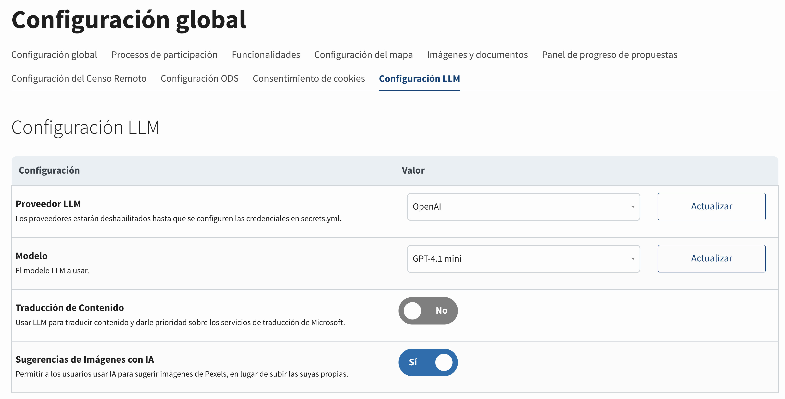
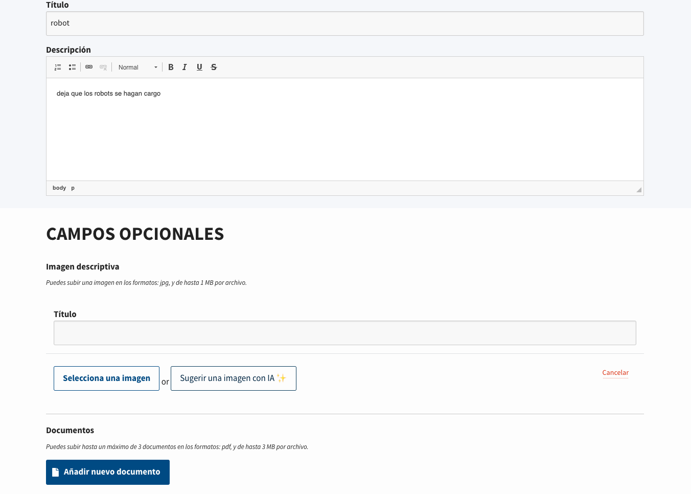
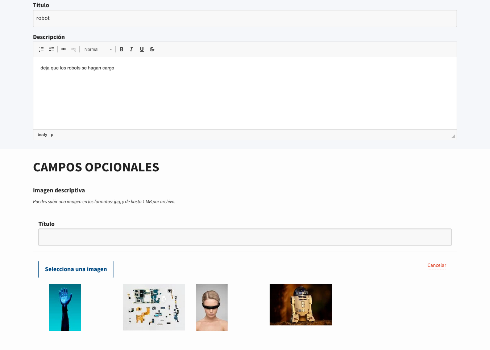
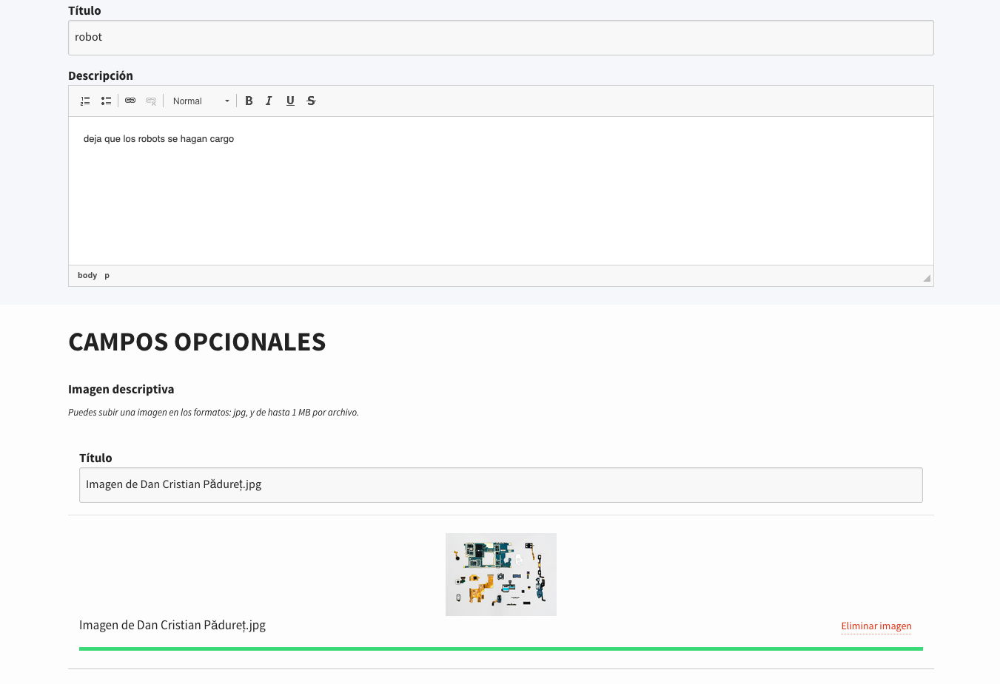

# Sugerencias de Imágenes con IA

## Resumen

La funcionalidad de Sugerencias de Imágenes con IA permite a los usuarios obtener recomendaciones de imágenes potenciadas por IA al crear o editar contenido en Consul Democracy. En lugar de buscar y subir imágenes manualmente, los usuarios pueden hacer clic en un botón para recibir sugerencias relevantes de imágenes de stock de Pexels basadas en el título y la descripción de su contenido.

La funcionalidad utiliza un Modelo de Lenguaje Grande (LLM) para analizar los campos de título y descripción de un recurso, extraer conceptos significativos y generar una consulta de búsqueda optimizada. Esta consulta se utiliza luego para buscar en la API de Pexels imágenes de stock relevantes. Cuando un usuario selecciona una imagen sugerida, se descarga y se adjunta a su contenido como si fuera una imagen subida por el usuario.

## Prerrequisitos

Para usar esta funcionalidad, necesitas:

1. **Cuenta de Proveedor LLM**: Una cuenta con un proveedor LLM (OpenAI, Anthropic, DeepSeek, etc.) o un endpoint Ollama auto-hospedado
2. **Clave API de Pexels**: Una clave API gratuita de [Pexels](https://www.pexels.com/api/)

### Obtener una Clave API de Pexels

1. Visita [Pexels API](https://www.pexels.com/api/)
2. Regístrate para una cuenta gratuita o inicia sesión
3. Navega a tu [panel de API](https://www.pexels.com/api/new/)
4. Crea una nueva aplicación para obtener tu clave API
5. Copia la clave API para usarla en la configuración

**Nota**: Pexels ofrece un generoso plan gratuito con 200 solicitudes por hora y 20,000 solicitudes por mes, que debería ser suficiente para la mayoría de los casos de uso.

## Configuración

### Paso 1: Configurar Secretos

Primero, necesitas configurar tu proveedor LLM. Para instrucciones detalladas, consulta la documentación de [Traducciones de contenido de usuario](user_content_translations.md), que cubre la configuración de LLM en detalle.

En resumen:

1. Agrega tu clave API de LLM al archivo `secrets.yml` en la sección `apis:` bajo `llm:`:

```yml
apis: &apis
  llm:
    # Proporciona claves para los proveedores LLM que pretendes usar.
    openai_api_key: "tu-clave-api-openai"
    # o
    anthropic_api_key: "tu-clave-api-anthropic"
    # u otros proveedores soportados
```

2. Agregar Clave API de Pexels

Agrega tu clave API de Pexels al archivo `secrets.yml` en la sección `apis:`:

```yml
apis: &apis
  microsoft_api_key: ""
  census_api_end_point: ""
  # ... otras configuraciones de API ...
  pexels_access_key: "tu-clave-api-pexels"
  llm: *llm
```

**Para configuraciones de multitenancy**: Puedes sobrescribir la clave API de Pexels para inquilinos específicos:

```yml
tenants:
  mi_subdominio_tenant:
    pexels_access_key: "clave-pexels-especifica-del-tenant"
```

### Paso 2: Configurar el Prompt de Sugerencia de Imagen (Opcional)

Puedes personalizar el prompt utilizado para generar consultas de búsqueda de imágenes editando `config/llm_prompts.yml`:

```yml
image_suggestion_prompt: |
  <task>Produce an image search query</task>
  <goal>A short and concise image search query, for finding best suited images for the input text</goal>
  <instructions>Analyze given title and description of a resource, translate sentences to english, extract the meaningful concepts and produce a search query string in english language.</instructions>
  <title>%{title}</title>
  <description>%{description}</description>
  <output>Reply ONLY with a single string.</output>
```

El prompt usa los marcadores `%{title}` y `%{description}` que serán reemplazados con el contenido real del recurso que se está creando o editando.

### Paso 3: Habilitar la Funcionalidad

Una vez que hayas configurado tanto el proveedor LLM como la clave API de Pexels:

1. Navega a **Admin > Configuración Global > Configuración LLM**
2. Habilita el interruptor de funcionalidad **Sugerencias de Imágenes con IA**
3. La funcionalidad estará habilitada si:
   - El proveedor LLM está configurado
   - El modelo LLM está seleccionado
   - La clave API de Pexels está presente en los secretos



## Cómo Funciona

### Experiencia del Usuario

Al crear o editar contenido (propuestas, inversiones presupuestarias, debates, etc.) que soporta imágenes:

1. **El usuario completa título y descripción**: La funcionalidad requiere que ambos campos de título y descripción estén completados para generar sugerencias de imágenes significativas.

2. **El usuario hace clic en "Sugerir una imagen con IA ✨"**: Aparece un botón junto al campo de carga de imagen (solo cuando no hay imagen adjunta actualmente).

   

3. **El sistema genera sugerencias**:
   - El LLM analiza el título y la descripción
   - Extrae conceptos clave y genera una consulta de búsqueda
   - Busca en la API de Pexels con la consulta generada
   - Devuelve hasta 4 sugerencias de imágenes relevantes

4. **El usuario ve las sugerencias**: Aparece una cuadrícula de imágenes sugeridas debajo del botón de carga.

   

5. **El usuario selecciona una imagen**: Al hacer clic en una imagen sugerida:
   - Descarga la imagen de Pexels
   - La adjunta al formulario como si fuera subida por el usuario
   - Reemplaza la interfaz de carga con la vista previa de la imagen seleccionada

   

### Flujo Técnico

1. **Frontend**: El usuario hace clic en el botón de sugerencia, que envía una solicitud AJAX con los datos del formulario (título, descripción, tipo de recurso, etc.)

2. **Procesamiento Backend**:
   - `ImageSuggestionsController#create` recibe la solicitud
   - Crea una instancia del modelo con los atributos proporcionados
   - Llama a `ImageSuggestions::Llm::Client` para generar una consulta de búsqueda
   - El cliente LLM:
     - Valida la configuración del LLM
     - Valida que el título y/o la descripción estén presentes
     - Envía el prompt al LLM con título y descripción
     - Recibe una cadena de consulta de búsqueda
     - Busca en la API de Pexels con la consulta
     - Devuelve hasta 4 resultados de imágenes

3. **Adjuntar Imagen**:
   - Cuando el usuario hace clic en una imagen sugerida, se llama a `ImageSuggestionsController#attach`
   - Descarga la imagen en resolución completa de Pexels
   - Crea un `ActionDispatch::Http::UploadedFile` a partir de la imagen descargada
   - Usa el sistema `DirectUpload` existente para adjuntar la imagen
   - Devuelve JSON con detalles de adjunto para procesamiento frontend

## Recursos Soportados

La funcionalidad de sugerencias de imágenes funciona con cualquier recurso que:

- Tenga atributos `title` y `description` (o responda a estos métodos)
- Soporte adjuntos de imágenes a través del sistema estándar de adjuntos de imágenes
- Use `Images::NestedComponent`

¡Actualmente, esto solo está implementado con la funcionalidad de Inversiones Presupuestarias!

## Personalización

### Estilos

La cuadrícula de imágenes sugeridas usa clases CSS que se pueden personalizar:

- `.suggested-images-container`: Contenedor para todas las imágenes sugeridas
- `.js-attach-suggested-image`: Botón de imagen individual
- `.suggested-image`: El elemento de imagen en sí

Los estilos están definidos en `app/assets/stylesheets/mixins/uploads.scss`.

## Consideraciones de Precios

### Costos de LLM

Las consultas de sugerencia de imágenes son relativamente cortas (típicamente 10-50 tokens), por lo que los costos son mínimos. Cada solicitud de sugerencia:

- Entrada: ~50-100 tokens (título + descripción + prompt)
- Salida: ~5-15 tokens (consulta de búsqueda)

### Costos de Pexels

Pexels ofrece un plan gratuito que debería ser suficiente para la mayoría de las instalaciones:

- 200 solicitudes por hora
- 20,000 solicitudes por mes

Para mayor uso, Pexels ofrece planes de pago. Consulta [precios de la API de Pexels](https://www.pexels.com/api/pricing/) para más detalles.

## Solución de Problemas

### El botón de funcionalidad no aparece

- Verifica que el proveedor LLM y el modelo estén configurados en **Admin > Configuración Global > Configuración LLM**
- Verifica que la configuración de Sugerencias de imágenes esté habilitada
- Asegúrate de que la clave API de Pexels esté presente en `secrets.yml`
- Revisa la consola del navegador para errores de JavaScript

### No se sugieren imágenes

- Pexels podría no tener fotos de stock para ciertos términos.
- Verifica que el LLM esté respondiendo correctamente (revisa los registros de la aplicación)
- Verifica que la clave API de Pexels sea válida y tenga cuota restante
