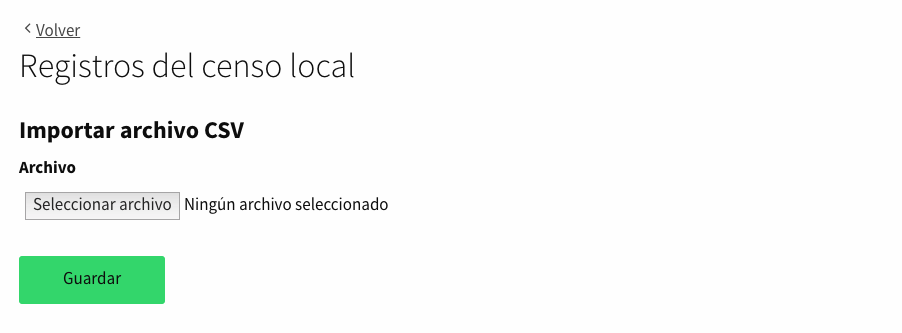

# Censo local

Esta funcionalidad está pensada para instalaciones con pocos recursos que no pueden configurar y personalizar su conexión con el censo de forma remota, por lo que les ofrecemos una solución para que puedan utilizar un censo local. Para ello, se proporciona a los administradores una forma de gestionar la base de datos del censo local a través del panel de administración en **Configuración > Censo local**.

## Gestión del censo local

Los administradores pueden gestionar este censo de dos maneras diferentes:

* **Manualmente**: añadiendo ciudadanos uno por uno a través de un formulario.
* **Automáticamente**: a través de un proceso de importación.

### Manualmente

Permite a los administradores crear un registro clicando en el botón _Crear nuevo registro en el censo local_ que aparece en la parte superior derecha de la página. Esto nos llevará a una nueva página donde poder rellenar el siguiente formulario y crear el nuevo registro:

### Automáticamente

Permite a los usuarios administradores importar multiples registros a través de un archivo CSV, clicando en el botón _Importar CSV_, que aparece en la parte superior derecha de la página. Esto nos llevará a una nueva página donde poder importar el CSV y crear los nuevos registros:

## Funcionalidades

* Búsqueda por número de documento: Como el censo local podría contener muchos registros, existe una función de búsqueda para permitir a los administradores encontrar los registros existentes por número de documento.

* Evitar la introducción de registros duplicados: Existe una validación de modelo que no permite añadir registros que compartan el mismo _número_ y _tipo_ de documento.
