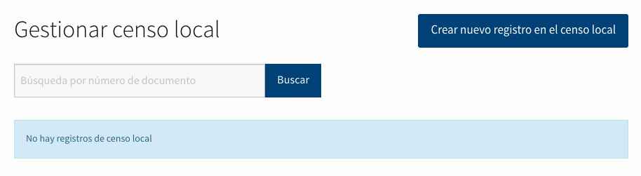
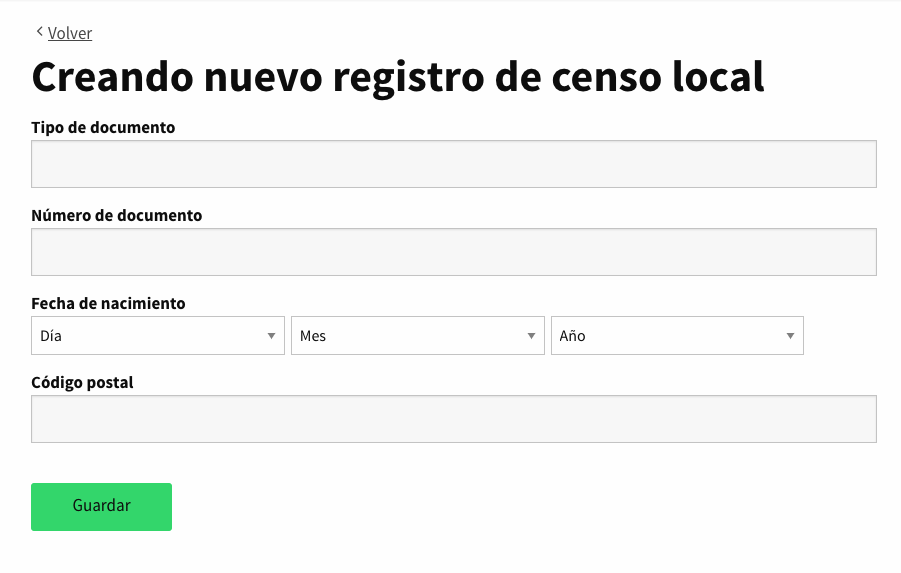
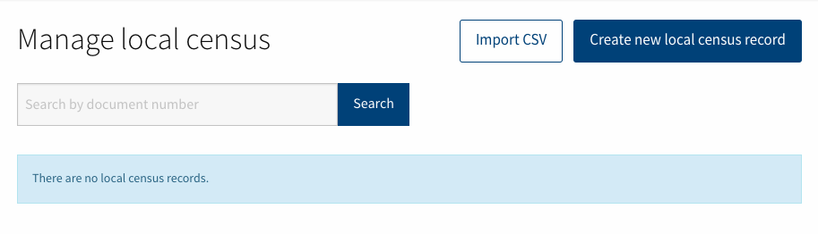

# Censo Local

Proporcionar a los usuarios administradores una forma de gestionar la base de datos del censo local a través del panel de administración **Configuración > Gestionar censo local**. Actualmente la única manera de manipular los registros de esta tabla es a través de la consola de rails.

Permitir a los usuarios de administradores gestionar esta tabla de dos maneras diferentes:

  - **Manualmente**: uno por uno a través de una interfaz CRUD.
  - **Automáticamente**: a través de un proceso de importación.

## Manualmente
Provide a way to manage local census records to administrator users through administration interface.

- Página de censo local

- Añadir un nuevo registro

Funcionalidades:

1. Búsqueda por número_de_documento: Como local_census_records podría contener muchos registros, hemos añadido una función de búsqueda para permitir a los administradores encontrar los registros existentes por número de documento.
1. Evitar la introducción de registros duplicados: Se ha añadido una validación de modelo al siguiente par de atributos [:número_de_documento, :tipo_de_documento]

## Automáticamente
Permite a los usuarios administradores importar registros del censo local a través de un archivo CSV.

- Página de censo local

- Página para importar un CSV

