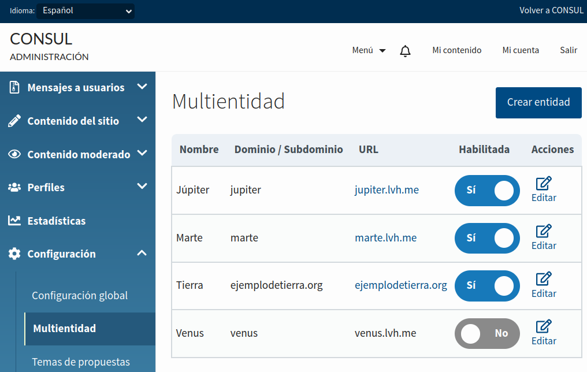
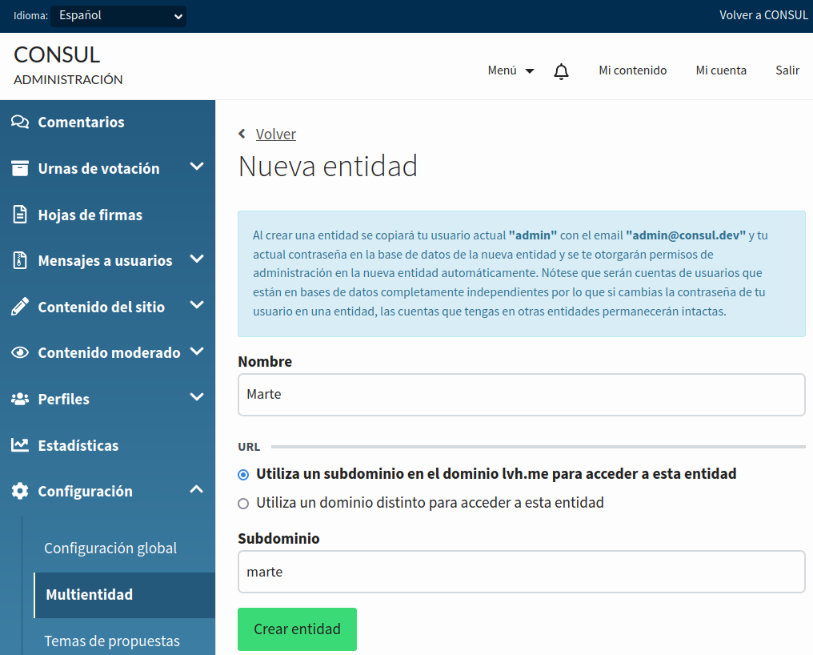
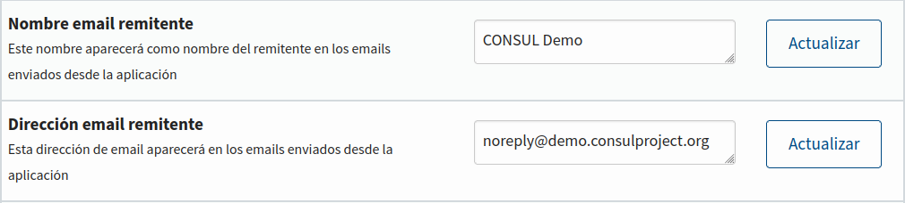

# Multientidad

## Qué es multientidad y cómo funciona

La funcionalidad denominada "multientidad" permite la gestión de varias instituciones ("entidades") independientes dentro de una misma aplicación. Por ejemplo, en nuestro caso, un usuario que se dé de alta en una entidad estará solamente dado de alta en esa entidad y sus datos no serán accesibles desde ninguna de las otras entidades.

A qué entidad accedemos se determina a partir de la URL a la que se accede con el navegador. En Consul Democracy se determina esta entidad a partir del subdominio de esta URL; por ejemplo, si utilizásemos el dominio `ejemplodesistemasolar.org` para gestionar los diferentes planetas del sistema solar, al acceder a `https://mercurio.ejemplodesistemasolar.org` accederíamos a los datos del planeta Mercurio mientras que al acceder a `https://venus.ejemplodesistemasolar.org` accederíamos a los datos del planeta Venus. También es posible utilizar distintos dominios por entidad (por ejemplo, `ejemplodetierra.org`).

## Habilitar multientidad

### Pasos preliminares tras actualizar desde la versión 1.5.0 de Consul Democracy

Si has actualizado una instalación de Consul Democracy a la versión 2.0.0 desde la versión 1.5.0, deberás realizar los siguientes pasos antes de habilitar multientidad. Estos pasos no son necesarios en nuevas instalaciones de Consul Democracy.

Así, en primer lugar, tras subir la versión 2.0.0 al servidor de producción, tendrás que ejecutar las tareas de actualización de versión:

```
RAILS_ENV=production bin/rails consul:execute_release_tasks
```

Es posible que, tras ejecutar esta orden, veas el siguiente aviso:

> The database search path has been updated. Restart the application to apply the changes.

Si es así, reincia la aplicación. Si no has recibido este aviso, comprueba que el fichero `config/database.yml` contiene la línea `schema_search_path: "public,shared_extensions"` y, de no ser así, añádela por ejemplo bajo la línea que dice `adapter: postgresql` y reincia la aplicación.

Una vez hecho esto, deberás abrir una consola de base de datos utilizando un usuario que tenga permisos para crear y modificar extensiones de base de datos:

```
sudo -u postgres psql -d consul_production
```

Si no usaste el [instalador](https://github.com/consuldemocracy/installer/) para instalar Consul Democracy, es posible que tengas que ejecutar las siguientes consultas de base de datos para garantizar los permisos del usuario de Rails para crear esquemas así como el acceso al esquema de extensiones compartidas:

```
CREATE SCHEMA shared_extensions AUTHORIZATION <reemplazar_con_usuario_de_rails_de_base_de_datos>;
GRANT CREATE ON DATABASE consul_production TO <reemplazar_con_usuario_de_rails_de_base_de_datos>;
GRANT usage ON SCHEMA shared_extensions TO public;
```

Tanto si usaste el instalador como si no, ejecuta:

```
ALTER EXTENSION pg_trgm SET SCHEMA shared_extensions;
ALTER EXTENSION unaccent SET SCHEMA shared_extensions;
```

### Paso común a todas las instalaciones de Consul Democracy

Existen dos posibles maneras de habilitar multientidad:

* Añadiendo `config.multitenancy = true` dentro de la clase `class Application < Rails::Application` del fichero `config/application_custom.rb`
* Cambiando la línea `multitenancy: false` por `multitenancy: true` (o añadiéndola si no está ya ahí) en el fichero `config/secrets.yml`

La diferencia entre ambas opciones está en que la primera utiliza un fichero que se encuentra bajo control de versiones y la segunda un fichero que no se encuentra bajo control de versiones. Elige la primera opción si deseas este cambio en el código de tu repositorio git y la segunda opción en caso contrario.

Tras habilitar esta opción, reinicia la aplicación.

## Gestión de entidades

Una vez habilitada la funcionalidad de multientidad y reiniciada la aplicación, aparecerá una nueva sección "Multientidad" dentro del menú "Configuración" de la administración de Consul Democracy.



Esta sección solamente estará disponible desde la entidad "principal" (la que se crea por defecto). Las entidades que se creen desde aquí no tendrán acceso a esta sección y por tanto no podrán a su vez añadir o editar nuevas entidades.

Dado que eliminar una entidad borraría **todos** los datos relacionados con esa entidad y no se podrían restaurar, no existe la opción de eliminar una entidad ya creada desde este panel de administración. Sin embargo, es posible deshabilitar una entidad, haciendo que sea imposible acceder a la misma.

La interfaz de administración de entidades es muy sencilla, necesitando solamente un nombre y un subdominio.



El nombre se usará como nombre del sitio por defecto para nuevas entidades. Nótese que, una vez una entidad se ha creado, cambiar este nombre no tendrá ningún efecto. Para cambiar el nombre del sitio de una entidad existente, edítalo en la sección "Configuración global" de la administración de esa entidad.

El dominio o subdominio será el que la aplicación utilice para acceder a la entidad. Si tienes un dominio como `ejemplodesistemasolar.org` y quieres acceder a las entidades utilizando subdominios (como `marte.ejemplodesistemasolar.org`), elige "Utiliza un subdominio". Si estás usando un dominio diferente para la entidad (como `ejemplodemarte.org`), elige "Utiliza un dominio distinto".

Nótese que, si estás usando un dominio distinto para una entidad, tendrás que configurar tus certificados SSL, servidor web y DNS para que acepten ese dominio y apunten a tu aplicación Consul Democracy.

Al añadir una nueva entidad, se creará automáticamente un usuario con permiso de administrador para esta nueva entidad **cuyos datos de acceso serán una copia de los del administrador que crea la entidad**. Este usuario se almacenará en el esquema de base de datos de la nueva entidad, con lo que cambiar su contraseña en una entidad no cambiará su contraseña en otras entidades.

## Pasos a realizar tras añadir una entidad

### Certificados SSL

Para que la aplicación sea accesible utilizando conexiones seguras de HTTPS/SSL, deberás tener un certificado SSL válido para la entidad que acabas de añadir. Dado que cada institución que utiliza Consul Democracy tiene su propio sistema para gestionar estos certificados, conseguir un certificado para la nueva entidad variará en función del sistema que utilice tu institución.

Si has instalado Consul Democracy usando el instalador y estás usando Certbot para gestionar estos certificados, tienes dos opciones.

Una opción es añadir manualmente cada certificado cada vez que creas una entidad. Por ejemplo, para añadir la entidad con subdominio `marte` al dominio `ejemplodesistemasolar.org`, ejecuta:

```
sudo certbot certonly --nginx --noninteractive --agree-tos --expand -d ejemplodesistemasolar.org,marte.ejemplodesistemasolar.org
```

Si vas a añadir muchos subdominios en distintos momentos, esta tarea puede resultar tediosa. Una alternativa es habilitar cualquier subdominio. Para conseguir esto, deberás tener acceso al panel de administración de tu dominio (DNS) para poder seguir las instrucciones al utilizar bien alguno de los [plugins DNS de Certbot](https://eff-certbot.readthedocs.io/en/stable/using.html#dns-plugins) o la [generación manual del certificado](https://eff-certbot.readthedocs.io/en/stable/using.html#manual) con la siguiente orden:

```
sudo certbot certonly --manual --agree-tos --expand -d ejemplodesistemasolar.org,*.ejemplodesistemasolar.org
```

Se te pedirá crear un registro TXT en el DNS de tu dominio con el subdominio `_acme-challenge` y con un cierto valor. También es posible que se te pida crear un archivo con un cierto nombre y un cierto contenido (normalmente en un directorio llamado `.well-known/acme-challenge`); si ese es el caso, asumiendo que estás usando los directorios por defecto de Consul Democracy, crea el fichero en `/home/deploy/consul/current/public/.well-known/acme-challenge/`.

Después de esto, actualiza la configuración de tu servidor web (por defecto, `/etc/nginx/sites-enabled/default`) para que use el certificado que se ha generado, y reinicia el servidor web con `sudo systemctl restart nginx`.

### Envío de correos electrónicos

Para disminuir la probabilidad de que los correos enviados por la aplicación sean identificados como fraudulentos, puede que quieras editar los campos "Nombre email remitente" y "Dirección email remitente" en el panel de administración de la nueva entidad. Los valores por defecto de estos campos son el nombre y el subdominio que se utilizaron al crear la entidad.



Si quieres utilizar una configuración de envío de correo electrónico diferente para una entidad, como podría ser una que utilice `jupiter` como subdominio, edita el fichero `config/secrets.yml` de la siguiente manera:

```
production:
  # (...) Otros secretos
  multitenancy: true
  tenants:
    jupiter:
      mailer_delivery_method: :smtp
      smtp_settings:
        :address: <servidor_de_correo>
        :port: <puerto>
        :domain: <tu_dominio>
        :user_name: <usuario>
        :password: <contraseña>
        :authentication: "plain"
        :enable_starttls_auto: true
   # (...) Otros secretos
```

Tras editar el fichero, reinicia la aplicación.

### Identificación mediante redes sociales

Si utilizas aplicaciones para que los usuarios puedan identificarse mediante Twitter, Google, Facebook o Wordpress, deberás hacer que la nueva entidad pueda identificarse con estos servicios. Para ello, tienes dos opciones.

Como primera opción, en el panel de configuración de Twitter/Google/Facebook/Wordpress, puedes modificar tu aplicación existente y añadir la URL de la nueva entidad en la lista de dominios permitidos. Al hacer esto, ten en cuenta la configuración de los términos y condiciones de tu aplicación, que puede no siempre ser compatible con esta opción.

Y como segunda opción, puedes crear una nueva aplicación de Twitter/Google/Facebook/Wordpress y configurarla para su uso desde el dominio de la nueva entidad. En este caso, deberás añadir la configuración de esta aplicación al fichero `config/secrets.yml`. Por ejemplo, si administrases una entidad con el subdominio `saturno`, edita el fichero de esta manera, rellenando la información de aquellos servicios que estés utilizando:

```
production:
  # (...) Otros secretos
  multitenancy: true
  tenants:
    saturno:
      twitter_key: <clave_twitter>
      twitter_secret: <secreto_twitter>
      facebook_key: <clave_facebook>
      facebook_secret: <secreto_facebook>
      google_oauth2_key: <clave_google>
      google_oauth2_secret: <secreto_google>
      wordpress_oauth2_key: <clave_wordpress>
      wordpress_oauth2_secret: <secreto_wordpress>
      wordpress_oauth2_site: <sitio_wordpress>
   # (...) Otros secretos
```

Tras editar el fichero, reinicia la aplicación.

## Información a tener en cuenta al realizar desarrollos

### Mantenimiento del fichero schema.rb

Cuando Consul Democracy crea una entidad, utiliza el fichero `db/schema.rb` para crear un nuevo esquema de la base de datos para esta entidad. Esto significa que, si por alguna razón este fichero no contiene la misma estructura de base de datos que se generaría creando una nueva base de datos y ejecutando las migraciones con `rake db:migrate`, podría darse el caso de que diferentes entidades tuvieran diferentes tablas o columnas en sus esquemas de base de datos. Las consecuencias de esta configuración podrían ser fatales.

Para evitarlo, recomendamos encarecidamente comprobar en tu sistema de integración continua que el fichero `db/schema.rb` que se encuentra en control de versiones es correcto. Consul Democracy incluye ya esta comprobación si realizas la integración continua con GitHub Actions. Contribuciones incluyendo esta comprobación en GitLab CI u otros entornos son más que bienvenidas.

### Estilos personalizados para cada entidad mediante CSS

Cuando la funcionalidad de multientidad está activada, Consul Democracy añade una clase al elemento `<html>` para que sea posible aplicar estilos (o eventos de JavaScript) solamente en ciertas entidades. Por ejemplo, en la entidad con subdominio `urano` este elemento tendría la clase `tenant-urano`.

Así, es posible sobrescribir los estilos para una entidad específica añadiendo a alguna hoja de estilos en la carpeta `app/assets/stylesheets/custom/`:

```
.tenant-urano {
  // Estilos que solamente se aplican a Urano
}
```

Para cambiar los colores en una determinada entidad de forma sencilla, puedes utilizar variables de CSS; su uso aparece documentado en el fichero [app/assets/stylesheets/custom/tenants.scss](https://github.com/consuldemocracy/consuldemocracy/blob/master/app/assets/stylesheets/custom/tenants.scss). Por ejemplo, para utilizar tonos de verde en los colores principales de la entidad con subdominio `urano`, puedes escribir:

```
.tenant-urano {
  --brand: #350;
  --brand-secondary: #173a00;
}
```

### Vistas personalizadas para cada entidad con ERB

En ocasiones puede resultar conveniente utilizar vistas completamente distintas. Por ejemplo, una entidad podría usar un pie de página que no tuviera nada que ver con el de otras entidades.

En estos casos, en lugar de añadir condiciones como `case Tenant.current_schema` a la vista, usar un fichero distinto podría resultar en código más fácil de mantener.

Para esto, podemos usar las "[variantes](https://guides.rubyonrails.org/layouts_and_rendering.html#the-variants-option)" que ofrece Rails, que hacen que por ejemplo una entidad llamada `via-lactea` use como vista un fichero terminado en `.html+via-lactea.erb` si este fichero existe. Es decir, para usar un archivo `application.html.erb` diferente para la entidad `via-lactea`, crea un nuevo archivo en `app/views/custom/layouts/application.html+via-lactea.erb`.

Recomendamos utilizar esta funcionalidad solamente cuando haya diferencias sustanciales entre la vista por defecto y la vista específica para una entidad. Si las diferencias son pequeñas, usa condiciones `if` o `case` en su lugar para evitar duplicación de código.

El mismo principio funciona también con componentes, solo que en este caso, al usar el directorio `custom/` para añadir archivos ERB para una entidad, el archivo ERB de la entidad por defecto también tiene que añadirse al directorio `custom/`; si no hay cambios en este fichero, valdrá con un enlace simbólico.

Por ejemplo, si estás escribiendo una vista personalizada del componente `admin/action_component` para la entidad `via-lactea` pero no vas a cambiar esta vista para la entidad por defecto:

1. Crea el archivo `app/components/custom/admin/action_component.rb` tal y como se indica en la [documentación de personalización de componentes](../customization/components.md)
1. Crea la vista personalizada para la entidad `via-lactea` y guárdala en `app/components/custom/admin/action_component.html+via-lactea.erb`
1. Entra en el directorio `app/components/custom/admin/` y ejecuta `ln -s ../../admin/action_component.html.erb`

## Limitaciones actuales de multientidad

La funcionalidad de multientidad se incluyó por primera vez en Consul Democracy 2.0.0 y hay algunas cosas que todavía no están disponibles.

### Aplicaciones disponibles desde múltiples dominios

Es posible que permitas acceder a tu aplicación de Consul Democracy desde dos dominios distintos; por ejemplo, `ejemplodesistemasolar.org` y un dominio en inglés llamado `solarsystemexample.org`.

En este caso, para conseguir que multientidad funcione con ambos dominios, es necesario cambiar ligeramente el código fuente de la aplicación. En concreto, hay que cambiar el método `allowed_domains` de la clase `Tenant` para que incluya ambos dominios. En la [documentación de personalización de modelos](../customization/models.md) puedes ver ejemplos de cómo personalizar métodos como este.

### Imágenes personalizadas por entidad

El panel de administración de Consul Democracy contiene una sección llamada "Personalizar imágenes", donde es posible personalizar algunas (aunque no todas) de las imágenes que aparecen en la aplicación. Usar esta interfaz permite tener imágenes distintas para cada entidad.

A veces, sin embargo, es útil incluir ciertas imágenes bajo control de versiones. Por ejemplo, si quisiéramos usar un logo distinto para una entidad en el subdominio `neptuno`, pondríamos ese archivo en `app/assets/images/custom/tenants/neptuno/logo_header.png`.

Este sistema tiene una limitación y es que solamente funcionará para imágenes que se pueden cambiar desde la interfaz de administración. Si quieres personalizar otra imagen, tendrás que cambiar el código que la renderiza. Por ejemplo, para que sea posible personalizar la imagen `avatar_admin.png`, cambia el código `image_tag("avatar_admin.png")` por `image_tag(image_path_for("avatar_admin.png"))`.

### Bases de datos en distintos servidores para cada entidad

En la versión 2.0.0 de Consul Democracy, los datos de todas las entidades se almacenan en la misma base de datos y por tanto no es posible usar bases de datos en distintos servidores.

En caso de que esta funcionalidad sea suficientemente solicitada, podrá incluirse en Consul Democracy en el futuro. Hay que tener en cuenta que la versión 2.0.0 de Consul Democracy utiliza Rails 6.0 y que para esta funcionalidad será necesario usar Rails 6.1 o incluso Rails 7.0.

### Idiomas distintos para distintas entidades

En la versión 2.0.0 de COSNSUL, todas las entidades están disponibles en los mismos idiomas, con lo que no sería posible (por ejemplo) que una entidad estuviera disponible en francés y otra en alemán, sino que ambas tendrían que estar disponibles en ambos idiomas.

Implementar esta posibilidad está planeado para la versión 2.1.0 de Consul Democracy.

### Borrado de entidades

Dado que eliminar una entidad borraría **todos** los datos relacionados con esa entidad y no se podrían restaurar, Consul Democracy no ofrece la opción de eliminar una entidad ya creada desde el panel de administración y solamente permite deshabilitarlas para que no sea posible acceder a ellas. Para eliminar una entidad, utiliza la consola de Rails.
