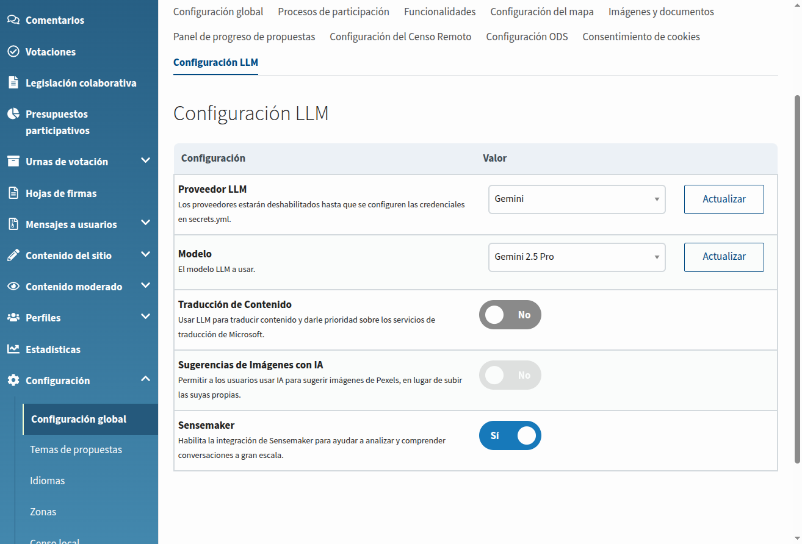
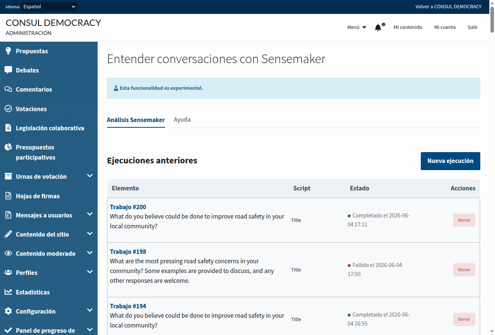
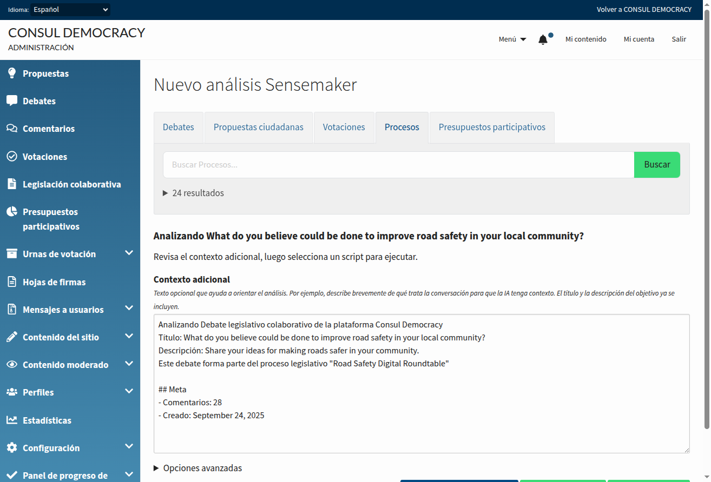
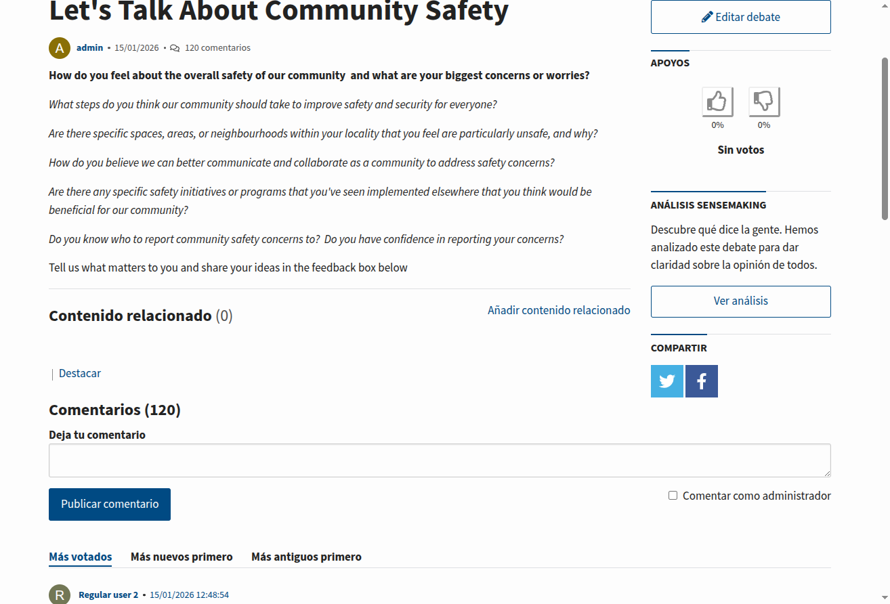
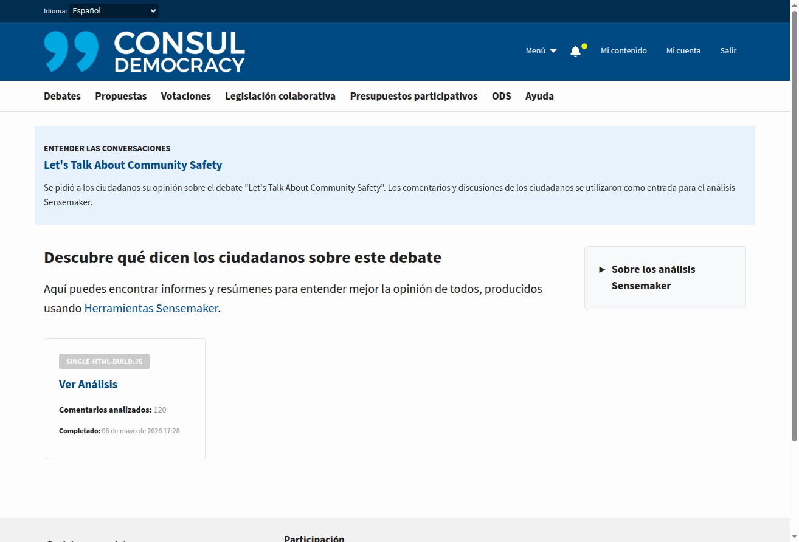

# Sensemaker

## Resumen

Sensemaker ayuda a los administradores a comprender conversaciones ciudadanas a gran escala en Consul Democracy. Utiliza Modelos de Lenguaje Grande (LLM) para analizar comentarios y debates asociados a recursos de participación —como debates, propuestas, votaciones, procesos legislativos y presupuestos participativos— y produce resúmenes e informes HTML que pueden publicarse para los ciudadanos.

Los administradores ejecutan análisis desde el área de administración, revisan los resultados de los trabajos y eligen qué resultados publicar. Cuando se publican, los ciudadanos ven un enlace **Ver análisis** en las páginas de los recursos correspondientes y pueden consultar informes y resúmenes producidos con [Sensemaking Tools](https://jigsaw-code.github.io/sensemaking-tools/).

Sensemaker es una funcionalidad experimental. El título y la descripción del recurso objetivo se incluyen como contexto para el análisis, y los administradores pueden añadir contexto adicional opcional antes de ejecutar un trabajo.

## Prerrequisitos

Para usar esta funcionalidad, necesitas:

1. **Cuenta de proveedor LLM**: Una cuenta con un proveedor LLM compatible (OpenAI, OpenRouter, Mistral, Vertex AI, etc.) o un endpoint Ollama autoalojado
2. **Directorio de datos con permisos de escritura**: Una carpeta en disco para los archivos de entrada y salida de Sensemaker
3. **Worker de trabajos en segundo plano**: Cuando `delay_jobs` está habilitado (habitual en producción), un worker debe procesar la cola Delayed Job `sensemaker`

## Configuración

### Paso 1: Instalar dependencias de Node

Los paquetes necesarios ya están listados en `package.json`:

```json
"@cosla/sensemaking-tools": "^1.1.4",
"@cosla/sensemaking-report-ui": "^0.1.1"
```

Ejecuta `npm install` desde la raíz de la aplicación. En el despliegue, asegúrate de que esto forma parte de tu pipeline de build o de assets existente para que los paquetes estén disponibles en `node_modules/@cosla/`.

### Paso 2: Configurar secretos

#### Credenciales LLM

Configura tu proveedor LLM en `secrets.yml`. Para instrucciones detalladas, consulta la documentación de [Traducciones de contenido de usuario](user_content_translations.md), que cubre la configuración de LLM en detalle.

En resumen, añade las claves API bajo `apis.llm`:

```yml
llm: &llm
  # Proporciona claves para los proveedores LLM que pretendes usar.
  # Consulta la configuración de RubyLLM para todos los proveedores soportados y usa los mismos nombres de clave aquí.
  openai_api_key: "tu-clave-api-openai"
  # u otros proveedores soportados

apis: &apis
  microsoft_api_key: ""
  # ... otras configuraciones de API ...
  llm: *llm
```

Para **Vertex AI**, configura también `vertexai_project_id` y opcionalmente `vertexai_location` bajo `llm:`, y `google_application_credentials` bajo `apis:` si usas un archivo de clave de cuenta de servicio.

#### Carpeta de datos de Sensemaker

Añade la carpeta de datos de Sensemaker en el **nivel superior** de `secrets.yml` (no bajo `apis:`):

```yml
sensemaker: &sensemaker
  sensemaker_data_folder: "vendor/sensemaking-tools/data"
```

Inclúyela en cada sección de entorno (como en `config/secrets.yml.example`):

```yml
production:
  <<: *maps
  <<: *apis
  <<: *sensemaker
```

La ruta es relativa a la raíz de la aplicación Rails. Los trabajos de Sensemaker leen y escriben artefactos CSV, JSON y HTML en este directorio.

### Paso 3: Preparar el directorio de datos

Crea el directorio configurado en `sensemaker_data_folder` y asegúrate de que el usuario de la aplicación puede escribir en él:

```bash
mkdir -p vendor/sensemaking-tools/data
```

### Paso 4: Configurar proveedor y modelo LLM

1. Navega a **Admin > Configuración Global > Configuración LLM**
2. Selecciona un **Proveedor LLM** (los proveedores permanecen deshabilitados en el desplegable hasta que las credenciales estén configuradas en `secrets.yml`)
3. Selecciona un **Modelo LLM**

### Paso 5: Habilitar Sensemaker

En la misma pestaña **Configuración LLM**:

1. Habilita el interruptor **Sensemaker**

El interruptor solo está disponible cuando:

- Hay un proveedor y modelo LLM configurados
- `sensemaker_data_folder` está definido en los secretos

**Nota para instalaciones actualizadas**: Si el interruptor o la página de configuración informan de un ajuste faltante, ejecuta:

```bash
bundle exec rake settings:add_new_settings
```



### Paso 6: Verificar la instalación

1. Abre **Admin > Sensemaker** (la entrada del menú aparece cuando Sensemaker está habilitado)
2. Haz clic en **Nueva ejecución**
3. Abre **Opciones avanzadas** y selecciona **Realizar verificación de salud**
4. Ejecuta el trabajo y confirma que finaliza sin errores en la lista de trabajos o en la página de detalle

Si la verificación de salud falla, revisa el mensaje de error del trabajo en la página de detalle (consulta [Solución de problemas](#solución-de-problemas)).

## Cómo Funciona

### Flujo de administración

1. Ve a **Admin > Sensemaker** y abre la pestaña **Análisis Sensemaker** para ver trabajos en ejecución y anteriores.

   

2. Haz clic en **Nueva ejecución** y busca un recurso objetivo (debate, propuesta, votación, elemento legislativo, presupuesto, etc.).

   

3. Revisa el campo de **contexto adicional** (el título y la descripción del objetivo se rellenan previamente cuando están disponibles) y añade orientación opcional para el análisis.

4. Elige cómo ejecutar el análisis: usa **Generar resumen** para ejecutar el script de resumen, **Generar informe** para ejecutar el pipeline completo de informes y producir un informe HTML (esto ejecuta automáticamente los trabajos previos de categorización y análisis avanzado cuando son necesarios), o **Opciones avanzadas** para elegir manualmente cualquier script (verificación de salud, categorizar, resumir, analizar o informe).

   

5. Cuando un trabajo finaliza correctamente, usa **Publicar** para hacer visibles los resúmenes e informes a los ciudadanos. Solo los trabajos completados con archivos de salida pueden publicarse. Usa **Despublicar** para ocultarlos de nuevo.

Solo los trabajos de **Resumir** e **Informe** pueden publicarse. Los de verificación de salud, categorizar y analizar sirven para configuración, diagnóstico y pasos intermedios del pipeline; solo son visibles en el área de administración.

Scripts disponibles:

| Script | Propósito | Publicable |
|--------|-----------|------------|
| Realizar verificación de salud | Verificar dependencias de Sensemaker y conectividad LLM | No |
| Categorizar | Categorizar comentarios en temas y subtemas | No |
| Resumir | Generar un resumen de la conversación | Sí |
| Analizar | Analizar la conversación con estadísticas | No |
| Informe | Analizar y generar un informe en formato HTML | Sí |

### Flujo público

Cuando Sensemaker está habilitado y un administrador ha **publicado** al menos un resumen o informe para un recurso:

1. Los ciudadanos ven un enlace **Ver análisis** en la página del recurso (debates, propuestas, votaciones, legislación, presupuestos, etc.).

   

2. El enlace abre un índice público de análisis publicados para ese recurso.

   

3. Los ciudadanos pueden abrir informes HTML o resúmenes desde el índice.

   

#### Patrones de rutas públicas

La mayoría de recursos usan el índice estándar de trabajos de Sensemaker:

| Patrón | URL de ejemplo | Se usa para |
|--------|----------------|-------------|
| Estándar | `/sensemaker/debates/123/jobs` | Debates, propuestas individuales, votaciones, preguntas y propuestas legislativas, etc. |
| Todas las propuestas | `/sensemaker/proposals/jobs` | Análisis globales del sitio donde el objetivo son todas las propuestas (`analysable_id` es nil) |
| Presupuesto | `/budgets/123/sensemaking` | Presupuestos participativos (y análisis de grupos de presupuesto agregados en la página del presupuesto) |

La ruta de **todas las propuestas** es distinta de la URL por propuesta. Su índice lista solo trabajos agregados de propuestas y no tiene recurso padre en la ruta de navegación.

Los **presupuestos participativos** también requieren que los administradores habiliten **Mostrar análisis de sensemaking** en el presupuesto (junto con los ajustes de resultados y estadísticas), y que el presupuesto esté en fase **finalizada** antes de que los ciudadanos puedan abrir la página de sensemaking.

### Flujo técnico

1. **Entrada**: Los comentarios y texto relacionado se exportan a un archivo CSV en la carpeta de datos configurada (`Sensemaker::CsvExporter`).
2. **Cola**: El trabajo se encola en la cola Delayed Job `sensemaker` (`Sensemaker::JobRunner`).
3. **Procesamiento**: El runner invoca `npx ts-node` para scripts del pipeline o `npx sensemaking-report-ui` para informes HTML. El proveedor LLM, el modelo y las credenciales se pasan desde la configuración LLM del admin mediante `Sensemaker::RuntimeConfig`.
4. **Salida**: Los archivos de resultado se escriben en la carpeta de datos y se registran en el registro `Sensemaker::Job`.
5. **Publicación**: Un administrador publica el trabajo; `Sensemaker::ReportLinkComponent` muestra entonces el enlace público cuando existe un trabajo publicado para el recurso.

## Recursos Soportados

### Objetivos de análisis en administración

Los administradores pueden analizar:

- Debates
- Propuestas (incluidas **todas las propuestas** como objetivo único)
- Votaciones y preguntas de votación
- Procesos legislativos, preguntas, propuestas y opciones de pregunta
- Presupuestos participativos y grupos de presupuesto

### Enlaces públicos "Ver análisis"

El enlace se muestra actualmente en:

- Páginas de detalle de debates
- Páginas de detalle e índice de propuestas (incluidos análisis de todas las propuestas)
- Cabeceras de votaciones
- Páginas de procesos legislativos, preguntas y propuestas
- Páginas de proyectos de gasto de presupuestos participativos (cuando el sensemaking del presupuesto está habilitado y existen trabajos publicados)

## Solución de Problemas

### Falta la entrada de menú Sensemaker

- Confirma que hay un proveedor y modelo LLM configurados en **Admin > Configuración Global > Configuración LLM**
- Habilita el interruptor **Sensemaker** en la misma pestaña
- Ambos son necesarios para que `Sensemaker.enabled?` devuelva true

### El interruptor Sensemaker está deshabilitado en Configuración LLM

- Define `sensemaker_data_folder` en `secrets.yml`
- Configura las credenciales LLM para poder seleccionar proveedor y modelo

### Error del trabajo: "Sensemaker data folder not configured"

- Añade `sensemaker_data_folder` a `secrets.yml`
- Crea el directorio y asegúrate de que el usuario de la aplicación puede escribir en él

### Error del trabajo: "Node.js not found" o "NPX not found"

- Instala Node.js en el servidor
- Asegúrate de que el worker de trabajos en segundo plano tiene `node` y `npx` en su `PATH`

### Error del trabajo: carpeta de paquete no encontrada

- Ejecuta `npm install` desde la raíz de la aplicación
- Confirma que `@cosla/sensemaking-tools` y `@cosla/sensemaking-report-ui` están en `package.json`

### Error del trabajo: proveedor LLM no soportado o clave API faltante

- Usa un proveedor compatible: OpenAI, OpenRouter, Mistral, Vertex AI u Ollama
- Añade la `llm.{provider}_api_key` correspondiente en `secrets.yml`
- Para Vertex AI, define `vertexai_project_id` (y opcionalmente `vertexai_location`)

### Los trabajos permanecen en estado "En ejecución"

- Asegúrate de que un worker Delayed Job está en ejecución y procesa la cola `sensemaker` cuando `delay_jobs` está habilitado

### No aparece el enlace público "Ver análisis"

- Confirma que Sensemaker está habilitado globalmente
- Confirma que el trabajo finalizó correctamente y fue **publicado**
- Para presupuestos participativos, habilita también **Mostrar análisis de sensemaking** en el presupuesto y asegúrate de que el presupuesto está finalizado

### Ajuste no encontrado en la pestaña Configuración LLM

Ejecuta `bundle exec rake settings:add_new_settings` para añadir la fila del ajuste `llm.use_sensemaker`.
