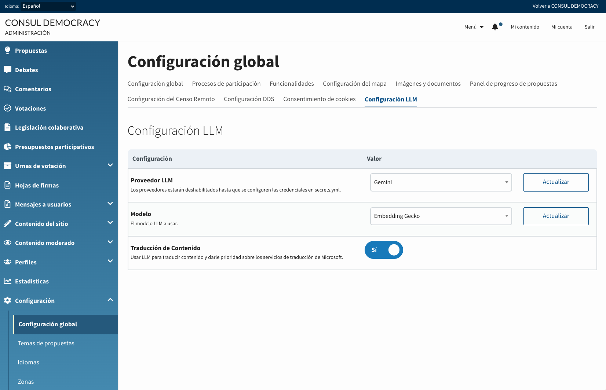
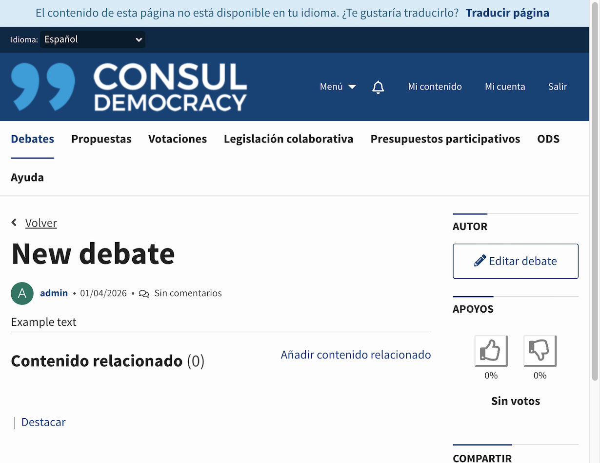
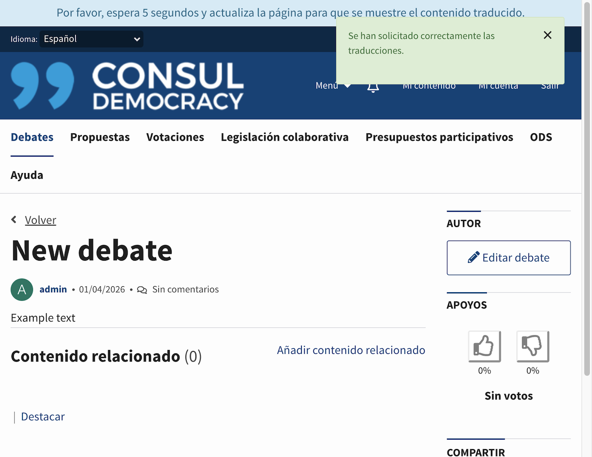
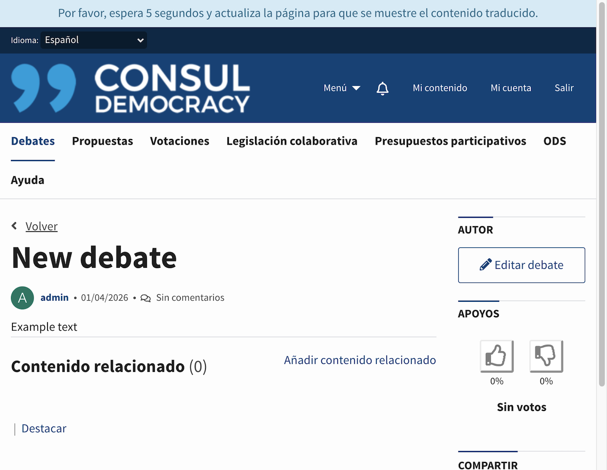
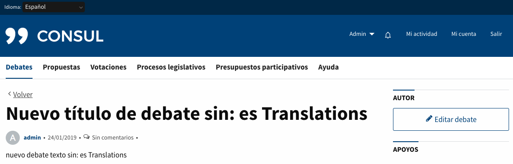
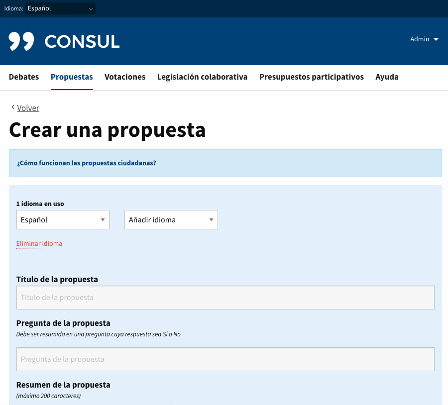
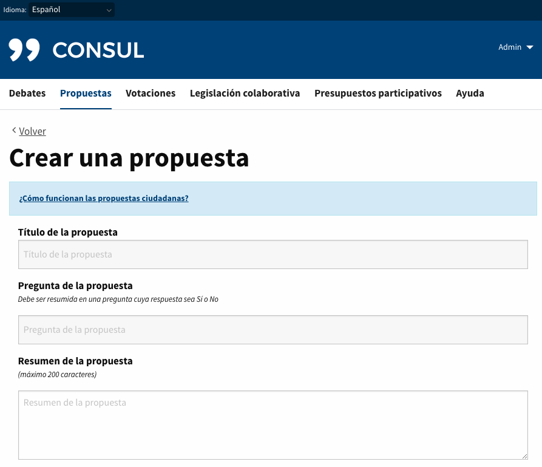

# Traducciones de contenido de usuario

## Traducciones remotas bajo demanda del usuario

Este servicio tiene como objetivo poder ofrecer todos los contenidos dinámicos de la aplicación (propuestas, debates, inversiones presupuestarias y comentarios) en diferentes idiomas sin la necesidad de que un usuario o un administrador haya creado cada una de sus traducciones.

Cuando un usuario accede a una pantalla con un idioma donde parte del contenido dinámico que está visualizando no tiene traducciones, dispondrá de un botón para solicitar la traducción de todo el contenido. Este contenido se enviará al proveedor de traducción configurado y, en cuanto se obtenga la respuesta, todas estas traducciones estarán disponibles para cualquier usuario.

La traducción de contenido se realiza a través del proveedor LLM (IA) que configures.

### Uso de traducciones con LLM

#### Cómo empezar

Para utilizar esta opción debes realizar los siguientes pasos:

1. Crear una cuenta con tu proveedor LLM preferido (OpenAI, Anthropic, etc.), o configura un endpoint Ollama en tus propios servidores.
2. Obtener una API key para el servicio. Este paso es diferente para cada proveedor, por lo que deberás consultar su documentación.

#### Configuración

##### Añadir la API key en las credenciales de la aplicación

Cuando ya tengas las credenciales del proveedor LLM, añade una subsección `llm:` dentro de `apis:` en el `secrets.yml`, utilizando los nombres de clave esperados por RubyLLM:

```yml
apis: &apis
  llm:
    # Añade aquí las credenciales de los proveedores LLM que vayas a usar.
    # Consulta la documentación de RubyLLM https://rubyllm.com/configuration#global-configuration-rubyllmconfigure
    # para ver todos los proveedores soportados y usa los mismos nombres aquí.
    deepseek_api_key: "1234567890"
```

##### Configurar proveedor y modelo LLM

Inicia la aplicación, accede a **Administración > Configuración global > Configuración LLM** y selecciona el proveedor y modelo que utilizarás para las traducciones.



Si ya añadiste las credenciales en `secrets.yml` pero el proveedor aparece deshabilitado, revisa que no falte ningún campo requerido según la [documentación de RubyLLM](https://rubyllm.com/configuration#global-configuration-rubyllmconfigure).

##### Configurar el prompt de traducción

Edita `config/llm_prompts.yml` y actualiza la clave `remote_translation_prompt` con el prompt que quieras utilizar. Asegúrate de que el prompt devuelva la traducción final tal y como debería verla el usuario.

### Funcionalidad

Una vez tenemos la API key en nuestro `secrets.yml` y la funcionalidad activada, los usuarios ya podrán utilizar las traducciones remotas en la aplicación.

Para aclarar el funcionamiento, se adjuntan unos pantallazos de cómo interactúa la aplicación con nuestros usuarios:

* Cuando un usuario accede a una pantalla en un idioma en el que no están disponibles todas las traducciones, le aparecerá un texto en la parte superior de la pantalla y un botón para poder solicitar la traducción. (**Nota:** *En el caso de acceder con un idioma no soportado por el servicio de traducción no se mostrará ningún texto ni botón de traducción.*)

  

* Una vez el usuario pulsa el botón de `Traducir página` se encolan las traducciones y se recarga la pantalla con un notice (*informando que se han solicitado correctamente las traducciones*) y un texto informativo en la cabecera (*explicando cuándo podrá ver estas traducciones*).

  

* Si un usuario accede a una pantalla que no dispone de traducciones pero ya han sido solicitadas por otro usuario, la aplicación no le mostrará el botón de traducir, pero sí un texto informativo en la cabecera (*explicando cuándo podrá ver estas traducciones*).

  

* Las peticiones de traducción se delegan a `Delayed Job` y en cuanto haya sido procesada, el usuario después de refrescar su página podrá ver el contenido traducido.

  

## Interfaz de traducción

Esta funcionalidad permite a los usuarios introducir contenidos dinámicos en diferentes idiomas a la vez. Cualquier usuario administrador de Consul Democracy puede activar o desactivar esta funcionalidad a través del panel de administración de la aplicación. Si desactivas esta funcionalidad (configuración de la funcionalidad por defecto) los usuarios sólo podrán introducir un idioma.

### Activar funcionalidad

Para activar la funcionalidad deberas acceder desde el panel de administración a la sección **Configuración > Configuración global > Funcionalidades** y activar el módulo de **Interfaz de traducción**.

### Casos de uso

Dependiendo de si activamos o desactivamos el módulo de **Interfaz de traducción** veremos los formularios de la siguiente manera:

* Cuando la interfaz de traducción está activa:
 Como podemos ver en la imagen a continuación la interfaz de traducción tiene 2 selectores, el primero "Seleccionar idioma" permite cambiar entre los lenguajes activos y el segundo selector "Añadir idioma" permite añadir nuevos idiomas al formulario. Los campos traducibles se pueden distinguir fácilmente mediante un fondo azul de los que no lo son.

 También disponemos de un botón `Eliminar idioma` para eliminar un idioma en caso de necesitarlo. Si un usuario elimina accidentalmente un idioma puede recuperarlo añadiendo dicho idioma otra vez al formulario.

 Esta funcionalidad está visible tanto para las páginas de creación como para las páginas de edición.

 

* Cuando la interfaz de traducción está desactivada:
  Cuando esta funcionalidad está desactivada los formularios se renderizan sin la interfaz de traducción y sin resaltar los campos traducibles con fondo azul.

  
