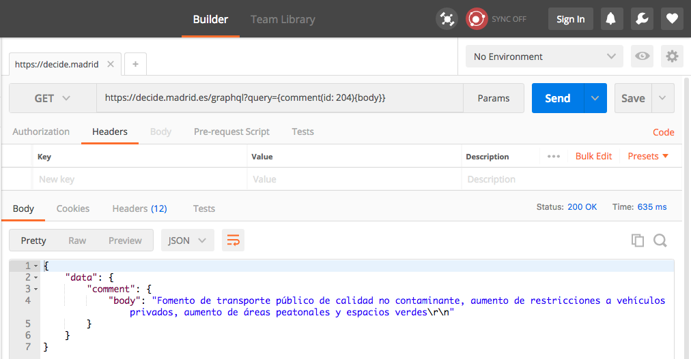

# GraphQL

* [Características](graphql.md#caracteristicas)
* [GraphQL](graphql.md#graphql)
* [Haciendo peticiones a la API](graphql.md#haciendo-peticiones-a-la-api)
  * [Clientes soportados](graphql.md#clientes-soportados)
    * [GraphiQL](graphql.md#graphiql)
    * [Postman](graphql.md#postman)
    * [Librerías HTTP](graphql.md#librerias-http)
* [Información disponible](graphql.md#informacion-disponible)
* [Ejemplos de consultas](graphql.md#ejemplos-de-consultas)
  * [Recuperar un único elemento de una colección](graphql.md#recuperar-un-unico-elemento-de-una-coleccion)
  * [Recuperar una colección completa](graphql.md#recuperar-una-coleccion-completa)
    * [Paginación](graphql.md#paginacion)
  * [Acceder a varios recursos en una única petición](graphql.md#acceder-a-varios-recursos-en-una-unica-peticion)
* [Limitaciones de seguridad](graphql.md#limitaciones-de-seguridad)
  * [Ejemplo de consulta demasiado profunda](graphql.md#ejemplo-de-consulta-demasiado-profunda)
  * [Ejemplo de consulta demasiado compleja](graphql.md#ejemplo-de-consulta-demasiado-compleja)
* [Ejemplos de código](graphql.md#ejemplos-de-codigo)

## Características <a id="caracteristicas"></a>

* API de sólo lectura
* Acceso público, sin autenticación
* Usa GraphQL por debajo
  * El tamaño máximo \(y por defecto\) de página está establecido a 25
  * La profundiad máxima de las consultas es de 8 niveles
  * Como máximo se pueden solicitar 2 colecciones en una misma consulta
  * Soporte para peticiones GET \(consulta dentro del _query string_\) y POST \(consulta dentro del _body_, como `application/json` o `application/graphql`\).

## GraphQL

La API de CONSUL utiliza GraphQL [http://graphql.org](https://graphql.org), en concreto la [implementación en Ruby](http://graphql-ruby.org/). Si no estás familiarizado con este tipo de APIs, es recomendable investigar un poco sobre GraphQL previamente.

Una de las caracteríticas que diferencian una API REST de una GraphQL es que con esta última es posible construir _consultas personalizadas_, de forma que el servidor nos devuelva únicamente la información en la que estamos interesados.

Las consultas en GraphQL están escritas siguiendo un estándar que presenta ciertas similitudes con el formato JSON, por ejemplo:

```text
{
  proposal(id: 1) {
    id,
    title,
    public_author {
      id,
      username
    }
  }
}
```

Las respuestas son en formato JSON:

```javascript
{
  "data": {
    "proposal": {
      "id": 1,
      "title": "Hacer las calles del centro de Madrid peatonales",
      "public_author": {
        "id": 2,
        "username": "electrocronopio"
      }
    }
  }
}
```

## Haciendo peticiones a la API

Siguiendo las [directrices oficiales](http://graphql.org/learn/serving-over-http/), la API de CONSUL soporta los siguientes tipos de peticiones:

* Peticiones GET, con la consulta dentro del _query string_.
* Peticiones POST
  * Con la consulta dentro del _body_, con `Content-Type: application/json`
  * Con la consulta dentro del _body_, con `Content-Type: application/graphql`

### Clientes soportados

Al ser una API que funciona a través de HTTP, cualquier herramienta capaz de realizar este tipo de peticiones resulta válida.

Esta sección contiene unos pequeños ejemplos sobre cómo hacer las peticiones a través de:

* GraphiQL
* Extensiones de Chrome como Postman
* Cualquier librería HTTP

#### GraphiQL

[GraphiQL](https://github.com/graphql/graphiql) es una interfaz de navegador para realizar consultas a una API GraphQL, así como una fuente adicional de documentación. Está desplegada en la ruta `/graphiql` y es la mejor forma de familiarizarse una API basada en GraphQL.


Tiene tres paneles principales:

* En el panel de la izquierda se escribe la consulta a realizar.
* El panel central muestra el resultado de la petición.
* El panel derecho \(ocultable\) contiene una documentación autogenerada a partir de la información expuesta en la API.

#### Postman

Ejemplo de petición `GET`, con la consulta como parte del _query string_:



Ejemplo de petición `POST`, con la consulta como parte del _body_ y codificada como `application/json`:


La consulta debe estar ubicada en un documento JSON válido, como valor de la clave `"query"`:


#### Librerías HTTP <a id="librerias-http"></a>

Por supuesto es posible utilizar cualquier librería HTTP de lenguajes de programación.

**IMPORTANTE**: Debido a los protocolos de seguridad de los servidores del Ayuntamiento de Madrid, es necesario incluir un _User Agent_ perteneciente a un navegador para que la petición no sea descartada. Por ejemplo:

`User-Agent: Mozilla/5.0 (Macintosh; Intel Mac OS X 10_12_5) AppleWebKit/537.36 (KHTML, like Gecko) Chrome/59.0.3071.115 Safari/537.36`

## Información disponible <a id="informacion-disponible"></a>

El fichero [config/api.yml](https://github.com/consul/docs/tree/b4ff5e1fdec31baa3e732562392eba3d2805505c/config/api.yml) contiene una lista completa de los modelos \(y sus campos\) que están expuestos actualmente en la API.

La lista de modelos es la siguiente:

| Modelo | Descripción |
| :--- | :--- |
| `User` | Usuarios |
| `Debate` | Debates |
| `Proposal` | Propuestas |
| `Comment` | Comentarios en debates, propuestas y otros comentarios |
| `Geozone` | Geozonas \(distritos\) |
| `ProposalNotification` | Notificaciones asociadas a propuestas |
| `Tag` | Tags en debates y propuestas |
| `Vote` | Información sobre votos |

## Ejemplos de consultas

### Recuperar un único elemento de una colección <a id="recuperar-un-unico-elemento-de-una-coleccion"></a>

 \`\`\` { proposal\(id: 2\) { id, title, comments\_count } } \`\`\` Respuesta: \`\`\`json { "data": { "proposal": { "id": 2, "title": "Crear una zona cercada para perros en Las Tablas", "comments\_count": 10 } } } \`\`\`

### Recuperar una colección completa <a id="recuperar-una-coleccion-completa"></a>

```text
{
  proposals {
    edges {
      node {
        title
      }
    }
  }
}
```

Respuesta:

```javascript
{
  "data": {
    "proposals": {
      "edges": [
        {
          "node": {
            "title": "ELIMINACION DE ZONA APARCAMIENTO EXCLUSIVO FUNCIONARIOS EN MADRID"
          }
        },
        {
          "node": {
            "title": "iluminación de zonas deportivas"
          }
        }
      ]
    }
  }
}
```

#### Paginación <a id="paginacion"></a>

Actualmente el número máximo \(y por defecto\) de elementos que se devuelven en cada página está establecido a 25. Para poder navegar por las distintas páginas es necesario solicitar además información relativa al `endCursor`:

```text
{
  proposals(first: 25) {
    pageInfo {
      hasNextPage
      endCursor
    }
    edges {
      node {
        title
      }
    }
  }
}
```

La respuesta:

```javascript
{
  "data": {
    "proposals": {
      "pageInfo": {
        "hasNextPage": true,
        "endCursor": "NQ=="
      },
      "edges": [
        # ...
      ]
    }
  }
}
```

Para recuperar la siguiente página, hay que pasar como parámetro el cursor recibido en la petición anterior, y así sucesivamente:

```text
{
  proposals(first: 25, after: "NQ==") {
    pageInfo {
      hasNextPage
      endCursor
    }
    edges {
      node {
        title
      }
    }
  }
}
```

### Acceder a varios recursos en una única petición <a id="acceder-a-varios-recursos-en-una-unica-peticion"></a>

Esta consulta solicita información relativa a varios modelos distintos en una única petición: `Proposal`, `User`, `Geozone` y `Comment`:

```text
{
  proposal(id: 15262) {
    id,
    title,
    public_author {
      username
    },
    geozone {
      name
    },
    comments(first: 2) {
      edges {
        node {
          body
        }
      }
    }
  }
}
```

## Limitaciones de seguridad

Permitir que un cliente personalice las consultas supone un factor de riesgo importante. Si se permitiesen consultas demasiado complejas, sería posible realizar un ataque DoS contra el servidor.

Existen tres mecanismos principales para evitar este tipo de abusos:

* Paginación de resultados
* Limitar la profundidad máxima de las consultas
* Limitar la cantidad de información que es posible solicitar en una consulta

### Ejemplo de consulta demasiado profunda

La profundidad máxima de las consultas está actualmente establecida en 8. Consultas más profundas \(como la siguiente\), serán rechazadas:

```text
{
  user(id: 1) {
    public_proposals {
      edges {
        node {
          id,
          title,
          comments {
            edges {
              node {
                body,
                public_author {
                  username
                }
              }
            }
          }
        }
      }
    }
  }
}
```

La respuesta obtenida tendrá el siguiente aspecto:

```javascript
{
  "errors": [
    {
      "message": "Query has depth of 9, which exceeds max depth of 8"
    }
  ]
}
```

### Ejemplo de consulta demasiado compleja

El principal factor de riesgo se da cuando se solicitan varias colecciones de recursos en una misma consulta. El máximo número de colecciones que pueden aparecer en una misma consulta está limitado a 2. La siguiente consulta solicita información de las colecciónes `users`, `debates` y `proposals`, así que será rechazada:

```text
{
  users {
    edges {
      node {
        public_debates {
          edges {
            node {
              title
            }
          }
        },
        public_proposals {
          edges {
            node {
              title
            }
          }
        }
      }
    }
  }
}
```

La respuesta obtenida tendrá el siguiente aspecto:

```javascript
{
  "errors": [
    {
      "message": "Query has complexity of 3008, which exceeds max complexity of 2500"
    },
    {
      "message": "Query has complexity of 3008, which exceeds max complexity of 2500"
    },
    {
      "message": "Query has complexity of 3008, which exceeds max complexity of 2500"
    }
  ]
}
```

No obstante sí que es posible solicitar información perteneciente a más de dos modelos en una única consulta, siempre y cuando no se intente acceder a la colección completa. Por ejemplo, la siguiente consulta que accede a los modelos `User`, `Proposal` y `Geozone` es válida:

```text
{
  user(id: 468501) {
    id
    public_proposals {
      edges {
        node {
          title
          geozone {
            name
          }
        }
      }
    }
  }
}
```

La respuesta:

```javascript
{
  "data": {
    "user": {
      "id": 468501,
      "public_proposals": {
        "edges": [
          {
            "node": {
              "title": "Empadronamiento necesario para la admisión en GoFit Vallehermoso",
              "geozone": {
                "name": "Chamberí"
              }
            }
          }
        ]
      }
    }
  }
}
```

## Ejemplos de código <a id="ejemplos-de-codigo"></a>

El directorio [doc/api/examples](https://github.com/consul/consul/tree/master/doc/api/examples/ruby) contiene ejemplos de código para acceder a la API.

